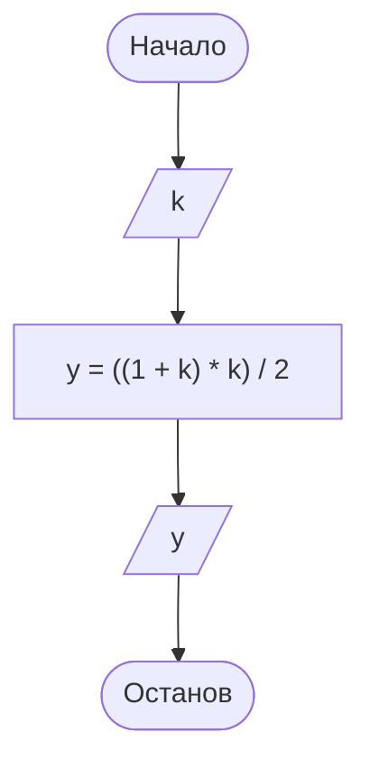

# Основы алгоритмизации и программирования
650a23836a97eeab17de058a

- [Практическая работа 1](#практическая-работа-1)
  - [Вариант 2.](#вариант-2)
    - [Задание 1](#задание-1)
      - [Анализ исходных данных](#анализ-исходных-данных)
      - [Математическая формализация](#математическая-формализация)
      - [Алгоритмизация](#алгоритмизация)
      - [Программирование](#программирование)
      - [Отладка и тестирование](#отладка-и-тестирование)
    - [Задание 2](#задание-2)
      - [Анализ исходных данных](#анализ-исходных-данных-1)
      - [Математическая формализация](#математическая-формализация-1)
      - [Алгоритмизация](#алгоритмизация-1)

---
2023-09-28

### Практическая работа 1
6514165b6a97eeab17de06ac

1.  Цель работы:
    1.  Сформировать умение  составлять  простейшие разветвляющиеся алгоритмы.
    2.  Сформировать умение составлять наборы тестов.

2.  Литература
    1.  Колдаев, В.Д.  Структуры и алгоритмы обработки данных: Учебное пособие/В.Д. Колдаев  –  Москва: ИЦ РИОР:НИЦ ИНФРА-М, 2014.  Режим доступа: http://znanium.com/bookread2.php? book= 418290#
    2.  Математическая логика и теория алгоритмов:учебник/ А.В. Пруцков,Л.Л. Волкова.  –  Москва: КУРС:ИНФРА-М, 2017.  –  Режим доступа: http://znanium.com/catalog.php?bookinfo=773373
    3.  Основы алгоритмизации и программирования:Учебное пособие/ В.Д. 
Колдаев; Под ред. Л.Г. Гагариной.  –  Москва: ИД Форум: ИНФРА-М, 2015-  Режим 
доступа: http://znanium.com/ bookread2.php? book= 484837


3.  Подготовка к работе:
    1.  Изучить понятие алгоритма, его свойства.
    2.  Изучить графический способ описания алгоритмов.
    3.  Изучить методику разработки линейных алгоритмов.

4.  Задание:
    1.  Составить алгоритмы для предложенных задач (таблица 1) по плану:
        1.  исходные данные; 
        2.  результат; 
        3.  анализ условия задачи; 
        4.  метод решения; 
        5.  графическое описание алгоритма; 
        6.  набор тестов для проверки правильности алгоритма.

**Вариант 1:**

1)  На плоскости даны две точки А(x1,  y1) и В(х2, у2). Определить 
расстояние между этими точками.
2)  Найти сумму цифр трехзначного числа, введенного 
пользователем.
3)  Определить площадь заштрихованной фигуры (рисунок 1), если 
известна длина стороны квадрата.

    

4)  Обменять значения двух переменных:

    - используя третью переменную;
    - не используя третью переменную.


**Вариант 2:**

1)  Вычислить значение $y (k>0)$.

$$ y = 1+2+3+...+k. $$

2)  Найти произведение цифр трехзначного числа, введенного 
пользователем.

3)  Определить площадь заштрихованной фигуры (рисунок 1), если 
известно, что радиус меньшей окружности $r$  равен половине 
радиуса большей окружности. 

    

    Рисунок 2

4)  Обменять значения двух переменных:
    - используя третью переменную;
    - не используя третью переменную.

5.  Порядок выполнения работы:
    1.  Решить задания в любом порядке.

6.  Содержание отчета:
    1.  Титульный лист.
    2.  Цель работы.
    3.  Условия задач.
    4.  Подробное решение заданий.
    5.  Вывод по проделанной работе.

7. Контрольные вопросы
   1.  Что такое алгоритм?
   2.  Каковы основные свойства алгоритма? 
   3.  Какие способы описания алгоритмов существуют?
   4.  Какие виды алгоритмов и соответствующих им конструкций существуют?
   5.  Что называется отладкой алгоритма?
   6.  Что такое тест?
   7.  Какой тест называют полным? неизбыточным? 


#### Вариант 2.

##### Задание 1

###### Анализ исходных данных

**Условие**:

$$ \tag{1} y = 1+2+3+...+k, k > 0 $$

**Исходные данные**:

- $k > 0$ — последний элемент выражения $(1)$.

**Требуемый результат**:

- $y$ — значение выражения $(1)$;

###### Математическая формализация

**Анализ условия**

Исходя из условия, выражение $(1)$ представляет собой возрастающую арифметическую прогрессию $y$, в которой известен первый элемент ($y_1 = 1$), разность ($d = 1$) и задан последний элемент $k$. Необходимо найти сумму первых $n$ элементов прогрессии.

Рассматриваемое соответствие $kQy$ можно задать как $q = (K, Y, \Gamma)$, такое что: 

$$ \tag{2} \Gamma = \{(k, y) \in K \times Y\ |\ k \in K, y \in Y\}. $$

где $\Gamma$ — график соответствия $q$.

Тогда, согласно условию, область отправления рассматриваемого соответствия определяется как:

$$ \tag{3} K = \{k \in \Bbb Z\ |\ k > 0 \} = \Bbb N. $$

Из $(1)$ очевидно, что область прибытия $\text{cod}\ q$ ограничена множеством натуральных чисел, являясь эквивалентным ему ($Y \subset \Bbb N$):

$$ \tag{4} Y = \{y\ |\ y \in \Bbb N \}. $$

Обе области являются бесконечными счётными множествами. Кроме того, из условия следует, что $пр_1 \Gamma = K$, что делает соответствие $q$ всюду определенным на всей области отправления, т.е. $\Gamma : k \mapsto y$ (отображение).

**Метод решения**

Сумму первых $n$ элементов арифметической прогрессии можно найти по формуле:

$$ \tag{5} S_n = \frac{(y_1 + y_n) \cdot n}{2}. $$

Т.к. $y_1 = 1$ и $d = 1$, то $n = y_n = k$. С учётом этого, выражение $(5)$ можно изложить следующим образом:

$$ \tag{6} y = \frac{(1 + k) \cdot k}{2} = \frac{1}{2} k^2 + \frac{1}{2} k. $$

Можно заметить, что выражение $(6)$ соответствует квадратичной функции (имеющей общий вид $y = ax^2 + bx + c$), при $a = b = \frac{1}{2}, c = 0$. Значит, рассматриваемое отображение $q$ является функциональным, т.е. $f : k \mapsto y$, что эквивалентно $f : K \to Y$, а $y = f(k)$. В общем виде квадратичная функция является сюръективной, т.е. $\text{pr}_2 \Gamma_f = Y$, но при сужении на области определения, ограниченной натуральными числами $D(f) =  \Bbb N$, она становится дискретной и биективной. Таким образом, выражение $(2)$ можно изложить следующим образом:

$$ \tag{6} \Gamma_f = \{(k, y) \in K \times Y\ |\ f(k) = y \}. $$

###### Алгоритмизация

По условию задачи не предполагается введение данных, выходящих за пределы $\text{dom}\ q$, исходя из чего сформирован линейный одношаговый алгоритм, показанный на Листинге 1.

**Листинг 1 – Алгоритм к заданию 1**.
```
алг f (арг цел k, рез цел y) 
  дано k > 0
  надо y
нач
| ввод k
| y := ((1 + k) * k) / 2
| вывод y
кон
```

Графическое описание алгоритма показано на Рисунке 2



Рисунок 2 – Блок-схема алгоритма к заданию 1

###### Программирование

Программа, представленная на Листинге 2, записана на языке C# и предназначена для исполнения в среде .NET 7.0. Типы данных для аргумента $k$ и возвращаемого значения $y$ выбраны исходя из выражений $(3)$ и $(4)$ соответственно.

```c#
static uint f (uint k)
{
    uint y = ((1 + k) * k) / 2;
    return y;
}
```

###### Отладка и тестирование

Выбранный для аргумента и возвращамого значения тип данных (`System.UInt32`) налагают технические ограничения как на $X$, так и на $Y$, лимитированные размером 32-битного целого числа без знака, находящимся в числовом промежутке $U = [Min, Max]$, где $Min =$ `UInt32.MinValue` ($\text{0}_{16} = 0_{10}$), $Max =$ `UInt32.MaxValue` ($\text{FFFFFFFF}_{16} = 4.294.967.295_{10}$), за пределами которого значения аргумента и функции не могут быть определены технически:

$$ \tag{8} U = \{n \in \Bbb Z\ |\ 0 \leq n \leq 4.294.967.295 \}. $$

Кроме того, из выражения $(5)$ следует, что при вычислении функции возможно переполнение по максимуму при возведении аргумента в квадрат, что лимитирует максимальное значение аргумента $k_{max} = \sqrt{Max} \approx 65535$.

Следовательно, практически реализуемая функция является сужением $f$ на подмножество её практической области определения $D(f)$, за пределами которой $f|_D$ не может быть верно определена, исходя из выбранного типа данных по причинам потери значения аргумента вследствии переполнения:

$$ \tag{9} D(f) = \{k \in \Bbb N\ |\ k \leq 65.535 \}. $$

Исследуемая функция $f$ является монотонно возрастающей, причём так, что $\forall (k_i, y_j)(y_j > k_i) \implies y_{max} > k_{max}$ при $i > 1$, поэтому максимуму функции будет соответствовать $k_{max}$, следовательно, область значений $f|_D$ можно вычислить подстановкой $k_{max}$ в уравнение $(5)$:

$$ \tag{10} R(f) = \{y \in \Bbb N\ |\ y = f(k), y \leq 2.147.450.880 \}. $$

Поскольку искомый алгоритм по условию не предусматривает обработки недопустимых значений аргумента, то для проверки правильности решения с учётом установленных ограничений можно использовать преимущественно позитивное тестирование методами эквивалентного разбиения и анализа граничных значений. 

Классы эквивалентности $(f(k_i))_{i=1}^n$, характеризуемые определёнными числовыми промежутками, выделяются исходя из диапазона возможных значений выбранного типа данных $(8)$ и практической области определения тестируемой функции $(9)$.

Итоговый набор тестов для проверки правильности алгоритма приведён в Таблице 1.

Таблица 1 – Набор тестов для проверки функции к заданию 1.

Класс | Промежуток $[k_1, k_n]$ | Кортеж $\langle k_i, y_i \rangle$ | Сценарий
-- | -- | -- | --
$U_1$ | $[0, 0]$ | $\langle 0, 0 \rangle$ | out of range $k$
$D$ | $[1, 65 535]$ | $\langle 1, 1 \rangle$ | inflow $k_1$
| | | $\langle 2, 3 \rangle$ | inflow $k_2$
| | | $\langle 32 768, 536 887 296 \rangle$  | inflow $\bar k$
| | | $\langle 65 534, 2 147 385 345 \rangle$  | inflow $k_{n-1}$
| | | $\langle 65 535, 2 147 450 880 \rangle$ | inflow $k_{n}$
$U_2$ | $[65 536, 4 294 967 295]$ | $\langle 65 536, 32 768 \rangle$ | overflow $k_1$
| | | $\langle 65 537, 98305 \rangle$ | overflow $k_2$
| | | $\langle 2 147 450 879, 1 610 629 120 \rangle$ | overflow $\bar k$
| | | $\langle 4 294 967 294, 1 \rangle$ | overflow $k_{n-1}$
| | | $\langle 4 294 967 295, 0 \rangle$ | overflow $k_{n}$

Из Таблицы 1 видно, что верные значения $f$ возвращает на сегменте класса $D$, соответствующего $(9)$. На сегменте $U_1$ значение находится за рамками условия задачи. На сегменте $U_2$ $f$ определяется неверно из-за потери значения аргумента вследствие переполнения.

##### Задание 2

###### Анализ исходных данных

**Условие**:

- пользователь вводит трёхзначное число

**Исходные данные**:

- $z$ — трёхзначное (целое) число.

**Требуемый результат**:

- $y$ — произведение цифр числа $z$.

###### Математическая формализация

**Анализ условия**

Принимая, что по условию ожидается введение целого числа, такое число $z$ в позиционной системе счисления можно представить следующим образом:

$$ \tag{11} z = sgn(z) a_{n-1} a_{n-2} ... a_1 a_0, 0 \leq a_i \leq b -1, $$

где 

- $a$ — цифра разряда;
- $b$ — основание системы счисления, $b \in \Bbb N$;
- $sgn(z)$ — функция знака (индикатор знака числа $a$).

Функция знака определяется следующим образом: 

$$ \tag{12}
  sgn(z) =
\begin{cases}
-1,  & z < 0 \\
0, & z = 0 \\
1, & z > 0
\end{cases}
.
$$

Выражение $(11)$ соответствует представлению $z$ в виде следующей суммы:

$$ \tag{13} z = sgn(z) \sum_{i=0}^{n-1} a_i \cdot b^i $$

где:

- $n$ — количество разрядов (разрядность);
- $i$ — номер разряда цифры $a_i$, начиная с нулевого.

Исходя из выражения $(13)$, требуемый результат можно формализовать следующим образом:

$$ \tag{14} y = sgn(z) \prod_{i=0}^{n-1} a_i $$

Рассматриваемое соответствие $zQy$ можно задать как $q = (Z, Y, \Gamma)$, такое что: 

$$ \tag{15} \Gamma = \{(z, y) \in Z \times Y\ |\ z \in Z, y \in Y\}. $$

где $\Gamma$ — график соответствия $q$.

Тогда, согласно исходному предположению, область отправления рассматриваемого соответствия определяется как:

$$ \tag{16} Z = \{z, -z\ |\ z \in \Bbb N\ \} \cup \{0\} = \Bbb Z. $$

Из выражений $(12)$, $(13)$ и $(14)$ следует область прибытия рассматриваемого соответствия:

$$ \tag{17} Y = \{y\ |\ y \in \Bbb Z \}. $$

Обе области являются бесконечными счётными множествами. Кроме того, из условия следует, что $пр_1 \Gamma = Z$, что делает соответствие $q$ всюду определенным на всей области отправления, т.е. $\Gamma : z \mapsto y$ (отображением).

**Метод решения**

Исходя из $(13)$, любую цифру разряда аргумента можно найти по следующей формуле:

$$ \tag{18} a_i = \Bigl\lfloor \frac{z\ \text{mod}\ b^{i+1}}{b^i} \Bigr\rfloor,$$

где $\text{mod}$ — бинарная операция взятия остатка $r$ от деления $z$ на $b^{i+1}$, в данном случае определяемая как:

$$ \tag{19} r = z\ \text{mod}\ b^{i+1} = z - b^{i+1} \Bigl\lfloor \frac{z}{b^{i+1}} \Bigr\rfloor.$$

С учётом $(18)$ выражение $(14)$ можно изложить следующим образом:

$$ \tag{20} y = sgn(z) \prod_{i=0}^{n-1} \Bigl\lfloor \frac{z\ \text{mod}\ b^{i+1}}{b^i} \Bigr\rfloor $$

Поскольку предполагается введение чисел в десятичной системе счисления, то $b = 10$. Кроме того, по условию $n = 3$, исходя из чего выражение $(20)$ в окончательной форме будет иметь следующий вид:

$$ \tag{21} y = sgn(z) \prod_{i=0}^{2} \Bigl\lfloor \frac{z\ \text{mod}\ 10^{i+1}}{10^i} \Bigr\rfloor $$

Можно заметить, что выражение $(21)$ по своему характеру является функциональным. Значит, рассматриваемое отображение $q$ также является функциональным, т.е. $f : z \mapsto y$, что эквивалентно $f : Z \to Y$, а $y = f(z)$. Кроме того, данная функция является сюръективной, т.е. $\text{pr}_2 \Gamma_f = Y$. С учётом этого, выражение $(15)$ можно изложить следующим образом:

$$ \tag{22} \Gamma_f = \{(z, y) \in Z \times Y\ |\ f(z) = y \}. $$

###### Алгоритмизация

---


$D$ её области определения ($D(f) \subset \text{pr}_1\Gamma_f$), за пределами которого $f|_D$ не может быть верно определена технически, т.е.:

$$ \tag{7} \text{dom}\ f = \{k \in \Bbb N\ |\ k \leq Max \}. $$

$$ \tag{8} \text{ran}\ f = \{y \in \Bbb N\ |\ y \leq Max \}. $$


---

Исследуемая функция $f$ является монотонно возрастающей, причём так, что $\forall (k_i, y_j)(y_j > k_i) \implies y_{max} > k_{max}$, поэтому $f|_D$ является частично определённой на полном диапазоне $\text{dom}\ f$, посольку лимитирующей в данном случае является именно $\text{cod}\ f$. Отсюда следует, что $R(f) = \text{ran}\ f$, а $D(f) \subset \text{dom}\ f$. Поскольку $f$ биективна, то она обратима, следовательно, $D(f) = R(f^{-1})$. Для нахождения $f^{-1}(k)$ необходимо решить уравнение $(5)$ относительно $k$, для чего $(5)$ нужно записать следующим образом:

$$ \tag{9} k^2 + k - 2y = 0. $$

Выражение $(9)$ представляет собой квадратное уравнение вида $ax^2 + bx + c = 0$, где $a = b = 1$, а $c = -2y$, корни которого вычисляются следующим образом:

$$ \tag{10} k = \frac{-b \pm \sqrt{b^2 - 4ac}}{2a} = \frac{-1 \pm \sqrt{1 + 8y}}{2}. $$

С учётом $\text{dom}\ f$ ($k \in \Bbb N$), выражение $(10)$ следует изложить как:

$$ \tag{11} f^{-1}(k) = k = \frac{-1 + \sqrt{1 + 8y}}{2}. $$

Поскольку $D(f^{-1}) =  \text{ran}\ f$, то, подставив граничные значения $y$ в выражение $(11)$, можно определить область значений обратной функции:

$$ k_{min} = \frac{-1 + \sqrt{1 + 8 \cdot 1}}{2} = 1. $$

$$ k_{max} = \frac{-1 + \sqrt{1 + 8 \cdot Max}}{2}. $$

Следовательно,

$$ \tag{12} R(f^{-1}) = \{k \in \Bbb N\ |\ k \leq k_{max} \}. $$

С учётом того, что $D(f) = R(f^{-1})$, а $R(f) = \text{ran}\ f$, области определения и значений $f|_D$ вычисляются подстановкой значения $Max$ в соответствующие выражения:

$$ \tag{13} D(f) = \{k \in \Bbb N\ |\ k \leq 92.681 \}. $$

$$ \tag{14} R(f) = \{y \in \Bbb N\ |\ y = f(k), y \leq 4.294.967.295 \}. $$

---


 при определённых значениях $k \leq Max$ $f|D$ может быть не определена. Соответственно, необходимо уточнить значение $D(f)$ с учётом ограничений, налагаемых на максимальное значение функции:


$D(f)$ 


Т.е. $D(f) определяется дополнительными условиями $k \leq Max$ и $y \leq Max$, одно из которых является лимитирующим. 

Исследуемая функция $f$ является монотнно возрастающей функции, причём так, что $\forall (k_i, y_j)(y_j > k_i) \implies y_{max} > k_{max}$, поэтому лимитирующим в данном случае является условие $y \leq Max$, т.к. при определённых значениях $k \leq Max$ $f|D$ может быть не определена. Соответственно, необходимо уточнить значение $D(f)$ с учётом ограничений, налагаемых на максимальное значение функции:

$$ \tag{7} R(f) = \{y \in \Bbb N\ |\ y = f(x), y \leq Max \}. $$

Поскольку $f$ биективна, то она обратима, следовательно, $R(f) = D(f^{-1})$. Исходя из $(6)$:


Т.е. приняв $D(f) \subset \text{pr}_1\Gamma_f$ и $R(f) \subset \text{pr}_2\Gamma_f$, необходимо установить точные границы 

$$ \tag{7} D(f) = \{k \in \Bbb N\ |\ k \leq MaxValue \}. $$


, находящихся в данном случае лимитирующим является $R(f) \subset \text{pr}_2\Gamma_f$). Следовательно, для установления верхней границы $D(f)$ ($k_{max}$) необходимо определить верхнюю границу ($R(f)$) $y_{max}$.


Необходимо установить, при каких значениях $k$ значение $y$ не выходит за границы


Поскольку $(6)$ и $(8)$:

$$ \tag{9} R(f) = \{y \in \Bbb N\ |\ y = f(x), y \leq MaxValue \}. $$


Исходя из (3) (4) и самого характера монотонно возрастающей функции $f$ ($\forall (k_i, y_j)(y_j > k_i) \implies y_{max} > k_{max}$), в данном случае лимитирующим является $R(f) \subset \text{pr}_2\Gamma_f$). Следовательно, для установления верхней границы $D(f)$ ($k_{max}$) необходимо определить верхнюю границу ($R(f)$) $y_{max}$.

Поскольку $f$ биективна, то она обратима, следовательно, $R(f) = D(f^{-1})$.


следует уточнить как:

$$ \tag{6} \text{dom}'\ f = \{k \in \Bbb N, k < 4294967295 \}. $$

$$ \tag{7} \text{cod}'\ f = \{y \in \Bbb N\ | y < 4294967295 \}. $$

Поскольку $\text{dom}\ f \supset \text{dom}'\ f$ и $\text{cod}\ f \supset \text{cod}'\ f$, реализуемая функция является сужением теоретически установленной функции $f$:

$$ f|D = D \to R. $$

Следует иметь в виду, что область определения реализуемой функции может не совпадать с уточнённой областью отправления $(6)$. Поскольку отображение $q$ биективно (т.е. взаимно-однозначно), то функция $f$ является обратимой. Т.к. по своему характеру функция $f$ является монотонно возрастающей, то для нахождения истинной области определения реализуемой функции  и,существует $f^{-1}. 


 не совпадает с областью определения теоретически установленной функции $f$, т.е. $D(f) \neq \text{dom}\ q$, поскольку:


Таким образом, $\text{dom}\ q \supset D(f)$, а $\text{dom}\ q$ является областью отправления реализуемой функции $f$, 

Исходя из практических ограничений, накладываемых выбранным типом данных для возвращаемого значения (`System.UInt32`), область прибытия реализуемой функции должн:


При этом следует иметь в виду, что в силу ограничений на тип возвращаемого значения, реализуемая функция не может быть определена на всём диапазоне значений $(6)$. 


 Таким образом, $\text{dom}\ q$ является областью отправления для реализуемой 


получается, что $\text{pr}_1 реализуемая функция не может быть полностью определённой на всём  $f|D$ фактически является сужением искомой $f(k)$, поскольку $\text{dom}\ q \supset D(f)$, т.к. область определения формализуется следующим образом:


Поскольку искомый алгоритм по условию не предусматривает обработки недопустимых значений аргумента, то для проверки правильности решения следует использовать позитивное тестирование методами эквивалентного разбиения и анализа граничных значений. 

Исходя из выбранного типа данных (`System.UInt32`), необходимо уточнить практические $dom f$ и $ran f$:

$$ \tag{6} R(f) = \{ y \in \Bbb N\ |\ 1 \leq y \leq 4294967295 \} $$

Соответственно, теоретическая $dom f$:

Набор тестов для проверки правильности алгоритма приведен в Таблице 1.


| Класс | Интервал | Аргумент | Выборка $K$ | Ожидание $Y$ | Сценарий |
-- | -- | -- | -- | -- | --


<script type="text/javascript" src="http://cdn.mathjax.org/mathjax/latest/MathJax.js?config=TeX-AMS-MML_HTMLorMML"></script>
<script type="text/x-mathjax-config"> MathJax.Hub.Config({ tex2jax: {inlineMath: [['$', '$']]}, messageStyle: "none" });</script>