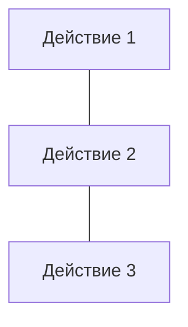

# Вопросы к экзамену

- [1. Понятие алгоритма. Свойства алгоритмов.](#1-понятие-алгоритма-свойства-алгоритмов)
- [2. Способы описания алгоритмов: словесно-формульный, графический, на алгоритмическом языке.](#2-способы-описания-алгоритмов-словесно-формульный-графический-на-алгоритмическом-языке)
  - [Словесный способ](#словесный-способ)
  - [Формульно-словесный способ](#формульно-словесный-способ)
  - [Табличный способ](#табличный-способ)
  - [Графический способ](#графический-способ)
  - [Программный способ (текстовая запись)](#программный-способ-текстовая-запись)
  - [О взаимодополнении способов представления](#о-взаимодополнении-способов-представления)
- [3. Графический способ описания.](#3-графический-способ-описания)
  - [Главные элементы блок-схем алгоритмов](#главные-элементы-блок-схем-алгоритмов)
  - [Общие требования к блок-схеме](#общие-требования-к-блок-схеме)
  - [Решение алгоритма сортировки пузырьком](#решение-алгоритма-сортировки-пузырьком)
- [4. Базовые структуры алгоритмов. Виды алгоритмов](#4-базовые-структуры-алгоритмов-виды-алгоритмов)
- [5. Виды алгоритмов: линейный, разветвляющийся, циклический.](#5-виды-алгоритмов-линейный-разветвляющийся-циклический)
  - [Последовательный (линейный) алгоритм](#последовательный-линейный-алгоритм)
  - [Разветвляющиеся алгоритмы](#разветвляющиеся-алгоритмы)
  - [Циклические алгоритмы](#циклические-алгоритмы)
- [6. Принципы алгоритмизации.](#6-принципы-алгоритмизации)
  - [Этапы решения задач на ЭВМ](#этапы-решения-задач-на-эвм)
    - [I этап: Постановка задачи и её содержательный анализ](#i-этап-постановка-задачи-и-её-содержательный-анализ)
    - [II этап: Математическая формализация](#ii-этап-математическая-формализация)
    - [III этап: Алгоритмизация (построение алгоритма)](#iii-этап-алгоритмизация-построение-алгоритма)
    - [IV этап: Программирование](#iv-этап-программирование)
    - [V этап: Отладка и тестирование программы](#v-этап-отладка-и-тестирование-программы)
    - [VI этап: Проведение расчетов и анализ результатов](#vi-этап-проведение-расчетов-и-анализ-результатов)
  - [Распределение общего времени между этапами, необходимое для разработки сложных программ](#распределение-общего-времени-между-этапами-необходимое-для-разработки-сложных-программ)
  - [Общие рекомендации](#общие-рекомендации)
  - [Принципы алгоритмизации](#принципы-алгоритмизации)
  - [Принципы, лежащие в основе создания эффективных алгоритмов](#принципы-лежащие-в-основе-создания-эффективных-алгоритмов)
- [7. Разветвляющийся алгоритм. Методика составления разветвляющихся алгоритмов.](#7-разветвляющийся-алгоритм-методика-составления-разветвляющихся-алгоритмов)
  - [Разветвляющиеся алгоритмы со сложным условием. Методика составления разветвляющихся алгоритмов со сложным условием](#разветвляющиеся-алгоритмы-со-сложным-условием-методика-составления-разветвляющихся-алгоритмов-со-сложным-условием)
- [8. Циклический алгоритм. Методика составления циклических алгоритмов.](#8-циклический-алгоритм-методика-составления-циклических-алгоритмов)
- [9. Отладка и тестирование алгоритмов.](#9-отладка-и-тестирование-алгоритмов)
- [10. Структура программы на языке С#.](#10-структура-программы-на-языке-с)
- [11. Основные элементы языка С#: переменные, константы, алфавит, идентификаторы, ключевые слова, выражения, операторы.](#11-основные-элементы-языка-с-переменные-константы-алфавит-идентификаторы-ключевые-слова-выражения-операторы)
  - [Состав языка](#состав-языка)
- [12. Основные типы данных языка С#.](#12-основные-типы-данных-языка-с)
- [13. Объявление переменных и констант в языке С#. Инициализация переменных.](#13-объявление-переменных-и-констант-в-языке-с-инициализация-переменных)
- [15. Функция ввода.](#15-функция-ввода)
- [16. Функции вывода.](#16-функции-вывода)

1. Понятие алгоритма. Свойства алгоритмов.
2. Способы описания алгоритмов: словесно-формульный, графический, на алгоритмическом языке.
3. Графический способ описания.
4. Базовые структуры алгоритмов. Виды алгоритмов
5. Виды алгоритмов: линейный, разветвляющийся, циклический.
6. Принципы алгоритмизации.
7. Разветвляющийся алгоритм. Методика составления разветвляющихся алгоритмов.
8. Циклический алгоритм. Методика составления циклических алгоритмов.
9.  Отладка и тестирование алгоритмов.
10. Структура программы на языке С#.
11. Основные элементы языка С#: переменные, константы, алфавит, идентификаторы, ключевые слова, выражения, операторы.
12. Основные типы данных языка С#.
13. Объявление переменных и констант в языке С#. Инициализация переменных.
14. Операции и выражения в языке С#: арифметические, логические выражения. Основные математические функции.
15. Функция ввода.
16. Функции вывода.
17. Условный оператор в языке С#.
18. Оператор выбора в языке С#.
19. Циклические операторы в языке С#: цикл с предусловием, цикл с постусловием, цикл с параметром.
20. Операторы передачи управления break и continue.
21. Методы в С#
22. Понятие массива. Объявление и инициализация одномерного массива в языке С#.
23. Понятие массива. Объявление и инициализация многомерного массива в языке С#.
24. Строки в языке С#. Функции для работы со строками.
25. Функции в языке С#. Структура функции. Вызов функции. Прототип функции.
26. Рекурсивные функции.
27. Область видимости переменных. Локальные и глобальные переменные. Статические и динамические переменные
28. Ввод/вывод в С#.  Форматированный ввод/вывод в С#.
29. Файловый ввод/вывод в С#. Функции для работы с файлами.
30. Структуры в языке С#. Определение и инициализация структуры. Создание экземпляра структуры.
31. Базовые понятия ООП: объект, его свойства и методы, класс. Основные принципы ООП: инкапсуляция, наследование, полиморфизм.
32. Классы в С#.

## 1. Понятие алгоритма. Свойства алгоритмов.

**Алгоритм** – это система последовательных операций (в соответствии с определёнными правилами) для решения поставленной задачи, понятное и точное предписание (указание) исполнителю совершить последовательность действий, направленных на достижение указанной цели или на решение поставленной задачи.

Исполнитель выполняет алгоритм **формально**.

**Система команд исполнителя** (**СКИ**) — совокупность команд, которые данный исполнитель умеет выполнять. Совокупность всех действий, которые исполнитель может выполнить в ответ на эти команды, называется **системой допустимых действий** Исполнителя.

**Свойства алгоритма**

1. Дискретность
2. Понятность (единственность толкования)
3. Определённость (детерминированность — обязательное завершение каждого из действий)
4. Конечность (результативность)
5. Выполнимость (эффективность)
6. Массовость (универсальность — возможность применения для целого класса задач)
7. Однозначность

## 2. Способы описания алгоритмов: словесно-формульный, графический, на алгоритмическом языке.
https://otus.ru/nest/post/1769/

**Алгоритмом** (algorithm) называют чёткое описание последовательности действий, направленных на решение конкретной задачи.

Способы описания алгоритмов:

- словесный (вербальный);
- графический (блок-схемы);
- математический (формулами);
- алгоритмические языки (программа).

### Словесный способ
Словесное описание алгоритма предполагает наличие некого словесного перечня действий. Пример: вам говорят что-то типа следующего: «Вычислите Z при условии, что Z = X + Y, когда X равен 0,89, а Y равен 1,286. Полученное значение Z следует возвести в куб и вычислить корень».

У такого способа есть недостаток: отсутствие наглядности выполнения процесса и чёткой формализации объектов алгоритма.

### Формульно-словесный способ
При использовании формульно-словесного способа инструкции задаются более чётко. Этот тот случай, когда словесные пояснения сопровождаются перечнем конкретных действий, плюс эти пояснения характеризуются наличием формальных символов и выражений (формул).

Для примера составим **формульно-словесный алгоритм** вычисления выражения: $z=2 \cdot x–(y+6)$:
- вводим значения $x$ и $y$;
- находим сумму ($y+6$);
- находим произведение ($2 \cdot x$);
- вычисляем $z$ как разность уже полученных выше значений: $z=2 \cdot x–(y+6)$;
- выводим $z$ как результат вычисления выражения.

Это более компактный и лаконичный метод, он нагляднее, но всё же строго формальным не является.

### Табличный способ
В случае применения табличного метода алгоритм задаётся в виде входных данных: расчётных форм и таблиц. Способ широко применяется в экономических расчетах. Исходные данные, как и результаты, заносятся в заголовки столбцов используемой таблицы. Простейший пример такого способа представления — та же таблица умножения.

### Графический способ
Этот метод ещё называют **способом блок-схем**. В данной ситуации каждый этап прохождения алгоритма представляется в виде геометрических фигур — так называемых «блоков», причём конкретная форма фигур зависит от выполняемой операции. Существует стандарт, регламентирующий размеры используемых графических блоков, а также их отображение, функции, формы и взаимное расположение. Направление работы алгоритма показывают линии соединения блоков.

Другое название способа — **визуальное представление**. При проектировании алгоритмов, представленных графически, придерживаются ряда правил:
- в начале алгоритма располагаются блоки ввода значений (входные данные);
- после ввода значений располагаются блоки обработки и блоки условия;
- алгоритм завершается блоками вывода значений, полученных в результате работы алгоритма (выходные данные);
- должен быть лишь один блок начала и один — окончания;
- межблочная связь указывается линиями (направленными либо ненаправленными);
- вычислительные формулы, данные и логические выражения размещаются внутри соответствующих блоков;
- возможно наличие комментариев в виде выносок.


Графический способ представления имеет практическое значение и используется не только в случае программирования. Его применяют при составлении информационных и структурных схем, инфографики и в иных ситуациях, когда нужно обеспечить чёткую визуализацию данных и графически отобразить последовательность расположения объектов алгоритма.

Создание блок-схемы алгоритма — важный и нужный этап решения поставленной задачи. Но при некоторых обстоятельствах этот этап можно считать промежуточным, так как в таком виде описанный алгоритм невозможно выполнить средствами ЭВМ. Зато графический способ представления значительно облегчает процесс дальнейшего создания компьютерной программы. О ней ниже.

### Программный способ (текстовая запись)
Программа представляет собой алгоритм, который записан как последовательность команд. Речь идёт о командах, понятных компьютеру, для чего используются различные языки программирования, представляющие собой системы кодирования предписаний с правилами их применения. Языки программирования характеризуются строго определённым синтаксисом, то есть свободное толкование конструкций не допускается.

В случае программного способа представления алгоритмическая последовательность записывается в виде компьютерной программы с высокой степенью формализации. В результате появляется возможность решать прикладные задачи.

### О взаимодополнении способов представления
Способы, представленные выше, нередко являются взаимодополняемыми:
- на этапе обсуждения используются словесные и словесно-формульные способы;
- на этапе проектирования рекомендуется использовать графические алгоритмы (графическое представление);
- на этапе проверки возможно табличное описание;
- на этапе непосредственного применения и решения прикладных задач используют текстовую запись, представленную в виде компьютерной программы.

## 3. Графический способ описания.
https://otus.ru/nest/post/1778/

**Блок-схема** — графическое изображение структуры алгоритма, в котором каждый этап процесса переработки данных представляется в виде геометрических фигур (блоков), имеющих определенную конфигурацию в зависимости от характера выполняемых при этом операций.

Существуют правила, единые обозначения и стандарты, регламентирующие применение визуального отображения схем алгоритмов. В России это ГОСТ 19.701-90 «Схемы алгоритмов программ, данных и систем», который близок к международному стандарту ISO 5807:1985.

### Главные элементы блок-схем алгоритмов
Прежде чем продолжить, стоит дать определение **блок-схемы** в соответствии со стандартом — речь идёт о совокупности символов, которые отвечают этапам работы алгоритма, причём эти символы имеют соединяющие линии:
- **пунктирную** — для соединения с комментарием;
- **сплошную** — отображает зависимости по управлению, допускается наличие на ней стрелки.

В соответствии со стандартом составитель может не указывать стрелку, если дуга направляется сверху вниз или слева направо.

Также существуют и дополнительные виды линий, которые применяются, когда надо дать описание блок-схемам параллельных алгоритмов, однако в этой статье мы их рассматривать не будем, как и ряд других дополнительных спецсимволов.

В таблице ниже дан перечень основных символов, используемых при описании алгоритмов:


### Общие требования к блок-схеме

https://prohor-off.ru/pascal/pascal2.html#:~:text=%D0%A2%D0%B8%D0%BF%D1%8B%20%D0%B0%D0%BB%D0%B3%D0%BE%D1%80%D0%B8%D1%82%D0%BC%D0%BE%D0%B2.,%D0%B8%20%D0%B8%D0%BC%D0%B5%D0%B5%D1%82%20%D0%BD%D0%B5%D1%81%D0%BA%D0%BE%D0%BB%D1%8C%D0%BA%D0%BE%20%D0%B2%D0%B5%D1%82%D0%B2%D0%B5%D0%B9%20%D0%BE%D0%B1%D1%80%D0%B0%D0%B1%D0%BE%D1%82%D0%BA%D0%B8.

- Стрелки в блок—схемах указываются только справа — налево и снизу — вверх.
- Блоки рисуются карандашом по линейке, текст пишется ручкой.
- Ширина всех блоков должна быть одинакова (блоки должны располагаться друг под другом).
- Все блоки алгоритма нумеруются.

### Решение алгоритма сортировки пузырьком
В этом примере давайте попробуем дать описание решению алгоритма сортировки по методу пузырьком (метод сортировки вставками). Здесь применяются 2 цикла. Во вложенном цикле осуществляется попарное сравнение элементов. Если нарушается порядок, происходит перестановка. По итогу выполнения одной итерации во внутреннем цикле, наибольший элемент будет смещён в самый конец массива. Внешний цикл будет выполняться, пока полностью весь массив не отсортируется.


На схеме отображено применение символов конца и начала цикла. Здесь условие внешнего цикла (`А`) проверяется в конце (с постусловием), а функционирует он до тех пор, пока переменная `hasSwapped` является `true`. Во внутреннем цикле используется предусловие для перебора пар элементов, которые сравниваются. Если они располагаются в неправильном порядке, они переставляются путём вызова внешней процедуры (`swap`). Для понимания назначения внешней процедуры, как и порядка следования аргументов этой процедуры, нужно оставлять комментарии. Если функция возвращает значение, то комментарий можно написать к символу-терминатору конца.

## 4. Базовые структуры алгоритмов. Виды алгоритмов

В 1969 году нидерландский ученый Эдсгер Дийкстра доказал важную теорему. Суть ее в том, что для решения любой логической задачи можно составить алгоритм, используя лишь три алгоритмических структуры: *следование*, *ветвление* и *повторение*. Эти структуры называют **базовыми**. В соответствии с этим различают три основных типа структур алгоритма:

- линейный (следование);
- альтернативный (разветвление);
- циклический (повторение, итерация).

Соответственно этим структурам выделяют следующие виды алгоритмов (по ходу выполнения):

- последовательный;
- разветвлённый;
- циклический.

Самой простой структурой является **«следование**».

Алгоритм реализован через последовательную алгоритмическую структуру, если все команды этого алгоритма выполняются один раз, причем в том порядке, в котором они записаны.

Алгоритм, основанный на конструкции «следование» называется **линейным алгоритмом**. Примером такого алгоритма может служить алгоритм вычисления дискриминанта квадратного уравнения, блок-схема которого приведена на рисунке 1.


**Рис. 1**

Следующей конструкцией является **«ветвление»**. Она встречается, если действия алгоритма зависят от некоторого условия.

Алгоритм реализован через алгоритмическую конструкцию «ветвление», если от входных данных зависит, какие команды будут выполняться. Условие, которое выражает эту зависимость, фактически является вопросом, на который можно ответить либо «да», либо «нет».

Существуют полная и неполная формы ветвления.

В полной форме если условие выполняется, то алгоритм переходит к выполнению первой серии команд, а если не выполняется — то ко второй.

В неполной форме алгоритм выполняет серию команд только если условие истинно. В противном случае ничего не происходит.

Алгоритм, основанный на конструкции «ветвление» называется **разветвляющимся алгоритмом**. Примером такого алгоритма может служить алгоритм нахождения корней квадратного уравнения, блок-схема которого приведена на рисунке 2.


**Рис. 2**

И, наконец, последняя алгоритмическая конструкция — «**повторение**».

Алгоритм реализован с использованием алгоритмической конструкции «повторение», если некая группа подряд идущих шагов алгоритма (она называется телом цикла) может выполняться многократно в зависимости от входных данных.

Алгоритм, содержащий конструкцию «повторение» называется **циклическим алгоритмом**.

Существует несколько разновидностей циклических алгоритмов.

Первый — **цикл с заданным условием продолжения работы** (цикл с предусловием или цикл-пока).

Второй — **цикл с заданным условием окончания работы** (цикл с постусловием или цикл-до).

И третий — **цикл с заданным числом повторений** (цикл с параметром).


Доказано, что при решении задач можно ограничиться только одним циклом — циклом с предусловием. Но в ряде случаев цикл с постусловием или цикл с параметром делают решение задачи легче.

Примером решения одной и той же задачи с помощью различных циклов может служить задача возведения некоторого числа $a$ в натуральную степень $n$.


## 5. Виды алгоритмов: линейный, разветвляющийся, циклический.

Алгоритмы бывают трёх типов:

- **последовательный** — действия выполняются по порядку друг за другом;
- **циклический** — организовывает повторение действий;
- **разветвляющийся** — содержит одно или несколько логических условий и имеет несколько ветвей обработки. Разветвление даёт возможность выбора варианта действий в зависимости от результатов анализа исходных условий.

### Последовательный (линейный) алгоритм

Самой простой структурой является **«следование**». Простейшие задачи имеют **линейный алгоритм** решения (имееют структуру"следование").

Алгоритм реализован через последовательную алгоритмическую структуру, если все команды этого алгоритма выполняются один раз, причем в том порядке, в котором они записаны. Алгоритм линейной структуры представляет собой последовательность действий и не содержит каких-либо *условий*.

<div style="background-color: white">


</div>

Алгоритм, основанный на конструкции «следование» называется **линейным алгоритмом**. Примером такого алгоритма может служить алгоритм вычисления дискриминанта квадратного уравнения, блок-схема которого приведена на рисунке 1.


**Рис. 1**

Таким образом, в таких алгоритмах все этапы решения задачи выполняются строго последовательно, т.е. линейные алгоритмы выполняются в естественном порядке его написания и не содержит разветвлений и повторений.



На практике линейные алгоритмы в чистом виде встречаются редко: при расчете арифметических и алгебраических выражений, при расчете по формулам, при решении ряда бытовых задач.

Существует несколько способов решения систем линейных уравнений, которые в основном делятся на два типа:
1) точные методы, представляющие собой конечные алгоритмы для вычисления корней системы,
2) итерационные методы, позволяющие получать корни системы с заданной точностью путем сходящихся бесконечных процессов.

### Разветвляющиеся алгоритмы

<div style="background-color: white">

| Условный оператор `IF` (полная запись) | Условный оператор `IF` (краткая запись) | Оператор выбора `CASE` |
-- | -- | --
 |  | 

</div>

Следующей конструкцией является **«ветвление»**. Она встречается, если действия алгоритма зависят от некоторого условия.

Алгоритм реализован через алгоритмическую конструкцию «ветвление», если от входных данных зависит, какие команды будут выполняться. Условие, которое выражает эту зависимость, фактически является вопросом, на который можно ответить либо «да», либо «нет».

Существуют полная и неполная формы ветвления.

В полной форме если условие выполняется, то алгоритм переходит к выполнению первой серии команд, а если не выполняется — то ко второй.

В неполной форме алгоритм выполняет серию команд только если условие истинно. В противном случае ничего не происходит.

Алгоритм, основанный на конструкции «ветвление» называется **разветвляющимся алгоритмом**. Примером такого алгоритма может служить алгоритм нахождения корней квадратного уравнения, блок-схема которого приведена на рисунке 2.


### Циклические алгоритмы

<div style="background-color: white">

| Безусловный оператор цикла `FOR` | Условный оператор цикла с предусловием `WHILE` | Условный оператор цикла с постусловием `REPEAT` |
-- | -- | --
 |  | 

</div>

И, наконец, последняя алгоритмическая конструкция — «**повторение**».

Алгоритм реализован с использованием алгоритмической конструкции «повторение», если некая группа подряд идущих шагов алгоритма (она называется телом цикла) может выполняться многократно в зависимости от входных данных.

Алгоритм, содержащий конструкцию «повторение» называется **циклическим алгоритмом**.

Существует несколько разновидностей циклических алгоритмов.

Первый — **цикл с заданным условием продолжения работы** (цикл с предусловием или цикл-пока).

Второй — **цикл с заданным условием окончания работы** (цикл с постусловием или цикл-до).

И третий — **цикл с заданным числом повторений** (цикл с параметром).


Доказано, что при решении задач можно ограничиться только одним циклом — циклом с предусловием. Но в ряде случаев цикл с постусловием или цикл с параметром делают решение задачи легче.

Примером решения одной и той же задачи с помощью различных циклов может служить задача возведения некоторого числа $a$ в натуральную степень $n$.


## 6. Принципы алгоритмизации.

### Этапы решения задач на ЭВМ

| | | |
-- | -- | --
| 1. | Постановка задачи. | Работа без ЭВМ
| 2. | Математическая формализация. | Работа без ЭВМ
| 3. | Алгоритмизация. | Работа без ЭВМ
| 4. | Программирование | Работа на ЭВМ
| 5. | Отладка и тестирование программы | Работа на ЭВМ
| 6. | Проведение расчетов и анализ результатов |

#### I этап: Постановка задачи и её содержательный анализ

① Формируется условие задачи:

1. Что дано? (Анализ исходных данных) → **аргументы**
2. Что необходимо определить? → **результат**
3. Какие данные допустимы и в каких единицах измерения?
4. Какие результаты и в каком виде должны быть получены?

② Всем величинам присвоить имена.

#### II этап: Математическая формализация

Реально существующие объекты, предметы, явления заменяются математическими формулами.

#### III этап: Алгоритмизация (построение алгоритма)

При разработке алгоритма решения сложной задачи следует использовать метод структурного подхода:

1. Алгоритм собирается из 3-х основных базовых структур.
2. Разработка алгоритма «сверху вниз».
3. Сквозной структурный контроль.

**Сквозной структурный контроль** представляет собой совокупность технологических операций контроля, позволяющих обеспечить как можно более раннее обнаружение ошибок в процессе разработки. Термин «сквозной» в названии отражает выполнение контроля на всех этапах разработки. Термин «структурный» означает наличие четких рекомендаций по выполнению контролирующих операций на каждом этапе.

Сквозной структурный контроль должен выполняться на специальных контрольных сессиях, в которых, помимо разработчиков, могут участвовать специально приглашенные эксперты. Одна из первых сессий должна быть организована на этапе определения спецификаций. На этой сессии проверяют полноту и точность спецификаций, при этом целесообразно присутствие заказчика или специалиста по предметной области, которые смогут определить, насколько правильно и полно определены спецификации программного обеспечения.

На этапе проектирования вручную по частям проверяют алгоритмы разрабатываемого программного обеспечения на конкретных наборах данных и сверяют полученные результаты с соответствующими спецификациями. Основная задача – убедиться в правильности понимания спецификаций и проанализировать достоинства и недостатки концептуальных решений, закладываемых в проект.

На этапе реализации проверяют план (последовательность) реализации модулей, набор тестов, а также тексты отдельных модулей.

Для всех этапов целесообразно иметь списки наиболее часто встречающихся ошибок, которые формируют по литературным источникам и исходя из опыта предыдущих разработок. Такие списки позволяют сконцентрировать усилия на конкретных моментах, а не проверять все подряд. При этом все найденные ошибки фиксируют в специальном документе, но не исправляют их (более подробно см. §9.2).

Помимо раннего обнаружения ошибок, сквозной структурный контроль обеспечивает своевременную подготовку качественной документации по проекту.

https://studfile.net/preview/2007545/page:17/

#### IV этап: Программирование

- выбор языка программирования;
- запись алгоритма на выбранном языке программирования.

#### V этап: Отладка и тестирование программы

Ошибки программы:

- синтаксические;
- логические.

**Тест** – набор исходных данных, для которых заранее известен результат.

#### VI этап: Проведение расчетов и анализ результатов

Производится расчет программы (выполнение на ЭВМ).

После выполнения программы необходимо провести обработку и осмысление результатов.

### Распределение общего времени между этапами, необходимое для разработки сложных программ


### Общие рекомендации

1. Необходимо создать программу универсальной.
2. Вместо констант лучше использовать переменные.
3. Программа должна иметь комментарии.

### Принципы алгоритмизации
https://studfile.net/preview/9012806/page:3/

На сегодняшний день самой популярной методикой программирования является **структурное программирование** "сверху – вниз". Эта технология программирования представляет собой процесс пошагового разбиения алгоритма на все более мелкие части с целью получить такие элементы, для которых можно легко написать конкретные предписания.

Структурная алгоритмизация основывается на двух принципах:

1) последовательная детализация "сверху - вниз";

2) ограниченность базового набора структур для построения алгоритмов любой степени сложности.

Из принципов вытекают требования структурного программирования:

1) программа должна составляться мелкими шагами, таким образом, сложная задача разбивается на достаточно простые, легко воспринимаемые части;

2) логика программы должна опираться на минимальное число достаточно простых базовых управляющих структур.

Базовый набор структурной алгоритмизации содержит линейные, разветвляющиеся и циклические структуры.

Можно перечислить основные свойства и достоинства структурного программирования:

1) возможность преодоления барьера сложности программ;

2) возможность демонстрации правильности программ на различных этапах решения задачи;

3) наглядность программ;

4) простота модификации программ.

### Принципы, лежащие в основе создания эффективных алгоритмов
https://studfile.net/preview/9012806/page:3/

Разработке алгоритма предшествуют такие этапы, как **формализация и моделирование** задачи. **Формализация** предполагает замену словесной формулировки решаемой задачи краткими символьными обозначениями, близкими к обозначениям в языках программирования или к математическим. **Моделирование** задачи является важнейшим этапом, целью которого является поиск общей концепции решения. Обычно моделирование выполняется путем выдвижения гипотез решения задачи и их проверке любым рациональным способом (прикидочные расчеты, физическое моделирование и т.д.). Результатом каждой проверки является либо принятие гипотезы, либо отказ от нее и разработка новой.

При разработке алгоритма используют следующие основные принципы.

1. **Принцип поэтапной детализации алгоритма** (другое название — "проектирование сверху-вниз"). Этот принцип предполагает первоначальную разработку алгоритма в виде укрупненных блоков (разбиение задачи на подзадачи) и их постепенную детализацию.

2. **Принцип "от главного к второстепенному"**, предполагающий составление алгоритма, начиная с главной конструкции. При этом, часто, приходится "достраивать" алгоритм в обратную сторону, например, от середины к началу.

3. **Принцип структурирования**, т.е. использования только типовых алгоритмических структур при построении алгоритма. Нетиповой структурой считается, например, циклическая конструкция, содержащая в теле цикла дополнительные выходы из цикла. В программировании нетиповые структуры появляются в результате злоупотребления командой безусловного перехода (GoTo). При этом программа хуже читается и труднее отлаживается.

## 7. Разветвляющийся алгоритм. Методика составления разветвляющихся алгоритмов.
**Разветвляющийся алгоритм** – это такой алгоритм, в котором в зависимости от выполнения некоторого условия совершается либо одна, либо другая последовательность действий.

В таких алгоритмах делается выбор: выполнять или не выполнять какую-нибудь группу команд в зависимости от условия, т.е. выбирается один из нескольких возможных путей (вариантов) вычислительного процесса. Каждый подобный путь называется **ветвью алгоритма**.

Для изображения разветвляющегося алгоритма используется ветвление, при котором выполнение программы идет по одной из двух, нескольких или множества ветвей. Выбор ветви зависит от условия на входе ветвления и поступивших сюда данных.

Признаком разветвляющегося алгоритма является наличие операций условного перехода, когда происходит проверка истинности некоторого логического выражения (проверяемое условие) и в зависимости от истинности или ложности проверяемого условия для выполнения выбирается та или иная ветвь алгоритма.

**Логическое выражение** – такое выражение, результатом вычисления которого является «истина» или «ложь».

В логических выражениях используется операция сравнения: `<` (меньше), `>` (больше), `<=` (меньше или равно), `>=` (больше или равно), `=` (равно), `<>` (не равно). Часто встречаются задачи, в которых используются не отдельные условия, а совокупность связанных между собой условий (отношений). Для связи используются `AND` и (или) `OR`.

**Полная форма** ветвления предусматривает организацию выполнения двух разных наборов команд, из которых выполняется только один. В **сокращенной форме** один из наборов команд (чаще по ответу «Нет») опускается. В этом случае, если условие ложное, то никакие действия не выполняются.


Алгоритм предполагает выполнение *Действия 1*, если записанное условие истинно (выполняется), и выполнение *Действия 2*, если условие ложно (не выполняется) – это полная развилка.


Если в алгоритме отсутствует Действие 2, т.е. если записанное условие истинно, то выполняется Действие 1, а если условие ложно, то никаких действий не выполняется – это не полная развилка.

### Разветвляющиеся алгоритмы со сложным условием. Методика составления разветвляющихся алгоритмов со сложным условием
Признаком является наличие операций проверки условий. Сложное условие или составное состоит из двух простых условий, связанных логическими операциями (не, и или).

## 8. Циклический алгоритм. Методика составления циклических алгоритмов.
https://studfile.net/preview/9012806/page:5/

Алгоритм реализован с использованием алгоритмической конструкции «повторение», если некая группа подряд идущих шагов алгоритма (она называется телом цикла) может выполняться многократно в зависимости от входных данных.

Алгоритм, содержащий конструкцию «повторение» называется **циклическим алгоритмом**.

Циклические алгоритмы являются наиболее распространенным видом алгоритмов, в них предусматривается повторное выполнение определенного набора действий при выполнении некоторого условия. Такое повторное выполнение часто называют **циклом**.

Существуют два основных видов циклических алгоритмов: циклические алгоритмы с **предусловием**, циклические алгоритмы с **постусловием**. Они отличаются друг от друга местоположением условия выхода их цикла.

**Цикл с предусловием** начинается с проверки условия выхода из цикла. Это логическое выражение, например $I<=6$. Если оно истинно, то выполняются те действия, которые должны повторяться. В противном случае, если логическое выражение $I<=6$ ложно, то этот цикл прекращает свои действия.

**Цикл с постусловием** функционирует иначе. Сначала выполняется один раз те действия, которые подлежат повторению, затем проверяется логическое выражение, определяющее условие выхода из цикла, например, $I>6$. Проверка его осуществляется тоже по-другому. Если условие выхода истинно, то цикл с постусловием прекращает свою работу, в противном случае происходит повторение действий, указанных в цикле. Повторяющиеся действия в цикле называются "**телом цикла**".

Разновидности циклических алгоритмов:
- **цикл с заданным условием продолжения работы** (цикл с предусловием или цикл-пока);
- **цикл с заданным условием окончания работы** (цикл с постусловием или цикл-до);
- **цикл с заданным числом повторений** (цикл с параметром).


Доказано, что при решении задач можно ограничиться только одним циклом — циклом с предусловием. Но в ряде случаев цикл с постусловием или цикл с параметром делают решение задачи легче.

Примером решения одной и той же задачи с помощью различных циклов может служить задача возведения некоторого числа $a$ в натуральную степень $n$.


## 9. Отладка и тестирование алгоритмов.
https://studfile.net/preview/9012806/page:4/

**Отладка алгоритма** – это процесс выявления и исправления ошибок в нём. Суть отладки алгоритма в том, что выбирается некоторый набор исходных данных, называемый *тестовым набором* (*тестом*), и задача с этим набором решается дважды: один раз — исполнением алгоритма, второй раз — каким-либо иным способом, исходя из условия задачи (например, вручную). При совпадении результатов алгоритм считается верным.

**Задачи отладки**. При всех методах отладки алгоритмов система отладки с той или иной степенью автоматизации должна решать следующие задачи:
- обнаруживать наличие ошибок;
- проводить диагностику и локализацию ошибок;
- устранять ошибки и корректировать алгоритмы и программы, а также соответствующую документацию;
- информировать оператора о ходе, вычислений, переменных величинах и передачах управления в отлаживаемых алгоритмах и программах.

Самыми сложными среди перечисленных являются задачи обнаружения, диагностики и локализации ошибок.

**Тест** – набор исходных данных, для которых заранее известен результат.

**Тестирование** – это проверка в процессе эксперимента соответствия (*конформности*) реализации требованиям, заданным в виде спецификации. Тестирование **полное**, если оно однозначно отвечает на вопрос: есть в реализации ошибки или нет, где под ошибкой понимается нарушение требований, то есть *неконформность*.

Набор тестов называется **значимым**, если каждая конформная реализация его проходит; **исчерпывающий**, если каждая неконформная реализация его не проходит; **полный**, если он значимый и исчерпывающий.

**Избыточное тестирование** — тестирование алгоритма со всеми возможными комбинациями всех возможных входных данных во всех возможных условиях выполнения.

Тестирование алгоритма позволяет выявить логические ошибки построения алгоритма. Подобные ошибки можно обнаружить при тестировании алгоритма на большом количестве различных тестовых наборов данных, так как далеко не при каждом сочетании входных данных логические ошибки построения алгоритма дают о себе знать. Следовательно, эффективное проектирование текстовых наборов данных - задача достаточно сложная.

**Структурное тестирование** основывается на детальном изучении логики алгоритма и подборе тестов, позволяющих обеспечить максимально возможное количество проверяемых операторов, логических ветвлений и условий.

При использовании структурного тестирования для построения тестовых наборов данных возможно использование следующих критериев:

1) набор данных должен обеспечивать выполнение каждого оператора, по крайней мере, один раз;

2) тестовые наборы данных в узлах ветвления с более чем одним условием должны обеспечивать принятие каждым условием значения истина или ложь хотя бы по одному разу;

3) тестовые наборы данных в узлах ветвления с более чем одним условием должны обеспечивать перебор всех возможных сочетаний значений условий в одном узле ветвления.

## 10. Структура программы на языке С#.
http://plssite.ru/csharpquick/qcsprogramstructure

Структура заготовки проекта
```c#
//Подключение пространства имен
using System;
using System.Collections.Generic;
using System.Linq; //можно удалить
using System.Text;

//Объявление пространства имен
namespace ConsoleApplication1
{
  //Объявление класса
  class Program
  {
    //Главный метод программы
    static void Main(string[] args)
    {
      //здесь размещается основной текст программы

      //Вывод строки
      Console.WriteLine("Hello World!");
      //Вспомогательный оператор
      Console.ReadKey();
    }
  }
}
```

Первая строка данной программы, это комментарий. Комментарии никак не влияют на работу программы, они нужны для человека, который будет сопровождать код программы (дорабатывать её, исправлять ошибки и т.п.). Комментарии в C# начинаются с символов «`//`» (две косые черты, два слэша), и действуют только до конца строки.

Вторая строка программы (`using System;`) является оператором, который подключает стандартное пространство имен `System`. По сути, мы получаем доступ к набору классов  имеющихся в «контейнере» `System`.  Как видно, данная строка состоит из двух слов, первое (ключевое слово `using`) означает, что мы хотим подключить пространство имен, а второе `System` — название нужного пространства имен.

> В конце второй строки стоит символ «`;`», который обозначает завершение оператора. Каждый оператор программы должен заканчиваться таким символом.

Далее объявляется своё пространство имен (`namespace ConsoleApplication1`), оно называется «ConsoleApplication1». Пространство имен является своего рода контейнером, и оно ограничивается фигурными скобками (открывающей и закрывающей), следующими за его названием. Таким образом, все что находится между этими скобками, принадлежит пространству имен `ConsoleApplication`.

Далее объявляется класс с именем «Program», это основной и единственный класс нашей программы. Как можно заметить, для объявления класса служит ключевое слово `class` за которым следует имя класса. В программе, может быть и не один, а несколько классов. Как правило, класс состоит из набора методов, которые определяют так называемое поведение класса (если хотите, функциональность). Границы класса, так же как и пространства имен обозначаются фигурными скобками. В нашем случае, класс имеет только один метод, это метод `Main`.

Далее как раз и объявляется метод `Main`. Этот метод является главным в нашей программе, так называемая точка входа в программу. Это означает, что при запуске программы, первым будет выполняться именно метод `Main`. Каждый метод тоже имеет границы, которые так же обозначаются фигурными скобками.

Метод `Main` нашей программы содержит только два оператора. Первый выводит сообщение «Hello World!». А второй, является вспомогательным, он заставляет программу ждать нажатие клавиши на клавиатуре, и не дает её до этого момента завершить свое выполнение (без этого оператора, программа бы вывела строку и быстро закрылась, так что мы даже не успели прочитать что она вывела).

## 11. Основные элементы языка С#: переменные, константы, алфавит, идентификаторы, ключевые слова, выражения, операторы.
http://smolapo.ru/sites/default/files/Prepod/Efremova/pril/13_2.pdf

### Состав языка
**Алфавит** – совокупность допустимых в языке символов. Алфавит языка С#
включает:
1. прописные и строчные латинские буквы и буквы национальных алфавитов (включая
кириллицу);
2. арабские цифры от `0` до `9`, шестнадцатеричные цифры от `A` до `F`;
3. специальные знаки: `" { } , | ; [ ] ( ) + - / % * . \ ' : ? < = > ! & ~ ^ @ _`
4. пробельные символы: пробел, символ табуляции, символ перехода на новую строку.

Из символов алфавита формируются **лексемы** языка: идентификаторы, ключевые
(зарезервированные) слова, знаки операций, константы, разделители (скобки, точка,
запятая, пробельные символы).

Границы лексем определяются другими лексемами, такими, как разделители или
знаки операций. В свою очередь лексемы входят в состав **выражений** (выражение задает
правило вычисления некоторого значения) и **операторов** (оператор задает законченное
описание некоторого действия).

**Идентификатор** – это имя программного элемента: константы, переменной, метки,
типа, класса, объекта, метода и т.д. Идентификатор может включать латинские буквы и
буквы национальных алфавитов, цифры и символ подчеркивания. Прописные и строчные
буквы различаются, например, `myname`, `myName` и `MyName` — три различных имени.
Первым символом идентификатора может быть буква или знак подчеркивания, но не цифра.

Пробелы и другие разделители внутри имен не допускаются. Язык С# не налагает
никаких ограничений на длину имен, однако для удобства чтения и записи кода не стоит
делать их слишком длинными.

Для улучшения читабельности кода программным элементам следует давать
осмысленные имена, составленные в соответствии с определенными правилами.
Существует несколько видов нотаций – соглашений о правилах создания имен.

В нотации Pascal каждое слово, входящее в идентификатор, начинается с заглавной
буквы. Например: `Age`, `LastName`, `TimeOfDeath`.

Венгерская нотация отличается от предыдущей наличием префикса,
соответствующего типу величины. Например: `fAge`, `sName`, `iTime`.

В нотации Camel с заглавной буквы начинается каждое слово идентификатора,
кроме первого. Например: `age`, `lastName`, `timeOfDeath`.

Наиболее часто используются нотации Pascal или Camel. Однако в простых
программах будут использоваться однобуквенные переменные.

**Ключевые слова** – это зарезервированные идентификаторы, которые имеют
специальное значение для компилятора, например, `static`, `int` и т.д. Ключевые слова можно использовать только по прямому назначению. Однако если перед ключевым словом
поставить символ `@,` например, `@int`, `@static`, то полученное имя можно использовать в качестве идентификатора. С полным перечнем ключевых слов и их назначением можно ознакомиться в справочной системе С#.

## 12. Основные типы данных языка С#.
http://smolapo.ru/sites/default/files/Prepod/Efremova/pril/13_2.pdf

С# является языком со строгой типизацией. В нем необходимо объявлять тип всех
создаваемых программных элементов (например, переменных, объектов, окон, кнопок и
т.д.), что позволяет среде CLR предотвращать возникновение ошибок, следя за тем, чтобы
объектам присваивались значения только разрешенного типа. Тип программного элемента
сообщает компилятору о его размере (например, тип `int` показывает, что объект занимает 4 байта) и возможностях (например, кнопка может быть нарисована, нажата и т. д.).

Тип данных характеризует одновременно:

- множество допустимых значений, которые могут принимать данные, принадлежащие к этому типу;
- набор операций, которые можно осуществлять над данными, принадлежащими к этому типу;
- размер выделяемой памяти;
- расположение в памяти.

В С# типы делятся на три группы:
1. *базовые* типы – предлагаемые языком;
2. типы, *определяемые пользователем*;
3. *анонимные* типы - типы, которые автоматически создаются на основе инициализаторов
объектов (начиная с версии С# 3.0).

Кроме того, типы С# разбиваются на две другие категории: *размерные типы* (value
type) и *ссылочные типы* (reference type). Почти все базовые типы являются размерными
типами. Исключение составляют типы `Object` и `String`, которые являются базовыми, но
ссылочными типами данных. Все пользовательские типы, кроме структур, являются
ссылочными. Дополнительно к упомянутым типам, язык С# поддерживает типы
указателей, однако они используются только с неуправляемым кодом.

Принципиальное различие между размерными и ссылочными типами состоит в
способе хранения их значений в памяти. В первом случае фактическое значение хранится в
стеке (или как часть большого объекта ссылочного типа). Адрес переменной ссылочного
типа тоже хранится в стеке, но сам объект хранится в куче.

**Стек** – это структура, используемая для хранения элементов по принципу LIFO (Last
input – first output или *первым ушел - последним пришел*). В данном случае под стеком
понимается область памяти, обслуживаемая процессором, в которой хранятся значения
локальных переменных. **Куча** – область памяти, используемая для хранения данных, работа с которыми реализуется через указатели и ссылки. Память для размещения таких данных выделяется программистом динамически, а освобождается сборщиком мусора.

Сборщик мусора уничтожает программные элементы в стеке через некоторое время
после того, как закончит существование раздел стека, в котором они объявлены. То есть,
если в пределах блока (фрагмента кода, помещенного в фигурные скобки `{}`) объявлена
локальная переменная, соответствующий программный элемент будет удален по окончании
работы данного блока. Объект в куче подвергается сборке мусора через некоторое время
после того, как уничтожена последняя ссылка на него.

Язык С# предлагает обычный набор базовых типов, каждому из них соответствует
тип, поддерживаемый общеязыковой спецификацией .NET (CLS).

<table>
<thead>
<tr>
  <th>Тип в языке C#</th><th>Размер в байтах</th><th>Тип .NET</th><th>Описание</th>
</tr>
</thead>
<tbody>
<tr>
  <td colspan=4><i><b>Базовый тип</b></i></td>
</tr>
<tr>
  <td>object</td><td></td><td>Object</td>
  <td>Может хранить все что угодно, т.к. является всеобщим предком</td>
</tr>
<tr>
  <td colspan=4><i><b>Логический тип</b></i></td>
</tr>
<tr>
  <td>bool</td><td>1</td><td>Boolean</td>
  <td>true или false</td>
</tr>
<tr>
  <td colspan=4><i><b>Целые типы</b></i></td>
</tr>
<tr>
  <td>sbyte</td><td>1</td><td>SByte</td>
  <td>Целое со знаком (от -128 до 127)</td>
</tr>
<tr>
  <td>byte</td><td>1</td><td>Byte</td>
  <td>Целое без знака (от 0 до 255)</td>
</tr>
</tr>
<tr>
  <td>short</td><td>2</td><td>Int16</td>
  <td>Целое со знаком (от -32768 до 32767)</td>
</tr>
</tr>
<tr>
  <td>ushort</td><td>2</td><td>UInt16</td>
  <td>Целое без знака (от 0 до 65535)</td>
</tr>
</tr>
<tr>
  <td>int</td><td>4</td><td>Int32</td>
  <td>Целое со знаком (от -2147483648 до 2147483647)</td>
</tr>
</tr>
<tr>
  <td>uint</td><td>4</td><td>UInt32</td>
  <td>Целое число без знака ( от 0 до 4 294 967 295)</td>
</tr>
</tr>
<tr>
  <td>long</td><td>8</td><td>Int64</td>
  <td>Целое со знаком (от -9223372036854775808 до 9223372036854775807)</td>
</tr>
</tr>
<tr>
  <td>ulong</td><td>8</td><td>UInt64</td>
  <td>Целое без знака (от 0 до 0fffffffffffffff)</td>
</tr>
<tr>
  <td colspan=4><i><b>Вещественные типы</b></i></td>
</tr>
<tr>
  <td>float</td><td>4</td><td>Single</td>
  <td>Число с плавающей точкой двойной точности. Содержит значения приблизительно от ±1.5*10<sup>-45</sup> до ±3.4*10<sup>38</sup> c 7 значащими цифрами</td>
</tr>
<tr>
  <td>double</td><td>8</td><td>Double</td>
  <td>Число с плавающей точкой двойной точности. Содержит значения приблизительно от ±5. 0*10<sup>-324</sup> до ±1.7*10<sup>308</sup> c 15-16 значащими цифрами </td>
</tr>
<tr>
  <td colspan=4><i><b>Символьный тип</b></i></td>
</tr>
<tr>
  <td>char</td><td>2</td><td>Char</td>
  <td>Символ Unicode</td>
</tr>
</tr>
<tr>
  <td colspan=4><i><b>Строковый тип</b></i></td>
</tr>
<tr>
  <td>string</td><td></td><td>String</td>
  <td>Строка из Unicode-символов</td>
</tr>
</tr>
<tr>
  <td colspan=4><i><b>Финансовый тип</b></i></td>
</tr>
<tr>
  <td>decimal</td><td>12</td><td>Decimal</td>
  <td>Число до 28 знаков с фиксированным положением десятичной точки. Обычно используется в финансовых расчетах и требует суффикса <<m>> или <<М>></td>
</tr>
</tbody>
</table>

## 13. Объявление переменных и констант в языке С#. Инициализация переменных.
http://smolapo.ru/sites/default/files/Prepod/Efremova/pril/13_2.pdf

***Переменная*** представляет собой типизированную область памяти. Программист
создает переменную, объявляя ее тип и указывая имя. При объявлении переменной ее
можно инициализировать (присвоить ей начальное значение), а затем в любой момент ей
можно присвоить новое значение, которое заменит собой предыдущее.
```c#
static void Main()
{
 int i=10; //объявление и инициализация целочисленной переменной i
 Console.WriteLine(i); //просмотр значения переменной
 i=100; //изменение значение переменной
 Console.WriteLine(i);
}
```
В языках предыдущего поколения переменные можно было использовать без
инициализации. Это могло привести к множеству проблем и долгому поиску ошибок. В
языке С# требуется, чтобы переменные были явно проинициализированы до их
использования. Проверим этот факт на примере.
```c#
static void Main()
{
 int i; //объявление переменной без инициализации
 Console.WriteLine(i); //просмотр значения переменной
}
```
При попытке скомпилировать этот пример в списке ошибок будет выведено
следующее сообщение: "*Использование локальной переменной i, которой не присвоено
значение*".

Инициализировать каждую переменную сразу при объявлении необязательно, но
необходимо присвоить ей значение до того, как она будет использована.

**Константа**, в отличие от переменной, не может менять свое значение. Константы
бывают трех видов: *литералы*, *типизированные константы* и *перечисления*.

В операторе присваивания:
```c#
x=32;
```
число `32` является литеральной константой. Его значение всегда равно `32` и его нельзя
изменить.

*Типизированные константы* именуют постоянные значения. Объявление типизированной константы происходит следующим образом:

    const <тип> <идентификатор> = <значение>;

Рассмотрим пример:
```c#
static void Main()
{
  const int i=10; //объявление целочисленной константы i
  Console.WriteLine(i); //просмотр значения константы
  i=100; //ошибка – недопустимо изменять значение константы
  Console.WriteLine(i);
}
```

*Перечисления* (*enumerations*) являются альтернативой константам. **Перечисление** —
это особый размерный тип, состоящий из набора именованных констант (называемых
*списком перечисления*). Синтаксис объявления перечисления следующий:
```
[атрибуты] [модификаторы] enum <имя> [ : базовый тип]
{список-перечисления констант(через запятую)};
```

> **Замечание**. Атрибуты и модификаторы являются необязательными элементами этой
конструкции. Более подробные сведения о их можно найти в дополнительных источниках
информации.

**Базовый тип** — это тип самого перечисления. Если не указать базовый тип, то по
умолчанию будет использован тип `int`. В качестве базового типа можно выбрать любой
целый тип, кроме `char`. Пример использования перечисления:
```c#
class Program
{
  enum gradus:int
  {
    min=0,
    krit=72,
    max=100, //1
  }
  static void Main()
  {
    Console.WriteLine("минимальная температура=" + (int) gradus.min);
    Console.WriteLine("критическая температура=" + (int)gradus.krit);
    Console.WriteLine("максимальная температура=" + (int)gradus.max);
  }
}
```
> **Замечания**
> 1. В общем случае последнюю запятую в объявлении перечисления можно не ставить (см. строку 1). Но лучше ее поставить: если вам придется добавить еще несколько строк в перечисление, такая предусмотрительность избавит вас от возможных синтаксических ошибок.
> 2. Запись `(int) gradus.min` используется для явного преобразования перечисления к целому типу.<br>
> Если убрать `(int)`, то на экран будет выводиться название констант.
> 3. Символ `+` в записи `"минимальная температура=" + (int) gradus.min` при обращении к методу `WriteLine` означает, что строка `"минимальная температура="` будет «склеена» со строковым представлением значения `(int) gradus.min`. В результате получится новая строка, которая и будет выведена на экран

14. Операции и выражения в языке С#: арифметические, логические выражения. Основные математические функции.

## 15. Функция ввода.
http://smolapo.ru/sites/default/files/Prepod/Efremova/pril/13_2.pdf

Программа при вводе данных и выводе результатов взаимодействует с внешними
устройствами. Совокупность стандартных устройств ввода (клавиатура) и вывода (экран)
называется консолью. В языке С# нет операторов ввода и вывода. Вместо них для обмена
данными с внешними устройствами используются специальные классы. В частности, для
работы с консолью используется стандартный класс `Console`, определенный в пространстве имен `System`.

Для ввода данных обычно используется метод `ReadLine`, реализованный в классе
`Console`. Данный метод в качестве результата возвращает строку, тип которой `string`.

Пример:
```c#
static void Main()
{
 string s = Console.ReadLine();
 Console.WriteLine(s);
}
```

Для того чтобы получить числовое значение, необходимо воспользоваться
преобразованием данных. Пример:
```c#
static void Main()
{
 string s = Console.ReadLine();
 int x = int.Parse(s); //преобразование строки в число
 Console.WriteLine(x);
}
```
Или сокращенный вариант:
```c#
static void Main()
{
 //преобразование введенной строки в число
 int x = int.Parse(Console.ReadLine());
 Console.WriteLine(x);
}
```

Для преобразования строкового представления целого числа в тип `int` мы используем
метод `Parse()`, который реализован для всех числовых типов данных. Таким образом, если нам потребуется преобразовать строковое представление в вещественное, мы можем
воспользоваться методом `float.Parse()` или `double.Parse()`. В случае, если соответствующее преобразование выполнить невозможно, то выполнение программы прерывается и генерируется исключение. Например, если входная строка имела неверный формат, то будет сгенерировано исключение `System.FormatExeption`.

## 16. Функции вывода.
http://smolapo.ru/sites/default/files/Prepod/Efremova/pril/13_2.pdf

В приведенных выше примерах мы уже рассматривали метод `WriteLine`, реализованный в классе `Console`, который позволяет организовывать вывод данных на экран. Однако существует несколько способов применения данного метода:
1. `Console.WriteLine(x); //на экран выводится значение идентификатора х`
2. `Console.WriteLine("x=" + x +"y=" + y); /* на экран выводится строка,
образованная последовательным слиянием строки "x=", значения x, строки "у=" и
значения у */`
3. `Console.WriteLine("x={0} y={1}", x, y); /* на экран выводится строка, формат
которой задан первым аргументом метода, при этом вместо параметра {0}
выводится значение x, а вместо {1} – значение y*/`

Далее мы будем использовать только третий вариант, поэтому рассмотрим его более
подробно. Пусть нам дан следующий фрагмент программы:
```c#
int i=3, j=4;
Console.WriteLine("{0} {1}", i, j);
```
При обращении к методу `WriteLine` через запятую перечисляются три аргумента:
`"{0} {1}"`, `i`, `j`. Первый аргумент `"{0} {1}"` определяет формат выходной строки. Следующие аргументы нумеруются с нуля, так переменная `i` имеет номер `0`, `j` – номер `1`. Значение переменной `i` будет помещено в выходную строку на место параметра `{0}`, а значение переменной `j` — на место параметра `{1}`. В результате на экран будет выведена строка: `3 4`.

Если мы обратимся к методу `WriteLine` следующим образом:
```c#
Console.WriteLine("{0} {1} {0)", j, i);
```
то на экран будет выведена строка: `4 3 4`.

Данный вариант использования метода WriteLine является наиболее универсальным,
потому что он позволяет не только выводить данные на экран, но и управлять форматом их
вывода. Рассмотрим несколько примеров:
1) *Использование управляющих последовательностей*:

    **Управляющей последовательностью** называют определенный символ, предваряемый
    обратной косой чертой. Данная совокупность символов интерпретируется как
    одиночный символ и используется для представления кодов символов, не имеющих
    графического обозначения (например, символа перевода курсора на новую строку) или
    символов, имеющих специальное обозначение в символьных и строковых константах
    (например, апостроф). Рассмотрим управляющие символы:

    Вид | Наименование
    -- | --
    `\a` | Звуковой сигнал
    `\b` | Возврат на шаг назад
    `\f` | Перевод страницы
    `\n` | Перевод строки
    `\r` | Возврат каретки
    `\t` | Горизонтальная табуляция
    `\v` | Вертикальная табуляция
    `\\` | Обратная косая черта
    `\’` | Апостроф
    `\”` | Кавычки

    Пример:
    ```c#
    static void Main()
    {
    Console.WriteLine("Ура!\nСегодня \"Информатика\"!!!");
    }
    ```
    ```
    Ура!
    Сегодня "Информатика"!!!
    Для продолжения нажмите любую клавишу...
    ```

    > **Замечание**. Вместо управляющей последовательности `\n` можно использовать константу `Enviropment.NewLine`. Она более универсальна, т.к. ее значение зависит от контекста и операционной системы, в которой запускается программа.

2) *Управление размером поля вывода*:

    Первым аргументом `WriteLine` указывается строка вида `{n, m}` – где `n` определяет номер идентификатора из списка аргументов метода `WriteLine`, а `m` – количество позиций (размер поля вывода), отводимых под значение данного идентификатора. При этом
    значение идентификатора выравнивается по правому краю. Если выделенных позиций
    для размещения значения идентификатора окажется недостаточно, то автоматически
    добавится необходимое количество позиций. Пример:
    ```c#
    static void Main()
    {
    double x= Math.E;
    Console.WriteLine("E={0,20}", x);
    Console.WriteLine("E={0,10}", x);
    }
    ```
    ```
    E=    2.71828182845905
    E=2.71828182845905
    >
    ```

3) *Управление размещением вещественных данных*:

    Первым аргументом `WriteLine` указывается строка вида `{n: ##.###}` – где `n` определяет номер идентификатора из списка аргументов метода `WriteLine`, а `##.###` определяет формат вывода вещественного числа. В данном случае, под целую часть числа
    отводится две позиции, под дробную – три. Если выделенных позиций для размещения
    целой части значения идентификатора окажется недостаточно, то автоматически
    добавится необходимое количество позиций. Пример:
    ```c#
    static void Main()
    {
    double x= Math.E;
    Console.WriteLine("E={0:##.###}", x);
    Console.WriteLine("E={0:.####}", x);
    }
    ```
    ```
    E=2.718
    E=2.7183
    >
    ```

4) *Управление форматом числовых данных*:

    Первым аргументом `WriteLine` указывается строка вида `{n:<спецификатор>m}` – где `n`
    определяет номер идентификатора из списка аргументов метода `WriteLine`,
    `<спецификатор>` — определяет формат данных, а `m` – количество позиций для дробной
    части значения идентификатора. В качестве спецификаторов могут использоваться
    следующие значения:

    Параметр | Формат | Значение
    -- | -- | --
    `C` или `c` | Денежный.<br>По умолчанию ставит денежный знак, определенный текущими региональными настройками. В русской Windows это р. | Задается количество десятичных разрядов.
    `D` или `d` | Целочисленный (используется только с целыми числами) | Задается инимальное количество цифр. При необходимости результат дополняется начальными нулями
    `E` или `e` | Экспоненциальное представление чисел | Задается количество символов после запятой. По умолчанию используется значение 6.
    `F` или `f` | Представление чисел с фиксированной точкой | Задается количество символов после запятой
    `G` или `g` | Общий формат (или экспоненциальный, или с фиксированной точкой) | Задается количество символов после запятой. По умолчанию выводится целая часть
    `N` или `n` | Стандартное форматирование с использованием запятых и пробелов в качестве разделителей между разрядами | Задается количество символов после запятой. По умолчанию – 2, если число целое, то ставятся нули
    `X` или `x` | Шестнадцатеричный формат
    `P` или `p` | Процентный

    Пример:
    ```c#
    static void Main()
    {
    Console.WriteLine("C Format:{0,14:C} \t{0:C2}", 12345.678);
    Console.WriteLine("D Format:{0,14:D} \t{0:D6}", 123);
    Console.WriteLine("E Format:{0,14:E} \t{0:E8}", 12345.6789);
    Console.WriteLine("G Format:{0,14:G} \t{0:G10}", 12345.6789);
    Console.WriteLine("N Format:{0,14:N} \t{0:N4}", 12345.6789);
    Console.WriteLine("X Format:{0,14:X} ", 1234);
    Console.WriteLine("P Format:{0,14:P} ", 0.9);
    }
    ```
    ```
    C Format:    $12,345.68 	$12,345.68
    D Format:           123 	000123
    E Format: 1.234568E+004 	1.23456789E+004
    G Format:    12345.6789 	12345.6789
    N Format:     12,345.68 	12,345.6789
    X Format:           4D2
    P Format:        90.00%
    >
    ```
