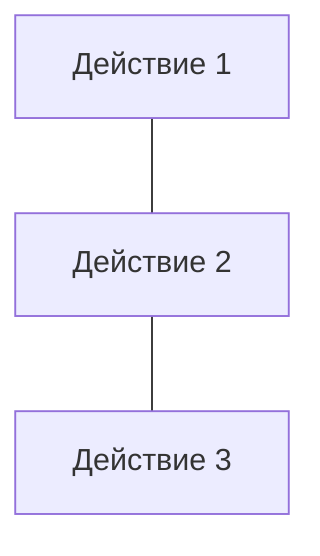

# Вопросы к экзамену

- [1. Понятие алгоритма. Свойства алгоритмов.](#1-понятие-алгоритма-свойства-алгоритмов)
- [2. Способы описания алгоритмов: словесно-формульный, графический, на алгоритмическом языке.](#2-способы-описания-алгоритмов-словесно-формульный-графический-на-алгоритмическом-языке)
  - [Словесный способ](#словесный-способ)
  - [Формульно-словесный способ](#формульно-словесный-способ)
  - [Табличный способ](#табличный-способ)
  - [Графический способ](#графический-способ)
  - [Программный способ (текстовая запись)](#программный-способ-текстовая-запись)
  - [О взаимодополнении способов представления](#о-взаимодополнении-способов-представления)
- [3. Графический способ описания.](#3-графический-способ-описания)
  - [Главные элементы блок-схем алгоритмов](#главные-элементы-блок-схем-алгоритмов)
  - [Общие требования к блок-схеме](#общие-требования-к-блок-схеме)
  - [Решение алгоритма сортировки пузырьком](#решение-алгоритма-сортировки-пузырьком)
- [4. Базовые структуры алгоритмов. Виды алгоритмов](#4-базовые-структуры-алгоритмов-виды-алгоритмов)
- [5. Виды алгоритмов: линейный, разветвляющийся, циклический.](#5-виды-алгоритмов-линейный-разветвляющийся-циклический)
  - [Последовательный (линейный) алгоритм](#последовательный-линейный-алгоритм)
  - [Разветвляющиеся алгоритмы](#разветвляющиеся-алгоритмы)
  - [Циклические алгоритмы](#циклические-алгоритмы)
- [6. Принципы алгоритмизации.](#6-принципы-алгоритмизации)
  - [Этапы решения задач на ЭВМ](#этапы-решения-задач-на-эвм)
    - [I этап: Постановка задачи и её содержательный анализ](#i-этап-постановка-задачи-и-её-содержательный-анализ)
    - [II этап: Математическая формализация](#ii-этап-математическая-формализация)
    - [III этап: Алгоритмизация (построение алгоритма)](#iii-этап-алгоритмизация-построение-алгоритма)
    - [IV этап: Программирование](#iv-этап-программирование)
    - [V этап: Отладка и тестирование программы](#v-этап-отладка-и-тестирование-программы)
    - [VI этап: Проведение расчетов и анализ результатов](#vi-этап-проведение-расчетов-и-анализ-результатов)
  - [Распределение общего времени между этапами, необходимое для разработки сложных программ](#распределение-общего-времени-между-этапами-необходимое-для-разработки-сложных-программ)
  - [Общие рекомендации](#общие-рекомендации)
  - [Принципы алгоритмизации](#принципы-алгоритмизации)
  - [Принципы, лежащие в основе создания эффективных алгоритмов](#принципы-лежащие-в-основе-создания-эффективных-алгоритмов)
- [7. Разветвляющийся алгоритм. Методика составления разветвляющихся алгоритмов.](#7-разветвляющийся-алгоритм-методика-составления-разветвляющихся-алгоритмов)
  - [Разветвляющиеся алгоритмы со сложным условием. Методика составления разветвляющихся алгоритмов со сложным условием](#разветвляющиеся-алгоритмы-со-сложным-условием-методика-составления-разветвляющихся-алгоритмов-со-сложным-условием)
- [8. Циклический алгоритм. Методика составления циклических алгоритмов.](#8-циклический-алгоритм-методика-составления-циклических-алгоритмов)
- [9. Отладка и тестирование алгоритмов.](#9-отладка-и-тестирование-алгоритмов)
- [10. Структура программы на языке С#.](#10-структура-программы-на-языке-с)
- [11. Основные элементы языка С#: переменные, константы, алфавит, идентификаторы, ключевые слова, выражения, операторы.](#11-основные-элементы-языка-с-переменные-константы-алфавит-идентификаторы-ключевые-слова-выражения-операторы)
  - [Состав языка](#состав-языка)
  - [Операторы языка C#](#операторы-языка-c)
  - [Операторы следования](#операторы-следования)
  - [Операторы ветвления](#операторы-ветвления)
  - [Операторы цикла](#операторы-цикла)
  - [Операторы безусловного перехода](#операторы-безусловного-перехода)
- [12. Основные типы данных языка С#.](#12-основные-типы-данных-языка-с)
  - [Базовые типы](#базовые-типы)
- [13. Объявление переменных и констант в языке С#. Инициализация переменных.](#13-объявление-переменных-и-констант-в-языке-с-инициализация-переменных)
- [14. Операции и выражения в языке С#: арифметические, логические выражения. Основные математические функции.](#14-операции-и-выражения-в-языке-с-арифметические-логические-выражения-основные-математические-функции)
  - [Операции](#операции)
  - [Приоритет операций](#приоритет-операций)
  - [Выражения и преобразование типов](#выражения-и-преобразование-типов)
  - [Основные математические функции](#основные-математические-функции)
- [15. Функция ввода.](#15-функция-ввода)
- [16. Функции вывода.](#16-функции-вывода)
- [17. Условный оператор в языке С#.](#17-условный-оператор-в-языке-с)
- [18. Оператор выбора в языке С#.](#18-оператор-выбора-в-языке-с)
- [19. Циклические операторы в языке С#: цикл с предусловием, цикл с постусловием, цикл с параметром.](#19-циклические-операторы-в-языке-с-цикл-с-предусловием-цикл-с-постусловием-цикл-с-параметром)
  - [Цикл с предусловием `while`](#цикл-с-предусловием-while)
  - [Цикл с постусловием `do while`](#цикл-с-постусловием-do-while)
  - [Цикл с параметром `for`](#цикл-с-параметром-for)
  - [Вложенные циклы](#вложенные-циклы)
- [20. Операторы передачи управления `break` и `continue`.](#20-операторы-передачи-управления-break-и-continue)
  - [Оператор безусловного перехода `goto`](#оператор-безусловного-перехода-goto)
  - [Оператор выхода `break`](#оператор-выхода-break)
  - [Оператор перехода к следующей итерации цикла `continue`](#оператор-перехода-к-следующей-итерации-цикла-continue)
  - [Обработка исключений](#обработка-исключений)
    - [Оператор `try`](#оператор-try)
    - [Операторы `checked` и `unchecked`](#операторы-checked-и-unchecked)
    - [Генерация собственных исключений](#генерация-собственных-исключений)
- [21. Методы в С#](#21-методы-в-с)
  - [Основные понятия](#основные-понятия)
  - [Перегрузка методов](#перегрузка-методов)
- [22. Понятие массива. Объявление и инициализация одномерного массива в языке С#.](#22-понятие-массива-объявление-и-инициализация-одномерного-массива-в-языке-с)
  - [Одномерные массивы](#одномерные-массивы)
  - [Массивы и исключения](#массивы-и-исключения)
  - [Массив как параметр](#массив-как-параметр)
  - [Массив как объект](#массив-как-объект)
- [23. Понятие массива. Объявление и инициализация многомерного массива в языке С#.](#23-понятие-массива-объявление-и-инициализация-многомерного-массива-в-языке-с)
  - [Многомерные массивы](#многомерные-массивы)
  - [Ступенчатые массивы](#ступенчатые-массивы)
  - [Оператор `foreach` и его использование при работе с массивами](#оператор-foreach-и-его-использование-при-работе-с-массивами)
- [24. Строки в языке С#. Функции для работы со строками.](#24-строки-в-языке-с-функции-для-работы-со-строками)
- [26. Рекурсивные функции.](#26-рекурсивные-функции)

1. Понятие алгоритма. Свойства алгоритмов.
2. Способы описания алгоритмов: словесно-формульный, графический, на алгоритмическом языке.
3. Графический способ описания.
4. Базовые структуры алгоритмов. Виды алгоритмов
5. Виды алгоритмов: линейный, разветвляющийся, циклический.
6. Принципы алгоритмизации.
7. Разветвляющийся алгоритм. Методика составления разветвляющихся алгоритмов.
8. Циклический алгоритм. Методика составления циклических алгоритмов.
9.  Отладка и тестирование алгоритмов.
10. Структура программы на языке С#.
11. Основные элементы языка С#: переменные, константы, алфавит, идентификаторы, ключевые слова, выражения, операторы.
12. Основные типы данных языка С#.
13. Объявление переменных и констант в языке С#. Инициализация переменных.
14. Операции и выражения в языке С#: арифметические, логические выражения. Основные математические функции.
15. Функция ввода.
16. Функции вывода.
17. Условный оператор в языке С#.
18. Оператор выбора в языке С#.
19. Циклические операторы в языке С#: цикл с предусловием, цикл с постусловием, цикл с параметром.
20. Операторы передачи управления break и continue.
21. Методы в С#
22. Понятие массива. Объявление и инициализация одномерного массива в языке С#.
23. Понятие массива. Объявление и инициализация многомерного массива в языке С#.
24. Строки в языке С#. Функции для работы со строками.
25. Функции в языке С#. Структура функции. Вызов функции. Прототип функции.
26. Рекурсивные функции.
27. Область видимости переменных. Локальные и глобальные переменные. Статические и динамические переменные
28. Ввод/вывод в С#.  Форматированный ввод/вывод в С#.
29. Файловый ввод/вывод в С#. Функции для работы с файлами.
30. Структуры в языке С#. Определение и инициализация структуры. Создание экземпляра структуры.
31. Базовые понятия ООП: объект, его свойства и методы, класс. Основные принципы ООП: инкапсуляция, наследование, полиморфизм.
32. Классы в С#.

## 1. Понятие алгоритма. Свойства алгоритмов.

**Алгоритм** – это система последовательных операций (в соответствии с определёнными правилами) для решения поставленной задачи, понятное и точное предписание (указание) исполнителю совершить последовательность действий, направленных на достижение указанной цели или на решение поставленной задачи.

Исполнитель выполняет алгоритм **формально**.

**Система команд исполнителя** (**СКИ**) — совокупность команд, которые данный исполнитель умеет выполнять. Совокупность всех действий, которые исполнитель может выполнить в ответ на эти команды, называется **системой допустимых действий** Исполнителя.

**Свойства алгоритма**

1. Дискретность
2. Понятность (единственность толкования)
3. Определённость (детерминированность — обязательное завершение каждого из действий)
4. Конечность (результативность)
5. Выполнимость (эффективность)
6. Массовость (универсальность — возможность применения для целого класса задач)
7. Однозначность

## 2. Способы описания алгоритмов: словесно-формульный, графический, на алгоритмическом языке.
https://otus.ru/nest/post/1769/

**Алгоритмом** (algorithm) называют чёткое описание последовательности действий, направленных на решение конкретной задачи.

Способы описания алгоритмов:

- словесный (вербальный);
- графический (блок-схемы);
- математический (формулами);
- алгоритмические языки (программа).

### Словесный способ
Словесное описание алгоритма предполагает наличие некого словесного перечня действий. Пример: вам говорят что-то типа следующего: «Вычислите Z при условии, что Z = X + Y, когда X равен 0,89, а Y равен 1,286. Полученное значение Z следует возвести в куб и вычислить корень».

У такого способа есть недостаток: отсутствие наглядности выполнения процесса и чёткой формализации объектов алгоритма.

### Формульно-словесный способ
При использовании формульно-словесного способа инструкции задаются более чётко. Этот тот случай, когда словесные пояснения сопровождаются перечнем конкретных действий, плюс эти пояснения характеризуются наличием формальных символов и выражений (формул).

Для примера составим **формульно-словесный алгоритм** вычисления выражения: $z=2 \cdot x–(y+6)$:
- вводим значения $x$ и $y$;
- находим сумму ($y+6$);
- находим произведение ($2 \cdot x$);
- вычисляем $z$ как разность уже полученных выше значений: $z=2 \cdot x–(y+6)$;
- выводим $z$ как результат вычисления выражения.

Это более компактный и лаконичный метод, он нагляднее, но всё же строго формальным не является.

### Табличный способ
В случае применения табличного метода алгоритм задаётся в виде входных данных: расчётных форм и таблиц. Способ широко применяется в экономических расчетах. Исходные данные, как и результаты, заносятся в заголовки столбцов используемой таблицы. Простейший пример такого способа представления — та же таблица умножения.

### Графический способ
Этот метод ещё называют **способом блок-схем**. В данной ситуации каждый этап прохождения алгоритма представляется в виде геометрических фигур — так называемых «блоков», причём конкретная форма фигур зависит от выполняемой операции. Существует стандарт, регламентирующий размеры используемых графических блоков, а также их отображение, функции, формы и взаимное расположение. Направление работы алгоритма показывают линии соединения блоков.

Другое название способа — **визуальное представление**. При проектировании алгоритмов, представленных графически, придерживаются ряда правил:
- в начале алгоритма располагаются блоки ввода значений (входные данные);
- после ввода значений располагаются блоки обработки и блоки условия;
- алгоритм завершается блоками вывода значений, полученных в результате работы алгоритма (выходные данные);
- должен быть лишь один блок начала и один — окончания;
- межблочная связь указывается линиями (направленными либо ненаправленными);
- вычислительные формулы, данные и логические выражения размещаются внутри соответствующих блоков;
- возможно наличие комментариев в виде выносок.


Графический способ представления имеет практическое значение и используется не только в случае программирования. Его применяют при составлении информационных и структурных схем, инфографики и в иных ситуациях, когда нужно обеспечить чёткую визуализацию данных и графически отобразить последовательность расположения объектов алгоритма.

Создание блок-схемы алгоритма — важный и нужный этап решения поставленной задачи. Но при некоторых обстоятельствах этот этап можно считать промежуточным, так как в таком виде описанный алгоритм невозможно выполнить средствами ЭВМ. Зато графический способ представления значительно облегчает процесс дальнейшего создания компьютерной программы. О ней ниже.

### Программный способ (текстовая запись)
Программа представляет собой алгоритм, который записан как последовательность команд. Речь идёт о командах, понятных компьютеру, для чего используются различные языки программирования, представляющие собой системы кодирования предписаний с правилами их применения. Языки программирования характеризуются строго определённым синтаксисом, то есть свободное толкование конструкций не допускается.

В случае программного способа представления алгоритмическая последовательность записывается в виде компьютерной программы с высокой степенью формализации. В результате появляется возможность решать прикладные задачи.

### О взаимодополнении способов представления
Способы, представленные выше, нередко являются взаимодополняемыми:
- на этапе обсуждения используются словесные и словесно-формульные способы;
- на этапе проектирования рекомендуется использовать графические алгоритмы (графическое представление);
- на этапе проверки возможно табличное описание;
- на этапе непосредственного применения и решения прикладных задач используют текстовую запись, представленную в виде компьютерной программы.

## 3. Графический способ описания.
https://otus.ru/nest/post/1778/

**Блок-схема** — графическое изображение структуры алгоритма, в котором каждый этап процесса переработки данных представляется в виде геометрических фигур (блоков), имеющих определенную конфигурацию в зависимости от характера выполняемых при этом операций.

Существуют правила, единые обозначения и стандарты, регламентирующие применение визуального отображения схем алгоритмов. В России это ГОСТ 19.701-90 «Схемы алгоритмов программ, данных и систем», который близок к международному стандарту ISO 5807:1985.

### Главные элементы блок-схем алгоритмов
Прежде чем продолжить, стоит дать определение **блок-схемы** в соответствии со стандартом — речь идёт о совокупности символов, которые отвечают этапам работы алгоритма, причём эти символы имеют соединяющие линии:
- **пунктирную** — для соединения с комментарием;
- **сплошную** — отображает зависимости по управлению, допускается наличие на ней стрелки.

В соответствии со стандартом составитель может не указывать стрелку, если дуга направляется сверху вниз или слева направо.

Также существуют и дополнительные виды линий, которые применяются, когда надо дать описание блок-схемам параллельных алгоритмов, однако в этой статье мы их рассматривать не будем, как и ряд других дополнительных спецсимволов.

В таблице ниже дан перечень основных символов, используемых при описании алгоритмов:


### Общие требования к блок-схеме

https://prohor-off.ru/pascal/pascal2.html#:~:text=%D0%A2%D0%B8%D0%BF%D1%8B%20%D0%B0%D0%BB%D0%B3%D0%BE%D1%80%D0%B8%D1%82%D0%BC%D0%BE%D0%B2.,%D0%B8%20%D0%B8%D0%BC%D0%B5%D0%B5%D1%82%20%D0%BD%D0%B5%D1%81%D0%BA%D0%BE%D0%BB%D1%8C%D0%BA%D0%BE%20%D0%B2%D0%B5%D1%82%D0%B2%D0%B5%D0%B9%20%D0%BE%D0%B1%D1%80%D0%B0%D0%B1%D0%BE%D1%82%D0%BA%D0%B8.

- Стрелки в блок—схемах указываются только справа — налево и снизу — вверх.
- Блоки рисуются карандашом по линейке, текст пишется ручкой.
- Ширина всех блоков должна быть одинакова (блоки должны располагаться друг под другом).
- Все блоки алгоритма нумеруются.

### Решение алгоритма сортировки пузырьком
В этом примере давайте попробуем дать описание решению алгоритма сортировки по методу пузырьком (метод сортировки вставками). Здесь применяются 2 цикла. Во вложенном цикле осуществляется попарное сравнение элементов. Если нарушается порядок, происходит перестановка. По итогу выполнения одной итерации во внутреннем цикле, наибольший элемент будет смещён в самый конец массива. Внешний цикл будет выполняться, пока полностью весь массив не отсортируется.


На схеме отображено применение символов конца и начала цикла. Здесь условие внешнего цикла (`А`) проверяется в конце (с постусловием), а функционирует он до тех пор, пока переменная `hasSwapped` является `true`. Во внутреннем цикле используется предусловие для перебора пар элементов, которые сравниваются. Если они располагаются в неправильном порядке, они переставляются путём вызова внешней процедуры (`swap`). Для понимания назначения внешней процедуры, как и порядка следования аргументов этой процедуры, нужно оставлять комментарии. Если функция возвращает значение, то комментарий можно написать к символу-терминатору конца.

## 4. Базовые структуры алгоритмов. Виды алгоритмов

В 1969 году нидерландский ученый Эдсгер Дийкстра доказал важную теорему. Суть ее в том, что для решения любой логической задачи можно составить алгоритм, используя лишь три алгоритмических структуры: *следование*, *ветвление* и *повторение*. Эти структуры называют **базовыми**. В соответствии с этим различают три основных типа структур алгоритма:

- линейный (следование);
- альтернативный (разветвление);
- циклический (повторение, итерация).

Соответственно этим структурам выделяют следующие виды алгоритмов (по ходу выполнения):

- последовательный;
- разветвлённый;
- циклический.

Самой простой структурой является **«следование**».

Алгоритм реализован через последовательную алгоритмическую структуру, если все команды этого алгоритма выполняются один раз, причем в том порядке, в котором они записаны.

Алгоритм, основанный на конструкции «следование» называется **линейным алгоритмом**. Примером такого алгоритма может служить алгоритм вычисления дискриминанта квадратного уравнения, блок-схема которого приведена на рисунке 1.


**Рис. 1**

Следующей конструкцией является **«ветвление»**. Она встречается, если действия алгоритма зависят от некоторого условия.

Алгоритм реализован через алгоритмическую конструкцию «ветвление», если от входных данных зависит, какие команды будут выполняться. Условие, которое выражает эту зависимость, фактически является вопросом, на который можно ответить либо «да», либо «нет».

Существуют полная и неполная формы ветвления.

В полной форме если условие выполняется, то алгоритм переходит к выполнению первой серии команд, а если не выполняется — то ко второй.

В неполной форме алгоритм выполняет серию команд только если условие истинно. В противном случае ничего не происходит.

Алгоритм, основанный на конструкции «ветвление» называется **разветвляющимся алгоритмом**. Примером такого алгоритма может служить алгоритм нахождения корней квадратного уравнения, блок-схема которого приведена на рисунке 2.


**Рис. 2**

И, наконец, последняя алгоритмическая конструкция — «**повторение**».

Алгоритм реализован с использованием алгоритмической конструкции «повторение», если некая группа подряд идущих шагов алгоритма (она называется телом цикла) может выполняться многократно в зависимости от входных данных.

Алгоритм, содержащий конструкцию «повторение» называется **циклическим алгоритмом**.

Существует несколько разновидностей циклических алгоритмов.

Первый — **цикл с заданным условием продолжения работы** (цикл с предусловием или цикл-пока).

Второй — **цикл с заданным условием окончания работы** (цикл с постусловием или цикл-до).

И третий — **цикл с заданным числом повторений** (цикл с параметром).


Доказано, что при решении задач можно ограничиться только одним циклом — циклом с предусловием. Но в ряде случаев цикл с постусловием или цикл с параметром делают решение задачи легче.

Примером решения одной и той же задачи с помощью различных циклов может служить задача возведения некоторого числа $a$ в натуральную степень $n$.


## 5. Виды алгоритмов: линейный, разветвляющийся, циклический.

Алгоритмы бывают трёх типов:

- **последовательный** — действия выполняются по порядку друг за другом;
- **циклический** — организовывает повторение действий;
- **разветвляющийся** — содержит одно или несколько логических условий и имеет несколько ветвей обработки. Разветвление даёт возможность выбора варианта действий в зависимости от результатов анализа исходных условий.

### Последовательный (линейный) алгоритм

Самой простой структурой является **«следование**». Простейшие задачи имеют **линейный алгоритм** решения (имееют структуру"следование").

Алгоритм реализован через последовательную алгоритмическую структуру, если все команды этого алгоритма выполняются один раз, причем в том порядке, в котором они записаны. Алгоритм линейной структуры представляет собой последовательность действий и не содержит каких-либо *условий*.

<div style="background-color: white">


</div>

Алгоритм, основанный на конструкции «следование» называется **линейным алгоритмом**. Примером такого алгоритма может служить алгоритм вычисления дискриминанта квадратного уравнения, блок-схема которого приведена на рисунке 1.


**Рис. 1**

Таким образом, в таких алгоритмах все этапы решения задачи выполняются строго последовательно, т.е. линейные алгоритмы выполняются в естественном порядке его написания и не содержит разветвлений и повторений.



На практике линейные алгоритмы в чистом виде встречаются редко: при расчете арифметических и алгебраических выражений, при расчете по формулам, при решении ряда бытовых задач.

Существует несколько способов решения систем линейных уравнений, которые в основном делятся на два типа:
1) точные методы, представляющие собой конечные алгоритмы для вычисления корней системы,
2) итерационные методы, позволяющие получать корни системы с заданной точностью путем сходящихся бесконечных процессов.

### Разветвляющиеся алгоритмы

<div style="background-color: white">

| Условный оператор `IF` (полная запись) | Условный оператор `IF` (краткая запись) | Оператор выбора `CASE` |
-- | -- | --
 |  | 

</div>

Следующей конструкцией является **«ветвление»**. Она встречается, если действия алгоритма зависят от некоторого условия.

Алгоритм реализован через алгоритмическую конструкцию «ветвление», если от входных данных зависит, какие команды будут выполняться. Условие, которое выражает эту зависимость, фактически является вопросом, на который можно ответить либо «да», либо «нет».

Существуют полная и неполная формы ветвления.

В полной форме если условие выполняется, то алгоритм переходит к выполнению первой серии команд, а если не выполняется — то ко второй.

В неполной форме алгоритм выполняет серию команд только если условие истинно. В противном случае ничего не происходит.

Алгоритм, основанный на конструкции «ветвление» называется **разветвляющимся алгоритмом**. Примером такого алгоритма может служить алгоритм нахождения корней квадратного уравнения, блок-схема которого приведена на рисунке 2.


### Циклические алгоритмы

<div style="background-color: white">

| Безусловный оператор цикла `FOR` | Условный оператор цикла с предусловием `WHILE` | Условный оператор цикла с постусловием `REPEAT` |
-- | -- | --
 |  | 

</div>

И, наконец, последняя алгоритмическая конструкция — «**повторение**».

Алгоритм реализован с использованием алгоритмической конструкции «повторение», если некая группа подряд идущих шагов алгоритма (она называется телом цикла) может выполняться многократно в зависимости от входных данных.

Алгоритм, содержащий конструкцию «повторение» называется **циклическим алгоритмом**.

Существует несколько разновидностей циклических алгоритмов.

Первый — **цикл с заданным условием продолжения работы** (цикл с предусловием или цикл-пока).

Второй — **цикл с заданным условием окончания работы** (цикл с постусловием или цикл-до).

И третий — **цикл с заданным числом повторений** (цикл с параметром).


Доказано, что при решении задач можно ограничиться только одним циклом — циклом с предусловием. Но в ряде случаев цикл с постусловием или цикл с параметром делают решение задачи легче.

Примером решения одной и той же задачи с помощью различных циклов может служить задача возведения некоторого числа $a$ в натуральную степень $n$.


## 6. Принципы алгоритмизации.

### Этапы решения задач на ЭВМ

| | | |
-- | -- | --
| 1. | Постановка задачи. | Работа без ЭВМ
| 2. | Математическая формализация. | Работа без ЭВМ
| 3. | Алгоритмизация. | Работа без ЭВМ
| 4. | Программирование | Работа на ЭВМ
| 5. | Отладка и тестирование программы | Работа на ЭВМ
| 6. | Проведение расчетов и анализ результатов |

#### I этап: Постановка задачи и её содержательный анализ

① Формируется условие задачи:

1. Что дано? (Анализ исходных данных) → **аргументы**
2. Что необходимо определить? → **результат**
3. Какие данные допустимы и в каких единицах измерения?
4. Какие результаты и в каком виде должны быть получены?

② Всем величинам присвоить имена.

#### II этап: Математическая формализация

Реально существующие объекты, предметы, явления заменяются математическими формулами.

#### III этап: Алгоритмизация (построение алгоритма)

При разработке алгоритма решения сложной задачи следует использовать метод структурного подхода:

1. Алгоритм собирается из 3-х основных базовых структур.
2. Разработка алгоритма «сверху вниз».
3. Сквозной структурный контроль.

**Сквозной структурный контроль** представляет собой совокупность технологических операций контроля, позволяющих обеспечить как можно более раннее обнаружение ошибок в процессе разработки. Термин «сквозной» в названии отражает выполнение контроля на всех этапах разработки. Термин «структурный» означает наличие четких рекомендаций по выполнению контролирующих операций на каждом этапе.

Сквозной структурный контроль должен выполняться на специальных контрольных сессиях, в которых, помимо разработчиков, могут участвовать специально приглашенные эксперты. Одна из первых сессий должна быть организована на этапе определения спецификаций. На этой сессии проверяют полноту и точность спецификаций, при этом целесообразно присутствие заказчика или специалиста по предметной области, которые смогут определить, насколько правильно и полно определены спецификации программного обеспечения.

На этапе проектирования вручную по частям проверяют алгоритмы разрабатываемого программного обеспечения на конкретных наборах данных и сверяют полученные результаты с соответствующими спецификациями. Основная задача – убедиться в правильности понимания спецификаций и проанализировать достоинства и недостатки концептуальных решений, закладываемых в проект.

На этапе реализации проверяют план (последовательность) реализации модулей, набор тестов, а также тексты отдельных модулей.

Для всех этапов целесообразно иметь списки наиболее часто встречающихся ошибок, которые формируют по литературным источникам и исходя из опыта предыдущих разработок. Такие списки позволяют сконцентрировать усилия на конкретных моментах, а не проверять все подряд. При этом все найденные ошибки фиксируют в специальном документе, но не исправляют их (более подробно см. §9.2).

Помимо раннего обнаружения ошибок, сквозной структурный контроль обеспечивает своевременную подготовку качественной документации по проекту.

https://studfile.net/preview/2007545/page:17/

#### IV этап: Программирование

- выбор языка программирования;
- запись алгоритма на выбранном языке программирования.

#### V этап: Отладка и тестирование программы

Ошибки программы:

- синтаксические;
- логические.

**Тест** – набор исходных данных, для которых заранее известен результат.

#### VI этап: Проведение расчетов и анализ результатов

Производится расчет программы (выполнение на ЭВМ).

После выполнения программы необходимо провести обработку и осмысление результатов.

### Распределение общего времени между этапами, необходимое для разработки сложных программ


### Общие рекомендации

1. Необходимо создать программу универсальной.
2. Вместо констант лучше использовать переменные.
3. Программа должна иметь комментарии.

### Принципы алгоритмизации
https://studfile.net/preview/9012806/page:3/

На сегодняшний день самой популярной методикой программирования является **структурное программирование** "сверху – вниз". Эта технология программирования представляет собой процесс пошагового разбиения алгоритма на все более мелкие части с целью получить такие элементы, для которых можно легко написать конкретные предписания.

Структурная алгоритмизация основывается на двух принципах:

1) последовательная детализация "сверху - вниз";

2) ограниченность базового набора структур для построения алгоритмов любой степени сложности.

Из принципов вытекают требования структурного программирования:

1) программа должна составляться мелкими шагами, таким образом, сложная задача разбивается на достаточно простые, легко воспринимаемые части;

2) логика программы должна опираться на минимальное число достаточно простых базовых управляющих структур.

Базовый набор структурной алгоритмизации содержит линейные, разветвляющиеся и циклические структуры.

Можно перечислить основные свойства и достоинства структурного программирования:

1) возможность преодоления барьера сложности программ;

2) возможность демонстрации правильности программ на различных этапах решения задачи;

3) наглядность программ;

4) простота модификации программ.

### Принципы, лежащие в основе создания эффективных алгоритмов
https://studfile.net/preview/9012806/page:3/

Разработке алгоритма предшествуют такие этапы, как **формализация и моделирование** задачи. **Формализация** предполагает замену словесной формулировки решаемой задачи краткими символьными обозначениями, близкими к обозначениям в языках программирования или к математическим. **Моделирование** задачи является важнейшим этапом, целью которого является поиск общей концепции решения. Обычно моделирование выполняется путем выдвижения гипотез решения задачи и их проверке любым рациональным способом (прикидочные расчеты, физическое моделирование и т.д.). Результатом каждой проверки является либо принятие гипотезы, либо отказ от нее и разработка новой.

При разработке алгоритма используют следующие основные принципы.

1. **Принцип поэтапной детализации алгоритма** (другое название — "проектирование сверху-вниз"). Этот принцип предполагает первоначальную разработку алгоритма в виде укрупненных блоков (разбиение задачи на подзадачи) и их постепенную детализацию.

2. **Принцип "от главного к второстепенному"**, предполагающий составление алгоритма, начиная с главной конструкции. При этом, часто, приходится "достраивать" алгоритм в обратную сторону, например, от середины к началу.

3. **Принцип структурирования**, т.е. использования только типовых алгоритмических структур при построении алгоритма. Нетиповой структурой считается, например, циклическая конструкция, содержащая в теле цикла дополнительные выходы из цикла. В программировании нетиповые структуры появляются в результате злоупотребления командой безусловного перехода (GoTo). При этом программа хуже читается и труднее отлаживается.

## 7. Разветвляющийся алгоритм. Методика составления разветвляющихся алгоритмов.
**Разветвляющийся алгоритм** – это такой алгоритм, в котором в зависимости от выполнения некоторого условия совершается либо одна, либо другая последовательность действий.

В таких алгоритмах делается выбор: выполнять или не выполнять какую-нибудь группу команд в зависимости от условия, т.е. выбирается один из нескольких возможных путей (вариантов) вычислительного процесса. Каждый подобный путь называется **ветвью алгоритма**.

Для изображения разветвляющегося алгоритма используется ветвление, при котором выполнение программы идет по одной из двух, нескольких или множества ветвей. Выбор ветви зависит от условия на входе ветвления и поступивших сюда данных.

Признаком разветвляющегося алгоритма является наличие операций условного перехода, когда происходит проверка истинности некоторого логического выражения (проверяемое условие) и в зависимости от истинности или ложности проверяемого условия для выполнения выбирается та или иная ветвь алгоритма.

**Логическое выражение** – такое выражение, результатом вычисления которого является «истина» или «ложь».

В логических выражениях используется операция сравнения: `<` (меньше), `>` (больше), `<=` (меньше или равно), `>=` (больше или равно), `=` (равно), `<>` (не равно). Часто встречаются задачи, в которых используются не отдельные условия, а совокупность связанных между собой условий (отношений). Для связи используются `AND` и (или) `OR`.

**Полная форма** ветвления предусматривает организацию выполнения двух разных наборов команд, из которых выполняется только один. В **сокращенной форме** один из наборов команд (чаще по ответу «Нет») опускается. В этом случае, если условие ложное, то никакие действия не выполняются.


Алгоритм предполагает выполнение *Действия 1*, если записанное условие истинно (выполняется), и выполнение *Действия 2*, если условие ложно (не выполняется) – это полная развилка.


Если в алгоритме отсутствует Действие 2, т.е. если записанное условие истинно, то выполняется Действие 1, а если условие ложно, то никаких действий не выполняется – это не полная развилка.

### Разветвляющиеся алгоритмы со сложным условием. Методика составления разветвляющихся алгоритмов со сложным условием
Признаком является наличие операций проверки условий. Сложное условие или составное состоит из двух простых условий, связанных логическими операциями (не, и или).

## 8. Циклический алгоритм. Методика составления циклических алгоритмов.
https://studfile.net/preview/9012806/page:5/

Алгоритм реализован с использованием алгоритмической конструкции «повторение», если некая группа подряд идущих шагов алгоритма (она называется телом цикла) может выполняться многократно в зависимости от входных данных.

Алгоритм, содержащий конструкцию «повторение» называется **циклическим алгоритмом**.

Циклические алгоритмы являются наиболее распространенным видом алгоритмов, в них предусматривается повторное выполнение определенного набора действий при выполнении некоторого условия. Такое повторное выполнение часто называют **циклом**.

Существуют два основных видов циклических алгоритмов: циклические алгоритмы с **предусловием**, циклические алгоритмы с **постусловием**. Они отличаются друг от друга местоположением условия выхода их цикла.

**Цикл с предусловием** начинается с проверки условия выхода из цикла. Это логическое выражение, например $I<=6$. Если оно истинно, то выполняются те действия, которые должны повторяться. В противном случае, если логическое выражение $I<=6$ ложно, то этот цикл прекращает свои действия.

**Цикл с постусловием** функционирует иначе. Сначала выполняется один раз те действия, которые подлежат повторению, затем проверяется логическое выражение, определяющее условие выхода из цикла, например, $I>6$. Проверка его осуществляется тоже по-другому. Если условие выхода истинно, то цикл с постусловием прекращает свою работу, в противном случае происходит повторение действий, указанных в цикле. Повторяющиеся действия в цикле называются "**телом цикла**".

Разновидности циклических алгоритмов:
- **цикл с заданным условием продолжения работы** (цикл с предусловием или цикл-пока);
- **цикл с заданным условием окончания работы** (цикл с постусловием или цикл-до);
- **цикл с заданным числом повторений** (цикл с параметром).


Доказано, что при решении задач можно ограничиться только одним циклом — циклом с предусловием. Но в ряде случаев цикл с постусловием или цикл с параметром делают решение задачи легче.

Примером решения одной и той же задачи с помощью различных циклов может служить задача возведения некоторого числа $a$ в натуральную степень $n$.


## 9. Отладка и тестирование алгоритмов.
https://studfile.net/preview/9012806/page:4/

**Отладка алгоритма** – это процесс выявления и исправления ошибок в нём. Суть отладки алгоритма в том, что выбирается некоторый набор исходных данных, называемый *тестовым набором* (*тестом*), и задача с этим набором решается дважды: один раз — исполнением алгоритма, второй раз — каким-либо иным способом, исходя из условия задачи (например, вручную). При совпадении результатов алгоритм считается верным.

**Задачи отладки**. При всех методах отладки алгоритмов система отладки с той или иной степенью автоматизации должна решать следующие задачи:
- обнаруживать наличие ошибок;
- проводить диагностику и локализацию ошибок;
- устранять ошибки и корректировать алгоритмы и программы, а также соответствующую документацию;
- информировать оператора о ходе, вычислений, переменных величинах и передачах управления в отлаживаемых алгоритмах и программах.

Самыми сложными среди перечисленных являются задачи обнаружения, диагностики и локализации ошибок.

**Тест** – набор исходных данных, для которых заранее известен результат.

**Тестирование** – это проверка в процессе эксперимента соответствия (*конформности*) реализации требованиям, заданным в виде спецификации. Тестирование **полное**, если оно однозначно отвечает на вопрос: есть в реализации ошибки или нет, где под ошибкой понимается нарушение требований, то есть *неконформность*.

Набор тестов называется **значимым**, если каждая конформная реализация его проходит; **исчерпывающий**, если каждая неконформная реализация его не проходит; **полный**, если он значимый и исчерпывающий.

**Избыточное тестирование** — тестирование алгоритма со всеми возможными комбинациями всех возможных входных данных во всех возможных условиях выполнения.

Тестирование алгоритма позволяет выявить логические ошибки построения алгоритма. Подобные ошибки можно обнаружить при тестировании алгоритма на большом количестве различных тестовых наборов данных, так как далеко не при каждом сочетании входных данных логические ошибки построения алгоритма дают о себе знать. Следовательно, эффективное проектирование текстовых наборов данных - задача достаточно сложная.

**Структурное тестирование** основывается на детальном изучении логики алгоритма и подборе тестов, позволяющих обеспечить максимально возможное количество проверяемых операторов, логических ветвлений и условий.

При использовании структурного тестирования для построения тестовых наборов данных возможно использование следующих критериев:

1) набор данных должен обеспечивать выполнение каждого оператора, по крайней мере, один раз;

2) тестовые наборы данных в узлах ветвления с более чем одним условием должны обеспечивать принятие каждым условием значения истина или ложь хотя бы по одному разу;

3) тестовые наборы данных в узлах ветвления с более чем одним условием должны обеспечивать перебор всех возможных сочетаний значений условий в одном узле ветвления.

## 10. Структура программы на языке С#.
http://plssite.ru/csharpquick/qcsprogramstructure

Структура заготовки проекта
```c#
//Подключение пространства имен
using System;
using System.Collections.Generic;
using System.Linq; //можно удалить
using System.Text;

//Объявление пространства имен
namespace ConsoleApplication1
{
  //Объявление класса
  class Program
  {
    //Главный метод программы
    static void Main(string[] args)
    {
      //здесь размещается основной текст программы

      //Вывод строки
      Console.WriteLine("Hello World!");
      //Вспомогательный оператор
      Console.ReadKey();
    }
  }
}
```

Первая строка данной программы, это комментарий. Комментарии никак не влияют на работу программы, они нужны для человека, который будет сопровождать код программы (дорабатывать её, исправлять ошибки и т.п.). Комментарии в C# начинаются с символов «`//`» (две косые черты, два слэша), и действуют только до конца строки.

Вторая строка программы (`using System;`) является оператором, который подключает стандартное пространство имен `System`. По сути, мы получаем доступ к набору классов  имеющихся в «контейнере» `System`.  Как видно, данная строка состоит из двух слов, первое (ключевое слово `using`) означает, что мы хотим подключить пространство имен, а второе `System` — название нужного пространства имен.

> В конце второй строки стоит символ «`;`», который обозначает завершение оператора. Каждый оператор программы должен заканчиваться таким символом.

Далее объявляется своё пространство имен (`namespace ConsoleApplication1`), оно называется «ConsoleApplication1». Пространство имен является своего рода контейнером, и оно ограничивается фигурными скобками (открывающей и закрывающей), следующими за его названием. Таким образом, все что находится между этими скобками, принадлежит пространству имен `ConsoleApplication`.

Далее объявляется класс с именем «Program», это основной и единственный класс нашей программы. Как можно заметить, для объявления класса служит ключевое слово `class` за которым следует имя класса. В программе, может быть и не один, а несколько классов. Как правило, класс состоит из набора методов, которые определяют так называемое поведение класса (если хотите, функциональность). Границы класса, так же как и пространства имен обозначаются фигурными скобками. В нашем случае, класс имеет только один метод, это метод `Main`.

Далее как раз и объявляется метод `Main`. Этот метод является главным в нашей программе, так называемая точка входа в программу. Это означает, что при запуске программы, первым будет выполняться именно метод `Main`. Каждый метод тоже имеет границы, которые так же обозначаются фигурными скобками.

Метод `Main` нашей программы содержит только два оператора. Первый выводит сообщение «Hello World!». А второй, является вспомогательным, он заставляет программу ждать нажатие клавиши на клавиатуре, и не дает её до этого момента завершить свое выполнение (без этого оператора, программа бы вывела строку и быстро закрылась, так что мы даже не успели прочитать что она вывела).

## 11. Основные элементы языка С#: переменные, константы, алфавит, идентификаторы, ключевые слова, выражения, операторы.
http://smolapo.ru/sites/default/files/Prepod/Efremova/pril/13_2.pdf

### Состав языка
**Алфавит** – совокупность допустимых в языке символов. Алфавит языка С# включает:
1. прописные и строчные латинские буквы и буквы национальных алфавитов (включая кириллицу);
2. арабские цифры от `0` до `9`, шестнадцатеричные цифры от `A` до `F`;
3. специальные знаки: `" { } , | ; [ ] ( ) + - / % * . \ ' : ? < = > ! & ~ ^ @ _`
4. пробельные символы: пробел, символ табуляции, символ перехода на новую строку.

Из символов алфавита формируются **лексемы** языка: идентификаторы, ключевые
(зарезервированные) слова, знаки операций, константы, разделители (скобки, точка,
запятая, пробельные символы).

Границы лексем определяются другими лексемами, такими, как разделители или
знаки операций. В свою очередь лексемы входят в состав **выражений** (выражение задает
правило вычисления некоторого значения) и **операторов** (оператор задает законченное
описание некоторого действия).

**Идентификатор** – это имя программного элемента: константы, переменной, метки,
типа, класса, объекта, метода и т.д. Идентификатор может включать латинские буквы и
буквы национальных алфавитов, цифры и символ подчеркивания. Прописные и строчные
буквы различаются, например, `myname`, `myName` и `MyName` — три различных имени.
Первым символом идентификатора может быть буква или знак подчеркивания, но не цифра.

Пробелы и другие разделители внутри имен не допускаются. Язык С# не налагает
никаких ограничений на длину имен, однако для удобства чтения и записи кода не стоит
делать их слишком длинными.

Для улучшения читабельности кода программным элементам следует давать
осмысленные имена, составленные в соответствии с определенными правилами.
Существует несколько видов нотаций – соглашений о правилах создания имен.

В нотации Pascal каждое слово, входящее в идентификатор, начинается с заглавной
буквы. Например: `Age`, `LastName`, `TimeOfDeath`.

Венгерская нотация отличается от предыдущей наличием префикса,
соответствующего типу величины. Например: `fAge`, `sName`, `iTime`.

В нотации Camel с заглавной буквы начинается каждое слово идентификатора,
кроме первого. Например: `age`, `lastName`, `timeOfDeath`.

Наиболее часто используются нотации Pascal или Camel. Однако в простых
программах будут использоваться однобуквенные переменные.

**Ключевые слова** – это зарезервированные идентификаторы, которые имеют
специальное значение для компилятора, например, `static`, `int` и т.д. Ключевые слова можно использовать только по прямому назначению. Однако если перед ключевым словом
поставить символ `@,` например, `@int`, `@static`, то полученное имя можно использовать в качестве идентификатора. С полным перечнем ключевых слов и их назначением можно ознакомиться в справочной системе С#.

https://codechick.io/tutorials/csharp/csharp-expressions-statements-blocks

**Выражение** — комбинация операндов (переменных, литералов и вызовов методов) и инструкций, результатом которой могут быть одиночные значения. В выражении должен быть хотя бы один операнд, но может не быть инструкций.

### Операторы языка C#
Программа на языке С# состоит из последовательности *операторов* (**инструкций**), каждый из которых определяет законченное описание некоторого действия и заканчивается точкой с запятой. Все операторы (инструкции) можно разделить на 4 группы:
- операторы следования;
- операторы ветвления;
- операторы цикла;
- операторы передачи управления.

### Операторы следования
Операторы следования выполняются в естественном порядке: начиная с первого до последнего. К операторам следования относятся: *выражение* и *составной оператор*.

Любое **выражение**, завершающееся точкой с запятой, рассматривается как оператор, выполнение которого заключается вычислением значения выражения или выполнением законченного действия, например, вызовом метода. Например:
```c#
++i; //оператор инкремента
x+=y; //оператор сложения с присваиванием
Console.WriteLine(x); //вызов метода
x=Math.Pow(a,b)+a*b; //вычисление сложного выражения
```

**Составной оператор** или **блок** представляет собой последовательность операторов, заключенных в фигурные скобки `{}`. Блок обладает собственной областью видимости: объявленные внутри блока имена доступны только внутри данного блока или блоков, вложенных в него. Составные операторы применяются в случае, когда правила языка предусматривают наличие только одного оператора, а логика программы требует нескольких операторов. Например, тело цикла `while` должно состоять только из одного оператора. Если заключить несколько операторов в фигурные скобки, то получится блок, который будет рассматриваться компилятором как единый оператор.

### Операторы ветвления
Операторы ветвления позволяют изменить порядок выполнения операторов в
программе. К операторам ветвления относятся условный оператор `if` и оператор выбора
`switch`.

### Операторы цикла
Операторы цикла используются для организации многократно повторяющихся вычислений. К операторам цикла относятся: цикл с предусловием *while*, цикл с постусловием *do while*, цикл с параметром *for* и цикл перебора *foreach*.

### Операторы безусловного перехода
В С# есть несколько операторов, изменяющих естественный порядок выполнения команд: оператор безусловного перехода *goto*, оператор выхода *break*, оператор перехода к следующей итерации цикла *continue*, оператор возврата из метода *return* и оператор генерации исключения *throw*.

## 12. Основные типы данных языка С#.
http://smolapo.ru/sites/default/files/Prepod/Efremova/pril/13_2.pdf

С# является языком со строгой типизацией. В нем необходимо объявлять тип всех
создаваемых программных элементов (например, переменных, объектов, окон, кнопок и
т.д.), что позволяет среде CLR предотвращать возникновение ошибок, следя за тем, чтобы
объектам присваивались значения только разрешенного типа. Тип программного элемента
сообщает компилятору о его размере (например, тип `int` показывает, что объект занимает 4 байта) и возможностях (например, кнопка может быть нарисована, нажата и т. д.).

Тип данных характеризует одновременно:

- множество допустимых значений, которые могут принимать данные, принадлежащие к этому типу;
- набор операций, которые можно осуществлять над данными, принадлежащими к этому типу;
- размер выделяемой памяти;
- расположение в памяти.

В С# типы делятся на три группы:
1. *базовые* типы – предлагаемые языком;
2. типы, *определяемые пользователем*;
3. *анонимные* типы - типы, которые автоматически создаются на основе инициализаторов
объектов (начиная с версии С# 3.0).

Кроме того, типы С# разбиваются на две другие категории: *размерные типы* (value
type) и *ссылочные типы* (reference type). Почти все базовые типы являются размерными
типами. Исключение составляют типы `Object` и `String`, которые являются базовыми, но
ссылочными типами данных. Все пользовательские типы, кроме структур, являются
ссылочными. Дополнительно к упомянутым типам, язык С# поддерживает типы
указателей, однако они используются только с неуправляемым кодом.

Принципиальное различие между размерными и ссылочными типами состоит в
способе хранения их значений в памяти. В первом случае фактическое значение хранится в
стеке (или как часть большого объекта ссылочного типа). Адрес переменной ссылочного
типа тоже хранится в стеке, но сам объект хранится в куче.

**Стек** – это структура, используемая для хранения элементов по принципу LIFO (Last
input – first output или *первым ушел - последним пришел*). В данном случае под стеком
понимается область памяти, обслуживаемая процессором, в которой хранятся значения
локальных переменных. **Куча** – область памяти, используемая для хранения данных, работа с которыми реализуется через указатели и ссылки. Память для размещения таких данных выделяется программистом динамически, а освобождается сборщиком мусора.

Сборщик мусора уничтожает программные элементы в стеке через некоторое время
после того, как закончит существование раздел стека, в котором они объявлены. То есть,
если в пределах блока (фрагмента кода, помещенного в фигурные скобки `{}`) объявлена
локальная переменная, соответствующий программный элемент будет удален по окончании
работы данного блока. Объект в куче подвергается сборке мусора через некоторое время
после того, как уничтожена последняя ссылка на него.

### Базовые типы
Базовые типы можно обобщённо разделить на следующие группы:
- объектный (базовый);
- логический;
- арифметические типы (*целый*, *вещественный*, *десятичный*);
- символьный;
- строковый.

*Целые числа* имеют несколько разновидностей:
- **знаковые** величины;
- **беззнаковые** величины (принимают только неотрицательные значения).

Язык С# предлагает обычный набор базовых типов, каждому из них соответствует
тип, поддерживаемый общеязыковой спецификацией .NET (CLS).

<table>
<thead>
<tr>
  <th>Тип в языке C#</th><th>Размер в байтах</th><th>Тип .NET</th><th>Описание</th>
</tr>
</thead>
<tbody>
<tr>
  <td colspan=4><i><b>Базовый тип</b></i></td>
</tr>
<tr>
  <td>object</td><td></td><td>Object</td>
  <td>Может хранить все что угодно, т.к. является всеобщим предком</td>
</tr>
<tr>
  <td colspan=4><i><b>Логический тип</b></i></td>
</tr>
<tr>
  <td>bool</td><td>1</td><td>Boolean</td>
  <td>true или false</td>
</tr>
<tr>
  <td colspan=4><i><b>Целые типы</b></i></td>
</tr>
<tr>
  <td>sbyte</td><td>1</td><td>SByte</td>
  <td>Целое со знаком (от -128 до 127)</td>
</tr>
<tr>
  <td>byte</td><td>1</td><td>Byte</td>
  <td>Целое без знака (от 0 до 255)</td>
</tr>
</tr>
<tr>
  <td>short</td><td>2</td><td>Int16</td>
  <td>Целое со знаком (от -32768 до 32767)</td>
</tr>
</tr>
<tr>
  <td>ushort</td><td>2</td><td>UInt16</td>
  <td>Целое без знака (от 0 до 65535)</td>
</tr>
</tr>
<tr>
  <td>int</td><td>4</td><td>Int32</td>
  <td>Целое со знаком (от -2147483648 до 2147483647)</td>
</tr>
</tr>
<tr>
  <td>uint</td><td>4</td><td>UInt32</td>
  <td>Целое число без знака ( от 0 до 4 294 967 295)</td>
</tr>
</tr>
<tr>
  <td>long</td><td>8</td><td>Int64</td>
  <td>Целое со знаком (от -9223372036854775808 до 9223372036854775807)</td>
</tr>
</tr>
<tr>
  <td>ulong</td><td>8</td><td>UInt64</td>
  <td>Целое без знака (от 0 до 0fffffffffffffff)</td>
</tr>
<tr>
  <td colspan=4><i><b>Вещественные типы</b></i></td>
</tr>
<tr>
  <td>float</td><td>4</td><td>Single</td>
  <td>Число с плавающей точкой двойной точности. Содержит значения приблизительно от ±1.5*10<sup>-45</sup> до ±3.4*10<sup>38</sup> c 7 значащими цифрами</td>
</tr>
<tr>
  <td>double</td><td>8</td><td>Double</td>
  <td>Число с плавающей точкой двойной точности. Содержит значения приблизительно от ±5. 0*10<sup>-324</sup> до ±1.7*10<sup>308</sup> c 15-16 значащими цифрами </td>
</tr>
<tr>
  <td colspan=4><i><b>Символьный тип</b></i></td>
</tr>
<tr>
  <td>char</td><td>2</td><td>Char</td>
  <td>Символ Unicode</td>
</tr>
</tr>
<tr>
  <td colspan=4><i><b>Строковый тип</b></i></td>
</tr>
<tr>
  <td>string</td><td></td><td>String</td>
  <td>Строка из Unicode-символов</td>
</tr>
</tr>
<tr>
  <td colspan=4><i><b>Финансовый (десятичный) тип</b></i></td>
</tr>
<tr>
  <td>decimal</td><td>12</td><td>Decimal</td>
  <td>Число до 28 знаков с фиксированным положением десятичной точки. Обычно используется в финансовых расчетах и требует суффикса <<m>> или <<М>></td>
</tr>
</tbody>
</table>

По умолчанию вещественным константам (константам, содержащим точку) присваивается тип `double`. Для указания константы типа `float` сразу за ней записывается `f` или `F`, например `3.14f`.

Вещественные константы можно записывать в полулогарифмическом виде, например `1.7е-5`.

## 13. Объявление переменных и констант в языке С#. Инициализация переменных.
http://smolapo.ru/sites/default/files/Prepod/Efremova/pril/13_2.pdf

***Переменная*** представляет собой типизированную область памяти. Программист
создает переменную, объявляя ее тип и указывая имя. При объявлении переменной ее
можно инициализировать (присвоить ей начальное значение), а затем в любой момент ей
можно присвоить новое значение, которое заменит собой предыдущее.
```c#
static void Main()
{
 int i=10; //объявление и инициализация целочисленной переменной i
 Console.WriteLine(i); //просмотр значения переменной
 i=100; //изменение значение переменной
 Console.WriteLine(i);
}
```
В языках предыдущего поколения переменные можно было использовать без
инициализации. Это могло привести к множеству проблем и долгому поиску ошибок. В
языке С# требуется, чтобы переменные были явно проинициализированы до их
использования. Проверим этот факт на примере.
```c#
static void Main()
{
 int i; //объявление переменной без инициализации
 Console.WriteLine(i); //просмотр значения переменной
}
```
При попытке скомпилировать этот пример в списке ошибок будет выведено
следующее сообщение: "*Использование локальной переменной i, которой не присвоено
значение*".

Инициализировать каждую переменную сразу при объявлении необязательно, но
необходимо присвоить ей значение до того, как она будет использована.

Идентификаторы переменных состоят из букв латинского алфавита и цифр (возможно использование букв *национальных* языков).

Строчные и заглавные символы различаются.

Желательно делать имена переменных осмысленными.

Рекомендуется применять два типа обозначения переменных, в которых регистр символов указывает предназначение величины:
- `camelCase` – первое слово начинается со строчной буквы, последующие слова с заглавной, например `age`, `ozenkaZaDisp`. Применяют для *простых* переменных (целых, вещественных, булевых и т.д.);
- `PascalCase` – каждое слово в имени переменной начинается с большой буквы, например `Age`, `OzenkaZaDisp`. Применяют для обозначения *классов* и *сложных
переменных*, тип которых определяет программист.

Переменные до их использования следует *проинициализировать*, т.е. в них следует занести какие-либо допустимые значения, иначе в ходе выполнения программы могут возникнуть трудно обнаруживаемые ошибки.

Пример фрагмента программы с объявлением переменных:
```c#
static void Main(string[] args)
{
  int i=-1, ozenka=0;
  double sredniyBall=0.0;
  …
}
```

Можно разделять объявление переменных и их инициализацию:
```c#
double c, d1;
c = 17e-5; d1 = 1.0;
```

**Константа**, в отличие от переменной, не может менять свое значение. Константы
бывают трех видов: *литералы*, *типизированные константы* и *перечисления*.

В операторе присваивания:
```c#
x=32;
```
число `32` является литеральной константой. Его значение всегда равно `32` и его нельзя
изменить.

*Типизированные константы* именуют постоянные значения. Объявление типизированной константы происходит следующим образом:

    const <тип> <идентификатор> = <значение>;

Рассмотрим пример:
```c#
static void Main()
{
  const int i=10; //объявление целочисленной константы i
  Console.WriteLine(i); //просмотр значения константы
  i=100; //ошибка – недопустимо изменять значение константы
  Console.WriteLine(i);
}
```

> **Задание**. Измените программу так, чтобы при объявлении константы не происходила
инициализация. Как на это отреагирует компилятор и почему?

<details>
<summary><b>Ответ</b></summary>

```c#
const i;
```

Компилятор выдаёт ошибку `Compiler Error CS0145: A const field requires a value to be provided`, поскольку константы обязательно требуется инициализировать при объявлении (т.к. их значение впоследствии всё равно не может быть изменено).

</details>

*Перечисления* (*enumerations*) являются альтернативой константам. **Перечисление** —
это особый размерный тип, состоящий из набора именованных констант (называемых
*списком перечисления*). Синтаксис объявления перечисления следующий:
```
[атрибуты] [модификаторы] enum <имя> [ : базовый тип]
{список-перечисления констант(через запятую)};
```

> **Замечание**. Атрибуты и модификаторы являются необязательными элементами этой
конструкции. Более подробные сведения о их можно найти в дополнительных источниках
информации.

**Базовый тип** — это тип самого перечисления. Если не указать базовый тип, то по
умолчанию будет использован тип `int`. В качестве базового типа можно выбрать любой
целый тип, кроме `char`. Пример использования перечисления:
```c#
class Program
{
  enum gradus:int
  {
    min=0,
    krit=72,
    max=100, //1
  }
  static void Main()
  {
    Console.WriteLine("минимальная температура=" + (int) gradus.min);
    Console.WriteLine("критическая температура=" + (int)gradus.krit);
    Console.WriteLine("максимальная температура=" + (int)gradus.max);
  }
}
```
> **Замечания**
> 1. В общем случае последнюю запятую в объявлении перечисления можно не ставить (см. строку 1). Но лучше ее поставить: если вам придется добавить еще несколько строк в перечисление, такая предусмотрительность избавит вас от возможных синтаксических ошибок.
> 2. Запись `(int) gradus.min` используется для явного преобразования перечисления к целому типу.<br>
> Если убрать `(int)`, то на экран будет выводиться название констант.
> 3. Символ `+` в записи `"минимальная температура=" + (int) gradus.min` при обращении к методу `WriteLine` означает, что строка `"минимальная температура="` будет «склеена» со строковым представлением значения `(int) gradus.min`. В результате получится новая строка, которая и будет выведена на экран

## 14. Операции и выражения в языке С#: арифметические, логические выражения. Основные математические функции.
http://smolapo.ru/sites/default/files/Prepod/Efremova/pril/13_2.pdf

### Операции
В данном разделе мы подробно рассмотрим только часть операций, остальные операции будут вводиться по мере необходимости.

> **Замечание**. Операции можно классифицировать по количеству операндов: **унарные** – воздействуют на один операнд, **бинарные** – воздействуют на два операнда, **тернарные** – воздействуют на три операнда. Некоторые символы используются для обозначения как унарных, так и бинарных операций. Например, символ «минус» используется как для обозначения унарной операции – арифметического отрицания, так и для обозначения бинарной операции вычитания. Будет ли данный символ обозначать унарную или бинарную операцию, определяется контекстом, в котором он используется.

Также операции можно разделить по типу операндов:

- *арифметические* и *сравнения*;
- *логические*;
- *битовые*;
- *строковые* (конкатенация).

1. **Инкремент** (`++`) и **декремент**(`--`).

    Эти операции имеют две формы записи — *префиксную*, когда операция записывается перед операндом, и *постфиксную* – операция записывается после операнда. Префиксная операция инкремента (декремента) увеличивает (уменьшает) свой операнд и возвращает измененное значение как результат. Постфиксные версии инкремента и декремента возвращают первоначальное значение операнда, а затем изменяют его.

    Рассмотрим эти операции на примере.
    ```c#
    static void Main()
    {
    int i = 3, j = 4;
    Console.WriteLine("{0} {1}", i, j);
    Console.WriteLine("{0} {1}", ++i, --j);
    Console.WriteLine("{0} {1}", i++, j--);
    Console.WriteLine("{0} {1}", i, j);
    }
    ```
    Результат работы программы:
    ```
    3 4
    4 3
    4 3
    5 2
    ```

    > **Задание**. Выясните, допустимы ли следующие способы записи `++(++i)`, `(i--)--`, `++(i--)` и т.д. И почему

    <details>
    <summary><b>Ответ</b></summary>

    Способы записи `++(++i)`, `(i--)--`, `++(i--)` и т.д. не являются допустимыми и возвращают ошибку `error CS1059: The operand of an increment or decrement operator must be a variable, property or indexer`, поскольку внутренний инкремент возвращает значение, а внешний инкремент не может быть применён к литералу (инкремент должен быть применён к идентификатору переменной, свойства или идексатора), что и утверждает сообщение об ошибке.

    </details>

2. **Операция `new`**.

    Используется для создания нового объекта. С помощью ее можно создавать как объекты ссылочного типа, так и размерные, например:
    ```c#
    object z=new object();
    int i=new int(); // то же самое, что и int i =0;
    ```

3. **Отрицание**.

   1. **Арифметическое отрицание** (`-`) – меняет знак операнда на противоположный.
   2. **Логическое отрицание** (`!`) – определяет операцию инверсии для логического типа.

    Рассмотрим эти операции на примере.
    ```c#
    static void Main()
    {
    int i = 3, j=-4;
    bool a = true, b=false;
    Console.WriteLine("{0} {1}", -i, -j);
    Console.WriteLine("{0} {1}", !a, !b);
    }
    ```
    Результат работы программы:
    ```
    -3 4
    False True
    ```

    > **Задание**. Выясните, допустимы ли следующие способы записи `!(-i)`, `-(!a)`. И почему.

    <details>
    <summary><b>Ответ</b></summary>

    > Способы записи `!(-i)`, `-(!a)` не являются допустимыми и возвращают ошибку `error CS0023: Operator '!' cannot be applied to operand of type 'int'`, поскольку логический оператор не может быть применён к операнду нелогического типа.

    </details>

4. **Явное преобразование типа**.

    Используется для явного преобразования из одного типа в другой. Формат операции:

        (<тип>) <выражение>;

    Рассмотрим эту операцию на примере.
    ```c#
    static void Main()
    {
    int i = -4;
    byte j = 4;
    int a = (int)j; //преобразование без потери точности
    byte b = (byte)i; //преобразование с потерей точности
    Console.WriteLine("{0} {1}", a, b);
    }
    ```
    Результат работы программы:
    ```
    4 252
    ```

    > **Задание**. Объясните, почему операция `(byte)i` вместо ожидаемого значения `-4` дала нам в качестве результата значение `252`.

    <details>
    <summary><b>Ответ</b></summary>

    Операция `(byte)i` вместо ожидаемого значения `-4` дала нам в качестве результата значение `252`, поскольку тип данных переменной `b` не предполагает хранение отрицательных значений (целое без знака &mdash; от 0 до 255), поэтому при преобразовании произошла потеря значимости (underflow), так как минимально хранимым значением в типе `byte` является `0`. Так, `-1` при подобном преобразовании будет представлена как `255`, `-2` — `254`, `-3` — `253`, `-4` — `252`.

    </details>

    > **Замечание**. В Pascal, C++ и других языках допускается неявное преобразование типов, которое в рамках предыдущего примера позволило бы записать: `b=i`. В этом случае происходит потеря точности вычислений, о чем компилятор либо "умалчивает", либо сообщает в виде предупреждения. Возможность неявного преобразования чревата вычислительными ошибками, которые очень трудно найти. Чтобы избежать подобных ошибок, в C# запрещены некоторые виды неявных преобразований.

5. **Умножение** (`*`), **деление** (`/`) и **деление с остатком** (`%`).

    Операции умножения и деления применимы для целочисленных и вещественных типов данных. Для других типов эти операции применимы, если для них возможно неявное преобразование к целым или вещественным типам. При этом тип результата равен «наибольшему» из типов операндов, но не менее `int`. Если оба операнда при делении целочисленные, то и результат тоже целочисленный.

    Рассмотрим эти операции на примере.
    ```c#
    static void Main()
    {
    int i = 100, j = 15;
    double a = 14.2, b = 3.5;
    Console.WriteLine("{0} {1} {2}", i*j, i/j, i%j);
    Console.WriteLine("{0} {1} {2}", a * b, a / b, a % b);
    }
    ```
    Результат работы программы:
    ```
    1500 6 10
    49.7 4.05714285714286 0.1999999999999999
    ```

    **Задания**

    1. Выполните фрагмент программы и объясните полученный результат:
    ```c#
    double a=100, b=33;
    Console.WriteLine(a/b);
    double d=100/33;
    Console.WriteLine(d);
    ```

    <details>
    <summary><b>Ответ</b></summary>

    ```c#
    3.03030303030303
    3
    >
    ```

    В обоих случаях результат соответствует типу операндов (`double`) — в первом случае операнды имеют тип `double`, поэтому результат содержит дробную часть, во втором же случае оба операнда имеют тип `int` (заданный неявно — самими литералами), поэтому результат не содержит дробной части, даже несмотря на тип переменной `d`.

    </details>

    2. Выясните, чему будет равен результат операции, и объясните, как получился данный
    результат:

    а) 1.0/0; б) 1/0

    <details>
    <summary><b>Ответ</b></summary>

    ```c#
    > 1.0 / 0
    ∞
    > 1 / 0
    (1,1): error CS0020: Division by constant zero
    >
    ```

    https://stackoverflow.com/questions/4262286/why-does-c-sharp-allow-dividing-a-non-zero-number-by-zero-in-floating-point-type

    **Short answer**: Floating point division is govered by IEEE754, which specifies that divide by zero should be infinity. There is no such standard for integer division, so they simply went with the standard rules of math.

    The IEEE Standard for Floating-Point Arithmetic (IEEE 754) is the most widely-used standard for floating-point computation, and is followed by many hardware and software implementations, including the C# compiler.

    This means that a floating-point variable in C# can contain a bit pattern that represents strange creatures such as `PositiveInfinity`, `NegativeInfinity`, and `Not-a-Number` (abbreviated as `NaN`). Under the IEEE 754 arithmetic rules, any of these non-finite floating-point values can be generated by certain operations. For example, an invalid floating-point operation such as dividing zero by zero results in `NaN`.

    In your specific examples, you can see that C# (unlike VB) overloads the `/` operator to mean either integer or floating-point division, depending on the numeric types of the numbers involved.

    In your first example the compiler sees `1.0`, and therefore uses floating-point division and puts the result into a floating-point variable. That variable contains a representation of infinity and the compiler is fine with that.

    In your second example the compiler sees `1`, and therefore uses integer division and puts the result into an integer variable. Because integral types in C# use two's complement system for representation, and don't use any special bit patterns to represent infinity (or `NaN`), the compiler gives an error.

    </details>

6. **Сложение** (`+`) и **вычитание** (`-`).

    Операции сложения и вычитания применимы для целочисленных и вещественных типов данных. Для других типов эти операции применимы, если для них возможно неявное преобразование к целым или вещественным типам.

7. **Операции отношения** (`<`, `<=`, `>`, `>=`, `==`, `!=`).

    Операции отношения сравнивают значения левого и правого операндов. Результат операции логического типа: `true` – если значения совпадают, `false` – в противном случае.

    *Операции сравнения*

    Обозначение | Значение
    -- | --
    `>` | больше
    `<` | меньше
    `>=` | больше или равно
    `<=` | меньше или равно
    `==` | равно
    `!=` | не равно

    Рассмотрим операции на примере:
    ```c#
    static void Main()
    {
    int i = 15, j = 15;
    Console.WriteLine(i<j); //меньше
    Console.WriteLine(i<=j); //меньше или равно
    Console.WriteLine(i>j); //больше
    Console.WriteLine(i>=j); //больше или равно
    Console.WriteLine(i==j); //равно
    Console.WriteLine(i!=j); //не равно
    }
    ```
    Результат работы программы:
    ```
    False
    True
    False
    True
    True
    False
    ```

    > **Задание**. Выясните, чему равен результат данного выражения:
    >
    > 1) `10<25<30` 2) `true<false`
    >
    > И объясните, как получился данный результат

    <details>
    <summary><b>Ответ</b></summary>

    ```c#
    > 10 < 25 < 30
    (1,1): error CS0019: Operator '<' cannot be applied to operands of type 'bool' and 'int'
    > true < false
    (1,1): error CS0019: Operator '<' cannot be applied to operands of type 'bool' and 'bool'
    ```

    В обоих случае компилятор возвращает ошибку, поскольку данные операции не могут быть применены к операндам логического типа (в первом случае сравнение `10 < 25` возвратит `true`, которое выступит левым операндом в выражении `true < 30`.

    </details>

8. **Логические и условные логические операции** (`&`, `|`, `^`, `~` и `&&`, `||`).

    Логические операции применяются к операндам логического типа.

    Результат логической операции И имеет значение истина тогда и только тогда, когда
    оба операнда принимают значение истина.

    Результат логической операции ИЛИ имеет значение истина тогда и только тогда,
    когда хотя бы один из операндов принимает значение истина.

    В языке C# есть тип данных `bool`, который используется для объявления переменных логических типа. Значения логических переменных: `true` (истина); `false` (ложь). Операции сравнения числовых величин `а<операция>b` в качестве результата дают логическое значение.

    *Логические операции над булевыми операндами*

    Обозначение | Пояснение
    -- | --
    `&` | Логическое **И** (**AND**) `x&y`
    `|` | Логическое **ИЛИ** (**OR**) `x|y`
    `^` | Отрицание равнозначности
    `~` | Логическое отрицание
    `&&` | Условное логическое **И** (`x&&y`, если `x` имеет значение `false`, то `y` не вычисляется — операция **И** имеет значение `false` вне зависимости от значения `y`).
    `||` | Условное логическое **ИЛИ** (`x||y`, если `x` имеет значение `true`, `y` не рассчитывается — результат операции **OR** является `true` независимо от значения `y`).

    Значение результата логических операций `true` или `false`.

    Логические операции `&`, `|`, `^` выполняются над *логическими* и над *целыми* величинами. В случае целых величин операции выполняются над *отдельными двоичными разрядами*:
    - `1` соответствует `true`,  `0` – `false`.

    К поразрядным относят операции:
    - логического сложения `|`,
    - логического умножения `&`,
    - сложения по модулю два `^` (отрицание равнозначности),
    - логического отрицания `~`.

    Например:

    $$
    7_{10} \& 4_{10} = 111_{2} \& 100_{2} = 100_{2} = 4_{10} \\~\\
    5_{10} \& 7_{10} = 101_{2} \& 111_{2} = 101_{2} = 5_{10} \\~\\
    5_{10} \text{}^\wedge 7_{10} = 101_{2} \text{}^\wedge 111_{2} = 010_{2} = 2_{10}
    $$

    Приоритет логических операций ниже арифметических. Старшинство логических операций убывает в следующей последовательности: операции сравнения, равенства и неравенства, `&`, `^`, `|`. Операция `~` относится к унарным префиксным операциям.

    Условные логические операции применимы к целым и вещественным величинам.

    *Примеры записи операций сравнения*:
    ```c#
    (nOzenka >= 3)&&(nOzenka<6)
    (nOzenka = =5)||(nOzenka= =4)
    (y1>=2 && y1<=7)
    (r>3.14) && (r<9.15)
    (dValue < dOldvalue) || (dValue != 0)
    ```

    *Примеры операторов с логическими данными*:
    ```c#
    bool dUsp;
    dUsp=true;
    dUsp=(nOzenka = =5)||(nOzenka= =4);
    ```

    Рассмотрим операции на примере:
    ```c#
    static void Main()
    {
    Console.WriteLine("x y x и y x или y");
    Console.WriteLine("{0} {1} {2} {3}", false, false, false&&false, false||false);
    Console.WriteLine("{0} {1} {2} {3}", false, true, false&&true, false||true);
    Console.WriteLine("{0} {1} {2} {3}", true, false, true&&false, true||false);
    Console.WriteLine("{0} {1} {2} {3}", true, true, true&&true, true||true);
    }
    ```
    Результат работы программы:
    ```
    x       y       x и y   x или y
    False   False   False   False
    False   True    False   True
    True    False   False   True
    True    True    True    True
    ```
    > **Замечание**. Фактически была построена таблица истинности для логических операций И и ИЛИ.

    > **Задание**. Объясните, какое значение примет переменная `t` в данном фрагменте программы:
    > ```c#
    > int a=10, b=3;
    > bool t=(a>=b && a!=2*b || a<0);
    > ```

    <details>
    <summary><b>Ответ</b></summary>

    ```c#
    > int a = 10, b = 3;
    > bool t = (a >= b && a != 2 * b || a < 0);
    > t
    true
    ```

    В соответствии с приоритетом сначала выполнится операция умножения, после чего — операции сравнения, которые в левой части от оператора ИЛИ вернут истину.

    </details>

9. **Условная операция**.

    Формат: `(<операнд1>)? <операнд2> : <операнд3>;`

    `Операнд1` – это логическое выражение, которое оценивается с точки зрения его
    эквивалентности константам `true` и `false`. Если результат вычисления `операнда1` равен `true`, то результатом условной операции будет значение `операнда2`, иначе — `операнда3`.

    Фактически условная операция является сокращенной формой условного оператора if,
    который будет рассмотрен позже.

    Пример использования условной операции:
    ```c#
    static void Main()
    {
    int x=5; int y=10;
    int max = (x > y) ? x : y;
    Console.WriteLine(max);
    }
    ```

    > Задание. Измените программу так, чтобы:
    > 1) вычислялось наименьшее значение из двух вещественных чисел `x` и `y`;
    > 2) если число двузначное, то на экран выводилось «Да», и «Нет» в противном случае.

    <details>
    <summary><b>Ответ</b></summary>

    ```c#
    > int x = 5; int y = 10;
    > int min = (x < y) ? x : y;
    > Console.WriteLine(min);
    5
    > Console.WriteLine(x / y != 0 ? "Да" : "Нет");
    Нет
    ```

    </details>

10. **Операции присваивания**: `=`, `+=`, `-=` и т.д.

    Формат операции **простого присваивания** (`=`):

        операнд_2 = операнд_1;

    В результате выполнения этой операции вычисляется значение `операнда_1`, и  результат записывается в `операнд_2`. Можно связать воедино сразу несколько операторов присваивания, записывая такие цепочки: `a=b=c=100`. Выражение такого вида выполняется справа налево: результатом выполнения `c=100` является число `100`, которое затем  присваивается переменной `b`, результатом чего опять является `100`, которое присваивается переменной `a`.

    Кроме простой операции присваивания существуют **сложные операции присваивания** (**составное присваивание**), например, *умножение с присваиванием* (`*=`), *деление с присваиванием* (`/=`),     *остаток от деления с присваиванием* (`%=`), *сложение с присваиванием* (`+=`), *вычитание с присваиванием* (`-=`) и т.д.

    В сложных операциях присваивания, например, при сложении с присваиванием, к
    `операнду_2` прибавляется `операнд_1`, и результат записывается в `операнд_2`. То есть, выражение `с += а` является более компактной записью выражения `с = с + а`.

    > **Задание**. Объясните, какие значения примут переменные `t` и `b` после выполнения данного фрагмента программы:
    > ```c#
    > int a=10, b=3;
    > int t=(a++)-b;
    > b+=t*a;
    > ```

    <details>
    <summary><b>Ответ</b></summary>

    ```c#
    > int a = 10, b = 3;
    > int t = (a++) - b;
    > b += t * a;
    > t
    7
    > b
    80
    ```

    Во время присвоения значения `t` инкремент в постпозиции вернёт изначальное значение `a`, поэтому `t` будет равно `10 - 3 = 7`. При присвоении `b` значение `a` уже будет увеличено инкрементом на `1`, поэтому `b = 3 + (7 * 11) = 3 + 77 = 80`.

    </details>

### Приоритет операций
https://learn.microsoft.com/ru-ru/dotnet/csharp/language-reference/operators/

https://intuit.ru/studies/courses/486/342/lecture/24837

https://ci-sharp.ru/obuchenie/osnovy/prioritety-operatorov-v-c-polnaya-tablicza/

Когда в выражении используется несколько операторов, C# должен определить, какой оператор выполнить первым. Вот тут и вступают в игру приоритеты операторов. Высший приоритет говорит компилятору выполнить данный оператор раньше других.
Полный список операций языка С# в соответствии с их приоритетами (по убыванию
приоритетов).

Приоритет | Оператор | Название | Описание |	Категория или имя
-- | -- | -- | -- | --
1 | | | | Primary / Основные
| | *x*`.`*y* | Member access expression (Dot operator) | Доступ к элементу | Member access and null-conditional operators and expressions
| | *f*`(`*x*`)` | Invocation expression | Вызов метода или делегата | Member access and null-conditional operators and expressions
| | *a*`[`*i*`]` | Indexer operator | Доступ к элементу массива или индексатору | Member access and null-conditional operators and expressions
| | *x*`?.`*y*, *x*`?[`*y*`]` | Null conditional operators | Доступ с условным значением NULL | Member access and null-conditional operators and expressions
| | *x*`++`, *x*`--` | Increment, Decrement operators | Постфиксное увеличение и уменьшение | Arithmetic operators
| | *x*`!` | Null-forgiving operator | Постфиксный оператор null-подавления (допускающий значение NULL) | Null-forgiving operator
| | `new` *F()* | New operator | Выделение памяти (создание экземпляра типа) | New operator
| | `typeof`*(x)* | Typeof operator | Получение типа | Type testing operators and cast expressions
| | `checked`*(x)*, `unchecked`*(x)* | Checked, Unchecked operators | Проверяемый и непроверяемый код | Checked and unchecked statements
| | `default`*(T)* | Default operator | Значение по умолчанию | Defaul value expressions
| | `nameof`*(x)* | Nameof operator | Имя переменной, типа или элемента в виде строковой константы | Nameof expression
| | `delegate`*(x) {}* | Delegate operator | Создание анонимного метода, преобразуемого в тип делегата | Delegate operator
| | `sizeof`*(T)* | Sizeof operator | Определение потребностей памяти для заданного типа | Sizeof operator
| | `stackalloc` *x* | Stackalloc operator | Выделяет блок памяти в стеке | Stackalloc expression
| | *x*`->`*y* | Pointer member access operator | Оператор доступа к элементу указателя | Pointer related operators
2 | | | | Unary / Унарные
| | `+`*x*, `-`*x* | Unary Plus and Minus operators | Унарный плюс и минус | Arithmetic operators
| | `!`*x* | Logical negation operator | Логическое отрицание операнда | Boolean logical operators
| | `~`*x* | Bitwise complement operator | Поразрядное отрицание (создает побитовое дополнение своего операнда путем инвертирования каждого бита) | Bitwise and shift operators
| | `++`*x*, `--`*x* | Increment, Decrement operator | Префиксный инкремент и декремент | Arithmetic operators
| | `^`*x* | Index from end operator | Указывает позицию элемента из конца последовательности | Member access and null-conditional operators and expressions
| | `(`*T*`)`*x* | Cast expression | Явное преобразование значения выражения *x* в тип *T* | Type testing operators and cast expressions
| | `await` *x* | Await operator | Асинхронное ожидание завершения задачи | Await operator
| |`&`*x* | Address-of operator | Возвращает адрес своего операнда | Pointer related operators
| | `*`*x* | Pointer indirection operator | Получает переменную, на которую указывает операнд (оператор разыменования) | Pointer related operators
| | `true` *x*, `false` *x* | True, False operators | Обрабатывают объекты как логическое значение | Logical operators
3 | | | | Range / Диапазон
| | *x*`..`*y* | Range operator | Задает начало и конец диапазона индексов в качестве операндов | Member access and null-conditional operators and expressions
4 | | | | Switch and with
| | *x* `switch` *E* | Switch expression | Сопоставление шаблонов | Switch expression |
| | *A* `with` *B* | With expression | Новый объект с измененными свойствами (недеструктивная мутация) | With expression
5 | | | | Multiplicative / Мультипликативные
| | *x* `*` *y*, *x* `/` *y*, *x* `%` *y* | Multiplication, Division, Remainder operators | Умножение, деление, остаток от деления | Arithmetic operators
6 | | | | Additive / Аддитивные
| | *x* `+` *y*, *x* `–` *y* | Addition, Subtraction operators | Сложение и вычитание | Arithmetic operators
7 | | | | Shift / Сдвиг
| | *x* `<<` *y*, *x* `>>` y, *x* `>>>` *y* | Left Shit, Right Shift, Unsigned Right Shift operators | Битовый сдвиг | Bitwise and shift operators
8 | | | | Relational and type-testing / Отношения и проверка типов
| | *x* `<` *y*, *x* `>` *y*, *x* `<=` *y*, *x* `>=` *y* | Less than, Greater then, Less than or Equal, Greater than or Equal | Сравнение величин | Comparison Operators
| | *E* `is` *T* | Is operator | Проверка принадлежности типа | Type testing operators and cast expressions
| | *E* `as` *T* | As operator | Приведение типа | Type testing operators and cast expressions
9 | | | | Equality / Равенство
| | *x* `==` *y*, *x* `!=` *y* | Equality, Inequality operators | Определение равенства и неравенства | Equality operators
10 | *x* `&` *y* | Logical AND operator | Логическое И или побитовое логическое И (Поразрядное И) | Boolean logical operators / Bitwise and shift operators
11 | *x* `^` *y* | Logical exclusive OR operator | Логическое исключающее ИЛИ или побитовое логическое исключающее ИЛИ (Поразрядное исключающее ИЛИ) | Boolean logical operators / Bitwise and shift operators
12 | *x* `\|` *y* | Logical OR operator | Логическое ИЛИ или побитовое логическое ИЛИ (Поразрядное ИЛИ) | Boolean logical operators / Bitwise and shift operators
13 | *x* `&&` *y* | Conditional logical AND operator (short-circuiting logical AND)	| Условное логическое И (Условное И) | Boolean logical operators
14 | *x* `\|\|` *y* | Conditional logical OR operator (short-circuiting logical OR) |	Условное логическое ИЛИ (Условное ИЛИ) | Boolean logical operators
15 | *x* `??` *y* | Null-coalescing operator | Оператор объединения с NULL | Null-coalescing operators
16 | *c* `?` *t* `:` *f* | Conditional operator |	Условная операция | Conditional operator
17 | | | | Assignment and lambda declaration / Назначение и объявление лямбда-выражений
| | *x* `=` *y* | Assignment operator | Простое присваивание | Assignment operators
| | *x* `+=` *y*, *x* `-=` *y*, *x* `*=` *y*, *x* `/=` *y*, *x* `%=` *y*, *x* `&=` *y*, *x* `\|=` *y*, *x* `^=` *y*, *x* `<<=` *y*,  *x* `>>=` *y*, *x* `>>>=` *y* | Compound assignment | Составное присваивание | Arithmetic operators
| | *x* `??=` *y* | Compound assignment with null-coalescing | Составное присваивание с null-слиянием | Null-coalescing operators
| | *x* `=>` *E* | Lambda expression operator | Назначение и объявление лямбда-выражения (используется для отделения входных параметров с левой стороны от тела лямбда-выражения с правой стороны) | Lambda expression operator

### Выражения и преобразование типов
**Выражение** – это синтаксическая единица языка, определяющая способ вычисления
некоторого значения. Выражения состоят из операндов, операций и скобок. Каждый
операнд является в свою очередь выражением или одним из его частных случаев –
константой, переменной или функций.

Примеры выражений:
```c#
(а + 0.12)/6 х && у || !z (t * Math.Sin(x)-l.05e4)/((2 * k + 2) * (2 * k + 3))
```

Вычисление значения выражения происходит с учетом приоритета операций, которые в нем участвуют. Если в выражении соседствуют операции одного приоритета, то унарные операции, условная операция и операции присваивания выполняются справа налево, остальные — слева направо. Например,

`а = b = с` означает `a=(b=c)`,

`a+b+c` означает `(а + b) + с`.

Если необходимо изменить порядок выполнения операций, то в выражении необходимо поставить круглые скобки.

> **Задания**
>
> 1. Укажите последовательность выполнения операций в данном выражении:
> ```c#
> (x*x+Math.Sin(x+1))/x-2.
> ```
> 2. Запишите заданное математическое выражение по правилам языка С#:
>
> a) $\sqrt{x^4 + \sqrt{|x+1|}}$; b) $\cfrac{a^2+b^2}{1 - \cfrac{a^3-b}{3}}$; c) $\ln{\left|(y - \sqrt{|x|})\left(x - \cfrac{y}{x+\cfrac{x^2}{4}}\right) \right|}$

<details>
<summary><b>Ответ</b></summary>

1.
   1. x*x
   2. (x+1)
   3. Math.Sin(x+1)
   4. (x*x+Math.Sin(x+1))
   5. (x*x+Math.Sin(x+1))/x
   6. (x*x+Math.Sin(x+1))/x-2

2.

```c#
// a)
Math.Sqrt(Math.Pow(x, 4) + Math.Abs(x + 1));
// b)
(a*a + b*b)/(1 - (Math.Pow(a, 3) - b)/3);
// c)
Math.Log(Math.Abs((y - Math.Sqrt(Math.Abs(x)))(x - y/(x + Math.Pow(x, 2)/4))))
```

</details>

Результат вычисления выражения характеризуется значением и типом. Например,
если `а` и `b` — переменные целого типа и описаны так:
```c#
int а = 2, b = 5;
```
то выражение `а + b` имеет значение `7` и тип `int`.

В выражение могут входить операнды различных типов. Если операнды имеют одинаковый тип, то результат операции будет иметь тот же тип. Если операнды разного типа, то перед вычислениями выполняются преобразования более коротких типов в более длинные для сохранения значимости и точности. Иерархия типов данных приведена в следующей схеме:

<div style="max-width: 300px">


</div>

Преобразование типов в выражениях происходит *неявно* (без участия программистов) следующим образом. Если одни из операндов имеет тип, изображенный на более низком уровне, чем другой, то он приводится к типу второго операнда при наличии пути между ними. Если пути нет, то возникает ошибка компиляции (чтобы ее избежать, необходимо воспользоваться операцией явного преобразования). Если путей преобразования несколько, то выбирается наиболее короткий, не содержащий пунктирных линий.

Вернемся к рассмотрению операции явного преобразования из предыдущего
раздела:
```c#
static void Main()
{
 int i = -4;
 byte j = 4;
 int a = (int)j; //1
 byte b = (byte)i; //2
 Console.WriteLine("{0} {1}", a, b);
}
```

В строке 1 можно обойтись без явного преобразования типа, т.е. можно записать `a=j`,
т.к. тип `int` в иерархии типов находится выше типа `byte` и существует путь для неявного преобразования типа `byte` в тип `int`. Но пути для неявного преобразования от типа `int` к типу `byte` нет, поэтому в строке 2 нельзя записать `b=i` – компилятор выдаст сообщение об ошибке.

> **Замечание**. Рассмотрим один важный пример. В С++ допустим следующий фрагмент
кода:
>
> ```c++
> int x=10;
> int y= (x)? 1: 2; // 3
> ```
> В данном примере в строке 3 происходит неявное преобразование типа переменной `х`, т.е. типа `int`, к логическому типу. При этом, если `х` принимает значение `0` (или `null` для ссылочных типов), то ему ставится в соответствие логическая величина `false`, всем другим значениям в соответствие ставится логическое значение `true`. В нашем случае переменная `х` принимает ненулевое значение, поэтому оно будет преобразовано к значению `true`, и в переменную `y` запишется значение `1`.
>
> В языке С# подобное неявное преобразование невозможно. Необходимо обязательно
выполнять операцию сравнения значения `х` с `0`. Например, следующим образом:
> ```c#
> int x=10;
> int y= (x!=0)? 1: 2; // 3
> ```

### Основные математические функции
С# содержит большое количество встроенных математических функций, которые реализованы в классе `Math` пространства имен `System`.

Рассмотрим краткое описание некоторых математических функций, подробнее с ними можно познакомиться в справочной системе VS или технической документации. Особое внимание следует обратить на типы операндов и результатов, т.к. каждая *функция* может имееть несколько перегруженных версий.

> **Замечание**. Использование нескольких функций с одним и тем же именем, но с различными типами параметров, называется перегрузкой функции. Например, функция `Math.Abs()`, вычисляющая *модуль* числа, имеет 7 перегруженных версий: `double Math.Abs (double x)`, `float Math.Abs (float x)`, `int Math.Abs(int x)`, и т.д.

№ | Название | Описание
-- | -- | --
1. |  `Math.Abs(<выражение>)` | Модуль
2. |  `Math.Ceiling(<выражение>)` | Округление для большего целого
3. |  `Math.Cos(<выражение>)` | Косинус
4. |  `Math.Е` | Число $е$
5. |  `Math.Exp(<выражение>)` | Экспонента
6. |  `Math.Floor(<выражение>)` |	Округление до меньшего целого
7. |	`Math.Log(<выражение>)` | Натуральный логарифм
8. |	`Math.Log10(<выражение>)` |	Десятичный логарифм
9. |	`Math.Max(<выражение1>, <выражение2>)` |	Максимум из двух значений
10. |	`Math.Min(<выражение1>, <выражение2>)` |	Минимум из двух значений
11. |	`Math.PI`	| Число $\pi$
12. |	`Math.Pow(<выражение1>, <выражение2>)` |	Возведение в степень
13. |	`Math.Round(<выражение>)` |	Простое округление
14. |	`Math.Sign(<выражение>)` |	Знак числа
15. |	`Math.Sin(<выражение>)` |	Синус
16. |	`Math.Sqrt(<выражение>)` |	Квадратный корень
17. |	`Math.Тan(<выражение>)` |	Тангенс

## 15. Функция ввода.
http://smolapo.ru/sites/default/files/Prepod/Efremova/pril/13_2.pdf

Программа при вводе данных и выводе результатов взаимодействует с внешними
устройствами. Совокупность стандартных устройств ввода (клавиатура) и вывода (экран)
называется консолью. В языке С# нет операторов ввода и вывода. Вместо них для обмена
данными с внешними устройствами используются специальные классы. В частности, для
работы с консолью используется стандартный класс `Console`, определенный в пространстве имен `System`.

Для ввода данных обычно используется метод `ReadLine`, реализованный в классе
`Console`. Данный метод в качестве результата возвращает строку, тип которой `string`.

Пример:
```c#
static void Main()
{
 string s = Console.ReadLine();
 Console.WriteLine(s);
}
```

Для того чтобы получить числовое значение, необходимо воспользоваться
преобразованием данных. Пример:
```c#
static void Main()
{
 string s = Console.ReadLine();
 int x = int.Parse(s); //преобразование строки в число
 Console.WriteLine(x);
}
```
Или сокращенный вариант:
```c#
static void Main()
{
 //преобразование введенной строки в число
 int x = int.Parse(Console.ReadLine());
 Console.WriteLine(x);
}
```

Для преобразования строкового представления целого числа в тип `int` мы используем
метод `Parse()`, который реализован для всех числовых типов данных. Таким образом, если нам потребуется преобразовать строковое представление в вещественное, мы можем
воспользоваться методом `float.Parse()` или `double.Parse()`. В случае, если соответствующее преобразование выполнить невозможно, то выполнение программы прерывается и генерируется исключение. Например, если входная строка имела неверный формат, то будет сгенерировано исключение `System.FormatExeption`.

> **Задания**.
>
> 1. Подумайте, какие еще исключения могут возникнуть при использовании метода `Parse`. Проверьте свои предположения на практике.
> 2. Измените предыдущий фрагмент программы так, чтобы с клавиатуры вводилось вещественное число, а на экран это число выводилось с точностью до 3 знаков после запятой.

<details>
<summary><b>Ответы</b></summary>

1. При введении значения, которое не может быть помещено в заданный тип (слишком большое или слишком малое), возникнет ошибка `System.OverflowException: Value was either too large or too small for an Int32.`

2. **Solution**:

    ```c#
    double x = double.Parse(Console.ReadLine());
    Console.WriteLine("{0:.###}", x);
    ```
    **Output**:
    ```
    12.6687954
    12.669
    ```

</details>

При вводе информация от клавиатуры читается как *строка символов*, которую необходимо преобразовать в соответствующий тип данных. Непосредственный ввод осуществляется после нажатия клавиши <kbd>Enter</kbd>.

**Последовательность операторов для ввода целой величины**:
```c#
string sRab="";
int nOzenka=-1;
…
Console.WriteLine("Введите значение переменной nOzenka");
sRab=Console.ReadLine();
nOzenka = Convert.ToInt32(sRab);
```
**Последовательность операторов для ввода вещественной величины**:
```c#
string sRab="";
double dVes1 =0.0;
…
Console.WriteLine("Введите значение переменной dVes1");
sRab=Console.ReadLine();
dVes1= Convert.ToDouble(sRab);
```
Если запустить программу, например из папки *…\bin\Debug\Zan1.exe*,
то по завершению программы консольное окно закрывается автоматически. Аналогично ведет себя программа, если запустить ее в среде программирования командой `Отладка – Начать отладку`. Для приостановки завершения автономного выполнения программы и просмотра результатов ее работы можно вставить в конец программы операторы
```c#
Console.WriteLine("Нажмите <Enter> для завершения программы");
Console.Read();
```

## 16. Функции вывода.
http://smolapo.ru/sites/default/files/Prepod/Efremova/pril/13_2.pdf

Вывод на экран в текстовом режиме называют *консольным*. Любые символы (буквы, цифры) являются *текстом*. Текст заключается в двойные кавычки, он может содержать латинские символы и символы кириллицы. Возможна вставка управляющих символов (см. ниже).

В приведенных выше примерах мы уже рассматривали метод `WriteLine`, реализованный в классе `Console`, который позволяет организовывать вывод данных на экран. Однако существует несколько способов применения данного метода:
1. `Console.WriteLine(x); //на экран выводится значение идентификатора х`
2. `Console.WriteLine("x=" + x +"y=" + y); /* на экран выводится строка,
образованная последовательным слиянием строки "x=", значения x, строки "у=" и
значения у */`
3. `Console.WriteLine("x={0} y={1}", x, y); /* на экран выводится строка, формат
которой задан первым аргументом метода, при этом вместо параметра {0}
выводится значение x, а вместо {1} – значение y*/`

Далее мы будем использовать только третий вариант, поэтому рассмотрим его более
подробно. Пусть нам дан следующий фрагмент программы:
```c#
int i=3, j=4;
Console.WriteLine("{0} {1}", i, j);
```
При обращении к методу `WriteLine` через запятую перечисляются три аргумента:
`"{0} {1}"`, `i`, `j`. Первый аргумент `"{0} {1}"` определяет формат выходной строки. Следующие аргументы нумеруются с нуля, так переменная `i` имеет номер `0`, `j` – номер `1`. Значение переменной `i` будет помещено в выходную строку на место параметра `{0}`, а значение переменной `j` — на место параметра `{1}`. В результате на экран будет выведена строка: `3 4`.

Если мы обратимся к методу `WriteLine` следующим образом:
```c#
Console.WriteLine("{0} {1} {0)", j, i);
```
то на экран будет выведена строка: `4 3 4`.

Данный вариант использования метода WriteLine является наиболее универсальным,
потому что он позволяет не только выводить данные на экран, но и управлять форматом их
вывода. Рассмотрим несколько примеров:
1) *Использование управляющих последовательностей*:

    **Управляющей последовательностью** называют определенный символ, предваряемый
    обратной косой чертой. Данная совокупность символов интерпретируется как
    одиночный символ и используется для представления кодов символов, не имеющих
    графического обозначения (например, символа перевода курсора на новую строку) или
    символов, имеющих специальное обозначение в символьных и строковых константах
    (например, апостроф). Рассмотрим управляющие символы:

    Вид | Наименование
    -- | --
    `\a` | Звуковой сигнал
    `\b` | Возврат на шаг назад
    `\f` | Перевод страницы
    `\n` | Перевод строки
    `\r` | Возврат каретки
    `\t` | Горизонтальная табуляция
    `\v` | Вертикальная табуляция
    `\\` | Обратная косая черта
    `\’` | Апостроф
    `\”` | Кавычки

    Пример:
    ```c#
    static void Main()
    {
      Console.WriteLine("Ура!\nСегодня \"Информатика\"!!!");
    }
    ```
    ```
    Ура!
    Сегодня "Информатика"!!!
    Для продолжения нажмите любую клавишу...
    ```

    > **Замечание**. Вместо управляющей последовательности `\n` можно использовать константу `Enviropment.NewLine`. Она более универсальна, т.к. ее значение зависит от контекста и операционной системы, в которой запускается программа.

    > **Задание**. Измените программу так, чтобы все сообщение выводилось в одну строку, а после вывода сообщения раздавался звуковой сигнал.

    <details>
    <summary><b>Ответ</b></summary>

    **Solution**:
    ```c#
    static void Main()
    {
      Console.WriteLine("Ура! Сегодня \"Информатика\"!!!\a");
    }
    ```
    **Output**:
    ```
    Ура! Сегодня "Информатика"!!!
    ```

    </details>

2) *Управление размером поля вывода*:

    Первым аргументом `WriteLine` указывается строка вида `{n, m}` – где `n` определяет номер идентификатора из списка аргументов метода `WriteLine`, а `m` – количество позиций (размер поля вывода), отводимых под значение данного идентификатора. При этом
    значение идентификатора выравнивается по правому краю. Если выделенных позиций
    для размещения значения идентификатора окажется недостаточно, то автоматически
    добавится необходимое количество позиций. Пример:
    ```c#
    static void Main()
    {
    double x= Math.E;
    Console.WriteLine("E={0,20}", x);
    Console.WriteLine("E={0,10}", x);
    }
    ```
    ```
    E=    2.71828182845905
    E=2.71828182845905
    >
    ```

3) *Управление размещением вещественных данных*:

    Первым аргументом `WriteLine` указывается строка вида `{n: ##.###}` – где `n` определяет номер идентификатора из списка аргументов метода `WriteLine`, а `##.###` определяет формат вывода вещественного числа. В данном случае, под целую часть числа отводится две позиции, под дробную – три. Если выделенных позиций для размещения целой части значения идентификатора окажется недостаточно, то автоматически добавится необходимое количество позиций. Пример:
    ```c#
    static void Main()
    {
    double x= Math.E;
    Console.WriteLine("E={0:##.###}", x);
    Console.WriteLine("E={0:.####}", x);
    }
    ```
    ```
    E=2.718
    E=2.7183
    >
    ```

    > **Задание**. Измените программу так, чтобы число $e$ выводилось на экран с точностью до 6 знаков после запятой.

    <details>
    <summary><b>Ответ</b></summary>

    **Solution**:
    ```c#
    static void Main()
    {
      Console.WriteLine("E={0:.######}", x);
    }
    ```
    **Output**:
    ```
    E=2.718282
    ```

    </details>

4) *Управление форматом числовых данных*:

    Первым аргументом `WriteLine` указывается строка вида `{n:<спецификатор>m}` – где `n`
    определяет номер идентификатора из списка аргументов метода `WriteLine`,
    `<спецификатор>` — определяет формат данных, а `m` – количество позиций для дробной
    части значения идентификатора. В качестве спецификаторов могут использоваться
    следующие значения:

    Параметр | Формат | Значение
    -- | -- | --
    `C` или `c` | Денежный.<br>По умолчанию ставит денежный знак, определенный текущими региональными настройками. В русской Windows это р. | Задается количество десятичных разрядов.
    `D` или `d` | Целочисленный (используется только с целыми числами) | Задается инимальное количество цифр. При необходимости результат дополняется начальными нулями
    `E` или `e` | Экспоненциальное представление чисел | Задается количество символов после запятой. По умолчанию используется значение 6.
    `F` или `f` | Представление чисел с фиксированной точкой | Задается количество символов после запятой
    `G` или `g` | Общий формат (или экспоненциальный, или с фиксированной точкой) | Задается количество символов после запятой. По умолчанию выводится целая часть
    `N` или `n` | Стандартное форматирование с использованием запятых и пробелов в качестве разделителей между разрядами | Задается количество символов после запятой. По умолчанию – 2, если число целое, то ставятся нули
    `X` или `x` | Шестнадцатеричный формат
    `P` или `p` | Процентный

    Пример:
    ```c#
    static void Main()
    {
    Console.WriteLine("C Format:{0,14:C} \t{0:C2}", 12345.678);
    Console.WriteLine("D Format:{0,14:D} \t{0:D6}", 123);
    Console.WriteLine("E Format:{0,14:E} \t{0:E8}", 12345.6789);
    Console.WriteLine("G Format:{0,14:G} \t{0:G10}", 12345.6789);
    Console.WriteLine("N Format:{0,14:N} \t{0:N4}", 12345.6789);
    Console.WriteLine("X Format:{0,14:X} ", 1234);
    Console.WriteLine("P Format:{0,14:P} ", 0.9);
    }
    ```
    ```
    C Format:    $12,345.68 	$12,345.68
    D Format:           123 	000123
    E Format: 1.234568E+004 	1.23456789E+004
    G Format:    12345.6789 	12345.6789
    N Format:     12,345.68 	12,345.6789
    X Format:           4D2
    P Format:        90.00%
    >
    ```

**Пример вывода текста**:
```c#
Console.WriteLine("Пример \nвывода текста");
```
**Результат отображения на экране**
```
Пример
вывода текста
```
**Вывод на экран текста без перевода строки**
```c#
Console.Write("Введите аргумент ad1= ");
```
**Вывод значений переменной**:
```c#
Console.WriteLine(<имя переменной>);
```
**Например вывод значения переменной `dVes1`**:
```c#
Console.WriteLine(dVes1);
```
**Вывод пустой строки**
```c#
Console.WriteLine();
```
**Вывод с поясняющим текстом (`dVes1 равна 11.4`)**
```c#
Console.WriteLine("\ndVes1=" + dVes1);
```
**Результат отображения, например**
```
dVes1=11,4
```
Целая часть вещественных чисел от дробной отделяется установленным системным разделителем (в тексте программы это точка; при вводе и выводе запятая, если она установлена в Windows).
```c#
Console.WriteLine("вес={0} длина={1}", ves, dl+1.0);
```
Здесь строка – это «шаблон», в который встраиваются значения переменных. Каждый пара фигурных скобок является «заполнителем», на место которых во время выполнения будет заносится значение соответствующей переменной или выражения из списка вывода. Заполнитель содержит номер элемента списка вывода, нумерация начинается с нуля. При выводе числовые значения преобразуются в текст автоматически. Количество заполнителей должно соответствовать количеству элементов списка вывода. При несоответствии количества заполнителей и числа аргументов в ходе выполнения программы будет сформировано исключение `FormatException`.

Для *форматирования* чисел при выводе используют специальные символы:
- с фиксированным разделителем `f (F)`,
- в экспоненциальном формате `e(E)`,
- целых чисел `d(D)` и другие.

Символы форматирования добавляются в виде суффикса к соответствующему заполнителю, например в виде `{0:f3}`, `{0:E}`, `{0:d8}`.

В результате выполнения оператора
```c#
Console.WriteLine("пример f2 ={0:f2}", 1234.678);
```
отобразится текст
```
пример f2 = 1234,68.
```

## 17. Условный оператор в языке С#.
http://smolapo.ru/sites/default/files/Prepod/Efremova/pril/13_3.pdf

Условный оператор `if` используется для разветвления процесса обработки данных на два направления. Он может иметь одну из форм: *сокращенную* или *полную*.

Форма *полного оператора `if`*:
```c#
if (B) S1; else S2;
```
где
- `B` – логическое выражение, истинность которого проверяется;
- `S1`, `S2` — оператор: простой или составной.

При выполнении полной формы оператора `if` сначала вычисляется значение выражения `B`, затем анализируется его результат: если `B` истинно, то выполняется оператор `S1`, а оператор `S2` пропускается; если `B` ложно, то выполняется оператор `S2`, а `S1` – пропускается. Таким образом, с помощью полной формы оператора `if` можно выбрать одно из двух альтернативных действий процесса обработки данных.

*Полная форма*:
```c#
if (<условие>) {<операторы1>;} else {<операторы2>;}
```

Условие записывается в круглых скобках, оно представляет собой логическое выражение. Если условие соответствует истинности выполняется *операторы1*. В случае ложности выполняется *операторы2*. *Операторы* заканчивается символом "`;`".

*Пример записи условного оператора*:
```c#
if ((a>0)&&(a<=1)){ b=1./a;} else {b*=a;}
if (d>=0) {x1= –a+d; x2= –a–d;} else {x1=0; x2=0.0;}
```

После операторных скобок перед `else` символ "`;`" не ставится.

Форма *сокращенного оператора `if`*:
```c#
if (B) S;
```
где
- `В` – логическое выражение, истинность которого проверяется;
- `S` – оператор: простой или составной.

При выполнении сокращенной формы оператора `if` сначала вычисляется выражение
`B`, затем проводится анализ его результата: если `B` истинно, то выполняется оператор `S`; если `B` ложно, то оператор `S` пропускается. Таким образом, с помощью сокращенной формы оператора `if` можно либо выполнить оператор `S`, либо пропустить его.

*Сокращенный вариант записи*:
```c#
if (<условие>) {<операторы3>;}
```
*Операторы3* выполняются только в случае истинности условия. Если условие ложно, то условный оператор эквивалентен «пустому» оператору.

Перед закрывающей операторной скобкой символ "`;`" записывается обязательно. Условные операторы можно вкладывать друг в друга.

Рассмотрим несколько примеров записи условного оператора `if`:
```c#
if (a > 0) x=y; // Сокращенная форма c простым оператором
if (++i>0) {x=y; y=2*z;} // Сокращенная форма c составным оператором
if (a > 0 || b<0) x=y; else x=z; // Полная форма с простым оператором
if (i!=j-1) { x= 0; y= 1;} else {x=1; y:=0;} // Полная форма с составными операторами
```
Операторы `S1` и `S2` могут также являться операторами `if`. Такие операторы называют вложенными. При этом ключевое слово `else` связывается с ближайшим предыдущим словом `if`, которое еще не связано ни с одним `else`. Рассмотрим несколько примеров алгоритмов с использованием вложенных условных операторов:


> **Замечание**. Т.к. оператор if допускает наличие только одного оператора действия, то можно записывать его без использования блока `{}`, например, так:
> ```c#
> if (x < 0) y = 0; else y=1;
> ```
> Однако предпочтительнее и в этом случае ставить блок, начиная его с новой строки. Это улучшает читабельность программы и значительно сокращает вероятность ошибки при внесении последующих изменений. В нашем случае оператор `if` следует записать так:
> ```c#
> if (x < 0)
> {
>   y = 0;
> }
> else
> {
>   y=1;
> }
> ```
> Далее будем придерживаться данного правила не только для оператора `if`, но и для других операторов.

Рассмотрим несколько примеров использования оператора `if`.

**Пример 1**. Найдем наибольшее значение из двух вещественных чисел:
```c#
static void Main()
{
  Console.Write("x= ");
  double x = double.Parse(Console.ReadLine());
  Console.Write("y=");
  double y = double.Parse(Console.ReadLine());
  double max;
  if (x > y )
  {
    max=x;
  }
  else
  {
    max=y;
  }
  Console.WriteLine("max= {0}", max);
}
```
Результат работы программы:
```
 x    y   max
 0    0   0
 1   -1   1
-2    2   2
```

> **Задания**.
>
> 1. Объясните, почему в данном примере не требуется инициализация переменной `max`.
> 2. Измените программу так, чтобы вычислялось наименьшее значение из двух
вещественных чисел.

<details>
<summary><b>Ответы</b></summary>

1. Инициализация не требуется, потому что невозможно заранее понять, какое значение должна принять переменная `max`. Она его принимает в зависимости от сравнения значений выражений `x` и `y`.
2. Программа:
    ```c#
    static void Main()
    {
        Console.Write("x=");
        double x = double.Parse(Console.ReadLine());
        Console.Write("y=");
        double y = double.Parse(Console.ReadLine());
        double min;
        if (x < y)
        {
            min = x;
        }
        else
        {
            min = y;
        }
        Console.WriteLine("min= {0}", min);
    }
    ```

</details>

> **Замечание**. Вычислить максимум из двух чисел можно с помощью метода `Math.Max(x,y)`.

**Пример 2**. Найдем наибольшее значение из трех вещественных чисел:
```c#
static void Main()
{
  Console.Write("x= ");
  double x = double.Parse(Console.ReadLine());
  Console.Write("y=");
  double y = double.Parse(Console.ReadLine());
  Console.Write("z=");
  double z = double.Parse(Console.ReadLine());
  double max;
  if (x > y && x>z)
  {
    max=x;
  }
  else
  {
    if (y>z)
    {
      max=y;
    }
    else
    {
      max=z;
    }
  }
  Console.WriteLine("max= {0}", max);
}
```
Результат работы программы:
```
 x   y   z   max
 0   0   0   0
 1  -1   2   2
-2  12   2   12
 4  -1  -3   4
```

> Задания.
>
> 1. Измените программу так, чтобы вычислялось наименьшее значение из трех
вещественных чисел.
> 2. Решите данную задачу используя метод `Math.Min(x,y)`.

<details>
<summary><b>Ответы</b></summary>

1. Программа.
    ```c#
    static void Main()
    {
      Console.Write("x= ");
      double x = double.Parse(Console.ReadLine());
      Console.Write("y=");
      double y = double.Parse(Console.ReadLine());
      Console.Write("z=");
      double z = double.Parse(Console.ReadLine());
      double min;
      if (x < y && x < z)
      {
          min = x;
      }
      else
      {
          if (y < z)
          {
              min = y;
          }
          else
          {
              min = z;
          }
      }
      Console.WriteLine("min= {0}", min);
    }
    ```

2. Программа:
    ```c#
    static void Main(string[] args)
    {
        Console.Write("x= ");
        double x = double.Parse(Console.ReadLine());
        Console.Write("y=");
        double y = double.Parse(Console.ReadLine());
        Console.Write("z=");
        double z = double.Parse(Console.ReadLine());
        double min = Math.Min(x, y);
        min = Math.Min(min, z);
        Console.WriteLine("min= {0}", min);
    }
    ```

</details>

## 18. Оператор выбора в языке С#.
http://smolapo.ru/sites/default/files/Prepod/Efremova/pril/13_3.pdf

Оператор выбора `switch` предназначен для разветвления процесса вычислений по нескольким направлениям. Формат оператора:
```c#
switch ( <выражение> )
{
 case <константное_выражение_1>:
 [<оператор 1>]; <оператор перехода>;
 case <константное_выражение_2>:
 [<оператор 2>]; <оператор перехода>;
 ...
 case <константное_выражение_n>:
 [<оператор n>]; <оператор перехода>;
 [default: <оператор>; ]
}
```
> **Замечание**. Операторы, записанные в квадратных скобках, являются необязательными
элементами в операторе `switch`. Если они отсутствуют, то могут отсутствовать и
соответствующие им операторы перехода.

При необходимости произвести разветвление на несколько ветвей применяют оператор `switch`:
```c#
switch (<переменная порядкового типа>)
{
  case i1: /*действия для случая, когда переменная принимает значение, равное i1 */
    break;
  case i2: /* действия для случая, когда переменная принимает значение, равное i2 */
    break;
  … //конечно многоточие в программе отсутствует
  default: // действия для случая, когда переменная принимает значение, отличающееся от перечисленных значений
    break;
}
```

Выполнение оператора:
- управление передается оператору `case`, метка которого совпадает со значением переменной в `switch`. Оператор `switch` может включать любое количество экземпляров `case`, но два оператора `case` не могут иметь одинаковое значение;
- переменная должна иметь целый, символьный тип или быть строкой символов. Нельзя использовать вещественные числа;
- значения `case` должны иметь тот же тип, что и переменная;
- после двоеточия за `case` может стоять один или несколько операторов;
- значения `case` должны быть константами;
- если ни одно выражение `case` не совпадает со значением переменной `switch`, управление передается операторам, следующим за необязательной меткой `default`. Если метки `default` нет, то управление передается за пределы оператора `switch`;
- оператор `break` передает управление за пределы конструкции `switch`.

```c#
int ozenka =0;
. . .
//Пример записи оператора
switch (ozenka)
{
  case 5:
  case 4: Console.WriteLine("Отл. и хор. успеваемость");
    break;
  case 3: Console.WriteLine("Уд. успеваемость");
    break;
  case 2:Console.WriteLine("Неуд. успеваемость");
    break;
  default: Console.WriteLine("Недопустимая оценка");
    break;
}
```

Выражение, стоящее за ключевым словом `switch`, должно иметь арифметический,
символьный, строковый тип или тип указатель. Все константные выражения должны иметь
разные значения, но их тип должен совпадать с типом выражения, стоящего внутри скобок
`switch` или приводиться к нему. Ключевое слово `case` и расположенное после него
константное выражение называют также меткой `case`.

Выполнение оператора начинается с вычисления выражения, расположенного за ключевым словом `switch`. Полученный результат сравнивается с меткой `case`. Если результат выражения соответствует метке `case`, то выполняется оператор, стоящий после этой метки, за которым обязательно должен следовать оператор перехода: `break`, `goto` и т.д. В случае отсутствия оператора перехода компилятор выдаст сообщении об ошибке. При использовании оператора `break` происходит выход из `switch` и управление передается оператору, следующему за `switch`. Если же используется оператор `goto`, то управление передается оператору, помеченному меткой, стоящей после `goto`.

*Оператор безусловного перехода*:
```c#
goto <метка>;
```
Метки специально объявлять не надо, они ставятся перед оператором:
```c#
goto met1;
…
met1: y=1;
```

> **Замечания**.
>
> Оператор перехода `goto` лучше использовать для перехода по меткам внутри `switch`, и не использовать его для выхода из оператора `switch`.
> Для повышения производительности рекомендуется размещать ветви, вероятность
выбора которых является наибольшей, ближе к началу. В этом случае будет на выбор требуемого варианта будет тратиться меньше времени.

**Пример**. По заданному виду арифметической операции (сложение, вычитание, умножение и деление) и двум операндам, вывести на экран результат применения данной операции к операндам.
```c#
static void Main()
{
  Console.Write("OPER= ");
  char oper=char.Parse(Console.ReadLine());
  bool ok=true;
  Console.Write("A= ");
  double a=double.Parse(Console.ReadLine());
  Console.Write("B= ");
  double b=double.Parse(Console.ReadLine());
  double res=0;
  switch (oper)
  {
    case '+' :
      res = a + b;
      break; //1
    case '-' :
      res = a - b;
      break;
    case '*' :
      res = a * b;
      break;
    case ':' :
      if (b != 0) //2
      {
        res = a / b;
        break;
      }
      else
      {
        goto default;
      }
    default:
      ok = false;
      break;
  }
  if (ok)
  {
    Console.WriteLine("{0} {1} {2} = {3}", a, oper, b, res);
  }
  else
  {
    Console.WriteLine("error");
  }
}
```
Результат выполнения программы:
```
oper  x   y   rez
+     4   5   9
:     4   0   error
%     4   3   error
```

Если необходимо, чтобы для разных меток выполнялось одно и то же действие, то метки перечисляются через двоеточие. Например:
```c#
switch (oper)
{
  case '+':
    res = a + b;
    break;
  case '-':
    res = a - b;
    break;
  case '*':
    res = a * b;
    break;
  case ':' : case '/' : //перечисление меток
    if (b != 0)
    {
      res = a / b;
      break;
    }
    else
    {
      goto default;
    }
  default:
    ok = false;
    break;
}
```

## 19. Циклические операторы в языке С#: цикл с предусловием, цикл с постусловием, цикл с параметром.
http://smolapo.ru/sites/default/files/Prepod/Efremova/pril/13_3.pdf

Операторы цикла используются для организации многократно повторяющихся вычислений. К операторам цикла относятся: цикл с предусловием `while`, цикл с постусловием `do while`, цикл с параметром `for` и цикл перебора `foreach`.

### Цикл с предусловием `while`
Оператор цикла `while` организует выполнение одного оператора (простого или составного) неизвестное заранее число раз. Формат цикла `while`:
```c#
while (B) S;
```
где
- `B` – выражение, истинность которого проверяется (условие завершения цикла);
- `S` – тело цикла (простой или составной оператор).

Перед каждым выполнением тела цикла анализируется значение выражения `В`: если оно истинно, то выполняется тело цикла, и управление передается на повторную проверку условия `В`; если значение `В` ложно – цикл завершается и управление передается на оператор, следующий за оператором `S`.

Если результат выражения `B` окажется ложным при первой проверке, то тело цикла не выполнится ни разу. Отметим, что если внутри цикла не будет оператора (или операторов), в результате выполнения которых условие `B` на какой-то итерации станет ложным, то произойдет зацикливание, то есть невозможность выхода из цикла. Поэтому внутри тела должны находиться операторы, приводящие к изменению значения выражения `B` так, чтобы цикл мог корректно завершиться.

В качестве иллюстрации выполнения цикла `while` рассмотрим программу вывода на экран целых чисел из интервала от 1 до `n`.
```c#
static void Main()
{
  Console.Write("N= ");
  int n=int.Parse(Console.ReadLine());
  int i = 1;
  while (i <= n) //пока i меньше или равно n
  {
    //выводим i на экран, затем увеличиваем его на 1
    Console.Write(" {0}", i++ );
  }
}
```
Результаты работы программы:
```
n   ответ
10  1 2 3 4 5 6 7 8 9 10
```

### Цикл с постусловием `do while`
Оператор цикла `do while` также организует выполнение одного оператора (простого или составного) неизвестное заранее число раз. Однако в отличие от цикла `while` условие завершения цикла проверяется после выполнения тела цикла. Формат цикла `do while`:
```c#
do S while (B);
```
где
- `В` – выражение, истинность которого проверяется (условие завершения цикла);
- `S` – тело цикла (простой или составной оператор).

Сначала выполняется оператор `S`, а затем анализируется значение выражения `В`: если оно истинно, то управление передается оператору `S`, если ложно — цикл завершается, и управление передается на оператор, следующий за условием `B`. Так как условие `В` проверяется после выполнения тела цикла, то в любом случае тело цикла выполнится хотя бы один раз.

В операторе `do while`, так же как и в операторе `while`, возможна ситуация зацикливания в случае, если условие `В` всегда будет оставаться истинным.

В качестве иллюстрации выполнения цикла `do while` рассмотрим программу вывода на экран целых чисел из интервала от $1$ до $n$.
```c#
static void Main()
{
 Console.Write("N= ");
 int n=int.Parse(Console.ReadLine());
 int i = 1;
 do
  Console.Write(" {0}", i++); //выводим i на экран, затем увеличиваем его на 1
 while (i <= n); //пока i меньше или равно n
}
```

### Цикл с параметром `for`
Цикл с параметром имеет следующую структуру:
```c#
for ( <инициализация>; <выражение>; <модификация>) <оператор>;
```
*Инициализация* используется для объявления и/или присвоения начального значения величине, используемой в цикле в качестве параметра (счетчика). Областью действия переменной, объявленной в части инициализации цикла, является цикл и вложенные блоки. Инициализация выполняется один раз в начале исполнения цикла.

*Выражение* определяет условие выполнения цикла: если его результатом является истина, цикл выполняется. Истинность выражения проверяется перед каждым выполнением тела цикла, таким образом, цикл с параметром реализован как цикл с предусловием.

*Модификация* выполняется после каждой итерации цикла и служит обычно для изменения параметра цикла.

*Оператор* (простой или составной) представляет собой тело цикла.

Любая из частей оператора `for` (инициализация, выражение, модификация, оператор) может отсутствовать, но точку с запятой, определяющую позицию пропускаемой части, надо оставить.
```c#
static void Main()
{
 Console.Write("N= ");
 int n=int.Parse(Console.ReadLine());
 for (int i=1; i<=n; i++)
 {
  Console.Write("{0}", i);
 }
}
```

### Вложенные циклы
Циклы могут быть простые или вложенные (кратные, циклы в цикле). Вложенными могут быть циклы любых типов: `while`, `do while`, `for`. Каждый внутренний цикл должен быть полностью вложен во все внешние циклы. «Пересечения» циклов не допускаются.

Рассмотрим пример использования вложенных циклов, который позволит вывести
на экран числа следующим образом:
```
2 2 2 2 2
2 2 2 2 2
2 2 2 2 2
2 2 2 2 2
```
```c#
static void Main()
{
 for (int i = 1; i <= 4; ++i)
 {
  for (int j=1; j<=5; ++j)
  {
    Console.Write(”2 ”);
  }
 Console.WreLine();
 }
}
```

## 20. Операторы передачи управления `break` и `continue`.
http://smolapo.ru/sites/default/files/Prepod/Efremova/pril/13_3.pdf

В С# есть несколько операторов, изменяющих естественный порядок выполнения команд: оператор безусловного перехода `goto`, оператор выхода `break`, оператор перехода к следующей итерации цикла `continue`, оператор возврата из метода `return` и оператор генерации исключения `throw`.

### Оператор безусловного перехода `goto`
Оператор безусловного перехода `goto` имеет формат:
```c#
goto <метка>;
```
В теле того же метода должна присутствовать ровно одна конструкция вида:
```c#
<метка>: <оператор>;
```
Оператор `goto` передает управление оператору с меткой. Рассмотрим пример использования оператора `goto`:
```c#
static void Main()
{
  float x;
  label: Console.WriteLine("x="); //оператор, помеченный меткой
  x = float.Parse(Console.ReadLine());
  if (x!=0)
  {
    Console.WriteLine("y({0})={1}", x, 1 / x );
  }
  else
  {
    Console.WriteLine("функция не определена");
    goto label; // передача управление метке
  }
}
```
Следует учитывать, что использование оператора `goto` затрудняет чтение больших по объему программ, поэтому использовать метки нужно только в крайних случаях.

### Оператор выхода `break`
Оператор `break` используется внутри операторов цикла и оператора выбора для обеспечения перехода в точку программы, находящуюся непосредственно за оператором, внутри которого находится `break`.

Мы уже применяли оператор `break` для выхода из оператора `switch`, аналогичным образом он может применяться для выхода из операторов цикла.

### Оператор перехода к следующей итерации цикла `continue`
Оператор перехода к следующей итерации цикла `continue` пропускает все операторы, оставшиеся до конца тела цикла, и передает управление на начало следующей итерации (повторение тела цикла). Рассмотрим оператор `continue` на примере.
```c#
static void Main()
{
 Console.WriteLine("n=");
 int n = int.Parse(Console.ReadLine());
 for (int i = 1; i <= n; i++)
 {
  if (i % 2 == 0)
  {
    continue;
  }
  Console.Write(" {0} ", i);
 }
}
```

> **Замечание**. Оператор `return` будет рассмотрен позже. Оператор `throw` рассматривается в следующей секции, посвященной обработке исключений.

### Обработка исключений
Язык С#, как и многие другие объектно-ориентированные языки, реагирует на ошибки и ненормальные ситуации с помощью механизма обработки исключений. **Исключение** — это объект, генерирующий информацию о "необычном программном происшествии". При этом важно проводить различие между ошибкой в программе, ошибочной ситуацией и исключительной ситуацией.

**Ошибка** в программе допускается программистом при ее разработке. Например, вместо операции сравнения (`==`) используется операция присваивания (`=`). Программист должен исправить подобные ошибки до передачи кода программы заказчику. Использование механизма обработки исключений не является защитой от ошибок в программе.

**Ошибочная ситуация** вызвана действиями пользователя. Например, пользователь вместо числа ввел строку. Такая ошибка способна вызывать исключение. Программист должен предвидеть ошибочные ситуации и предотвращать их с помощью операторов, проверяющих допустимость поступающих данных.

Даже если программист исправил все свои ошибки в программе, предвидел все ошибочные ситуации, он все равно может столкнуться с непредсказуемыми и неотвратимыми проблемами — **исключительными ситуациями**. Например, нехваткой доступной памяти или попыткой открыть несуществующий файл. Исключительные ситуации программист предвидеть не может, но он может отреагировать на них так, что они не приведут к краху программы.

Для обработки ошибочных и исключительных ситуаций в С# используется специальная подсистема обработки исключений. Преимущество данной подсистемы состоит в автоматизации создания большей части кода по обработке исключений. Раньше этот код приходилось вводить в программу "вручную". Кроме этого обработчик исключений способен распознавать и выдавать информацию о таких стандартных исключениях, как деление на нуль или попадание вне диапазона определения индекса.

#### Оператор `try`
В С# исключения представляются классами. Все классы исключений порождены от встроенного класса исключений `Exception`, который определен в пространстве имен `System`.

Управление обработкой исключений основывается на использовании оператора `try`. Синтаксис оператора:
```c#
try	// контролируемый блок
{
  …
}
catch //один или несколько блоков обработки исключений
{
  …
}
finally	//блок завершения
{
  …
}
```
Программные инструкции, которые нужно проконтролировать на предмет исключений, помещаются в блок `try`. Если исключение возникает в этом блоке, оно дает знать о себе выбросом определенного рода информации. Выброшенная информация может быть перехвачена и обработана соответствующим образом с помощью блока `catch`. Любой код, который должен быть обязательно выполнен при выходе из блока `try`, помещается в блок `finally`. Рассмотрим пример, демонстрирующий, как отследить и перехватить исключение.
```c#
static void Main()
{
  int  x = int.Parse(Console.ReadLine());
  int y =1 / x;
  Console.WriteLine(y);
}
```
Перечислим, какие исключительные ситуации могут возникнуть:

- пользователь может ввести нечисловое значение
- если ввести значение `0`, то произойдет деление на 0.

В первом случае система выведет ошибку `Unhandled exception. System.FormatException: The input string 'a' was not in a correct format.`, во втором — `Unhandled exception. System.DivideByZeroException: Attempted to divide by zero.`

> **Задание**. Переменные `x` и `y` объявлены целочисленными. Объясните, что будет выведено на экран, если заменить их тип на `double` и ввести с клавиатуры значение `х` равное `0`, и почему.

<details>
<summary><b>Ответ</b></summary>

Деление на ноль для `double` вместо исключения выдает специальное значение (`Infinity` или `NaN`), поэтому ошибки не возникнет.

</details>

Теперь попробуем обработать эти ситуации. Для этого изменим код следующим образом.
```c#
static void Main()
{
  try
  {
    int x = int.Parse(Console.ReadLine());
    int y =1 / x;
    Console.WriteLine("y={0}", y);
    Console.WriteLine("блок try выполнился успешно");
  }
  catch		// *
  {
    Console.WriteLine("возникла какая-то ошибка");
  }
  Console.WriteLine("конец программы");
}
```
Рассмотрим, как обрабатываются исключения в данном примере. Когда возникает исключение, выполнение программы останавливается и управление передается блоку `catch`. Этот блок *никогда* не возвращает управление в то место программы, где возникло исключение. Поэтому команды из блока `try`, расположенные ниже строки, в которой возникло исключение, никогда не будут выполнены. Блок `catch` обрабатывает исключение, и выполнение программы продолжается с оператора, следующего за этим блоком.

В нашем случае при вводе нечислового значения или `0` будет выведено сообщение "возникла ошибка", а затем сообщение "конец программы".

Обработчик исключений позволяет не только отловить ошибку, но и вывести полную информацию о ней. Для демонстрации сказанного заменим блок `catch` следующим фрагментом.
```c#
catch (Exception error)
{
  Console.WriteLine("Возникла ошибка {0}", error);
}
```
Теперь, если возникнет исключительная ситуация, "выброшенная" информация будет записана в идентификатор `error`. Данную информацию можно просмотреть с помощью метода `WriteLine`. Такое сообщение очень полное и будет полезно только разработчику на этапе отладки проекта.

Для пользователя на этапе эксплуатации приложения достаточно более краткой информации о типе ошибке. С этой целью в С# выделены стандартные классы исключений, такие как `DivideByZeroException`, `FormatException`. Внесем изменения в программу.
```c#
static void Main()
{
  try
  {
    int x = int.Parse(Console.ReadLine());    // 1 ситуация
    int y =1 / x;   // 2 ситуация
    Console.WriteLine("y={0}", y);
    Console.WriteLine("блок try выполнился успешно");
  }
  catch(FormatException)  // обработка 1 ситуации
  {
    Console.WriteLine("Ошибка: введено нечисловое значение!");
  }
  catch (DivideByZeroException) // обработка 2 ситуации
  {
    Console.WriteLine("Ошибка: деление на 0!");
  }
  Console.WriteLine("конец программы");
}
```
В данном примере обрабатывается каждая ситуация в отдельности, при этом пользователю сообщается лишь минимальная информация об ошибке. В следующей таблице содержится описание наиболее часто используемых обработчиков стандартных исключений.

Имя |	Описание
-- | --
`ArithmeticException` |	Ошибка в арифметических операциях или преобразованиях
`ArrayTypeMismatchException` |	Попытка сохранения в массиве элемента несовместимого типа
`DivideByZeroException` |	Попытка деления на ноль
`FormatException` |	Попытка передать в метод аргумент неверного формата
`IndexOutOfRangeException` |	Индекс массива выходит за границу диапазона
`InvalidCastException` |	Ошибка преобразования типа
`OutOfMemoryException` |	Недостаточно памяти для нового объекта
`OverflowException` |	Переполнение при выполнении арифметических операций
`StackOverflowException` |	Переполнение стека

Одно из основных достоинств обработки исключений состоит в том, что она позволяет программе отреагировать на ошибку и продолжить выполнение. Рассмотрим программу, которая строит таблицу значений для функции вида $y(x)=\frac{100}{(x^2-1)}$.
```c#
static void Main()
{
 Console.WriteLine("a=");
 int a = int.Parse( Console.ReadLine());
 Console.WriteLine("b=");
 int b = int.Parse(Console.ReadLine());
 for (int i = a; i <= b; ++i)
 {
  try
  {
   Console.WriteLine("y({0})={1}", i, 100 / (i * i - 1));
  }
  catch (DivideByZeroException)
  {
   Console.WriteLine("y({0})=Деление на 0", i);
  }
 }
}
```
Если встречается деление на нуль, генерируется исключение типа `DivideByZeroException`. В программе это исключение обрабатывается выдачей сообщения об ошибке, после чего выполнение программы продолжается. При этом попытка разделить на нуль не вызывает внезапную динамическую ошибку (т.к. блок обработки прерываний помещен внутрь цикла `for`). Вместо этого исключение позволяет красиво выйти из ошибочной ситуации и продолжить выполнение программы.

#### Операторы `checked` и `unchecked`
В С# предусмотрено специальное средство, которое связано с генерированием исключений, вызванных переполнением результата в арифметических вычислениях. Например, когда значение арифметического выражения выходит за пределы диапазона, определенного для типа данных выражения. Рассмотрим небольшой фрагмент программы:
```c#
static void Main()
{
 byte x = 200; byte y = 200;
 byte result = (byte) (x + y);
 Console.WriteLine(result);
}
```

Output
```
144
```

Здесь сумма значений `а` и `b` превышает диапазон представления значений типа `byte`. Следовательно, результат данного выражения не может быть записан в переменную `result`, тип которой `byte`.

Для управления подобными исключениями в С# используются операторы `checked` и `unchecked`. Чтобы указать, что некоторое выражение должно быть проконтролировано на предмет переполнения, используйте ключевое слово `checked`. А чтобы проигнорировать переполнение, используйте ключевое слово `unchecked`. В последнем случае результат будет усечен так, чтобы его тип соответствовал типу-результату выражения.

> **Замечание**. По умолчанию проверка переполнения отключена (галочка не стоит). В результате код выполняется быстро, но тогда программист должен быть уверен, что переполнения не случится или предусмотреть его возникновение. Как мы уже упоминали, можно включить проверку переполнения для всего проекта, однако она не всегда нужна. С помощью использования операторов `checked` и `unchecked` в С# реализуется механизм гибкого управления проверкой.

Можно задать (или отключить) проверку переполнения сразу для всего проекта. Для этого необходимо выполнить следующие действия

1. Щелкнуть правой кнопкой мыши на имени проекта
2. В выпадающем меню выбрать *Properties*
3. В появившемся окне (см. рис.) выбрать слева страницу *Build*
4. Щелкнуть на кнопке *Advanced*
5. В появившемся окошке поставить или убрать галочку напротив *Check for arithmetic overflow/underflow*.


Оператор `checked` имеет две формы:

1. проверяет конкретное выражение и называется *операторной checked-формой*

    ```c#
    checked ((тип-выражения) expr)
    ```
    где  `expr` — выражение, значение которого необходимо контролировать. Если значение контролируемого выражения переполнилось, генерируется исключение типа `OverflowException`.

2. проверяет блок инструкций

    ```c#
    checked
    {
    // Инструкции, подлежащие проверке.
    }
    ```

Оператор `unchecked` также имеет две формы:

1. операторная форма, которая позволяет игнорировать переполнение для заданного выражения

    ```c#
    unchecked ((тип-выражения) expr)
    ```
    где `ехрr`  — выражение, которое не проверяется на предмет переполнения. В случае переполнения это выражение усекается.

2. игнорирует переполнение, которое возможно в блоке инструкций

    ```c#
    unchecked
    {
    // Инструкции, для которых переполнение игнорируется.
    }
    ```

Рассмотрим пример программы, которая демонстрирует использование `checked` и `unchecked`.
```c#
static void Main()
{
 byte x = 200; byte y = 200;
 try
 {
  byte result = unchecked((byte)(x + y));
  Console.WriteLine("1: {0}", result);
  result = checked((byte)(x + y));
  Console.WriteLine("2: ", result);
 }
 catch (OverflowException)
 {
  Console.WriteLine("возникло переполнение");
 }
}
```

Результат выполнения программы:
```
1: 144
```
возникло переполнение

> **Задание**. Уберите блок `uncheсked`. Посмотрите, что изменится в выполнении программы и дайте этому объяснение

<details>
<summary>Ответ</summary>

Ничего не изменилось, поскольку переполнение повторно контролируется оператором `checked`, предписывающим сгенерировать исключение в случае переполнения. В обоих случаях исполнение программы будет оборвано до выполнения инструкции `Console.WriteLine("2: ", result);`.

</details>

В данном примере мы посмотрели, как использовать `checked` и `uncheсked` для проверки выражения. А теперь посмотрим, как использовать их для контроля за блоком инструкций.
```c#
static void Main()
{
 byte n = 1; byte i;
 try
 {
  unchecked	//блок без проверки
  {
   for (i = 1; i < 10; i++) n *= i;
   Console.WriteLine("1: {0}", n);
  }
  checked 	//блок с проверкой
  {
   n=1;
   for (i = 1; i < 10; i++) n *= i;
   Console.WriteLine("2: ", n);
  }
 }
 catch (OverflowException)
 {
  Console.WriteLine("возникло переполнение");
 }
}
```
Результат выполнения программы:
```
1: 128
```
возникло переполнение

> **Задание**. Поменяйте местами блоки `unchecked` и `checked`. Посмотрите, что изменится в выполнении программы и дайте этому объяснение

<details>
<summary>Ответ</summary>

Результат выполнения:
```
возникло переполнение
```

В этом случае выполнение кода не дойдёт до инструкций `Console.WriteLine()`.

</details>

#### Генерация собственных исключений
До сих пор мы рассматривали исключения, которые генерирует среда, но сгенерировать исключение может и сам программист. Для этого необходимо воспользоваться оператором `throw`, указав параметры, определяющие вид исключения. Параметром должен быть объект, порожденный от стандартного класса `System.Exception`. Этот объект используется для передачи информации об исключении обработчику.
```c#
static void Main()
{
 try
 {
  int x = int.Parse(Console.ReadLine());
  if (x < 0) throw new Exception(); //1
  Console.WriteLine("ok");
 }
 catch
 {
  Console.WriteLine("введено недопустимое значение");
 }
}
```
В строчке 1 c помощью команды new был создан объект исключения типа `Exception`. При необходимости можно генерировать исключение любого типа.

При генерации исключения можно определить сообщение, которое будет "выбрасываться" обработчиком исключений. Например:
```c#
static void Main()
{
 try
 {
  int x = int.Parse(Console.ReadLine());
  if (x < 0) throw new Exception("введено недопустимое значение"); //1
  Console.WriteLine("ok");
 }
 catch (Exception error)
 {
  Console.WriteLine(error.Message);
 }
}
```

Рассмотрим несколько полезных приемов использования обработчиков исключений.

**Пример 1**. Один `try`-блок можно вложить в другой. Исключение, сгенерированное во внутреннем `try`-блоке и не перехваченное `catch`-инструкцией, которая связана с этим `try`-блоком, передается во внешний `try`-блок. Например, в следующей программе исключение типа `ArithmeticException` перехватывается не внутренним `try`-блоком, а внешним.
```c#
static void Main()
{
 Console.WriteLine("a=");
 byte a = byte.Parse(Console.ReadLine());
 Console.WriteLine("b=");
 byte b = byte.Parse(Console.ReadLine());
 int f=1;
 try //Внешний блок-try
 {
  for (byte i = a; i <= b; ++i)
  {
   try //Внутренний блок-try
   {
    f=checked((int)(f*i));
    Console.WriteLine("y({0})={1:f6}", i, 100 / (f - 1));
   }
   catch (DivideByZeroException)
   {
    Console.WriteLine("y({0})=Деление на 0", i);
   }
  }
 }
 catch (ArithmeticException)
 {
  Console.WriteLine("ERROR");
 }
}
```
Использование вложенных `try`-блоков обусловлено желанием обрабатывать различные категории ошибок различными способами. Одни типы ошибок носят катастрофический характер и не подлежат исправлению. Другие — неопасны для дальнейшего функционирования программы, и с ними можно справиться прямо на месте их возникновения. Поэтому внешний `try`-блок можно использовать для перехвата самых серьезных ошибок, позволяя внутренним `try`-блокам обрабатывать менее опасные.

**Пример 2**. Исключение, перехваченное одной `catch`-инструкцией, можно сгенерировать повторно, чтобы обеспечить возможность его перехвата другой (внешней) `catch`-инструкцией. Это позволяет нескольким обработчикам получить доступ к исключению.
```c#
static void genException ()
{
 Console.WriteLine("a=");
 double a = double.Parse(Console.ReadLine());
 Console.WriteLine("b=");
 double b = double.Parse(Console.ReadLine());
 int f = 1;
 try //Внешний блок-try
 {
  for (double i = a; i <= b; ++i)
  {
   try //Внутренний блок-try
   {
    f = checked((int)(f * i));
    Console.WriteLine("y({0})={1:f6}", i, 100 / (f - 1));
   }
   catch (DivideByZeroException)
   {
    Console.WriteLine("y({0})=Деление на 0", i);
   }
  }
 }
 catch (ArithmeticException)
 {
  Console.WriteLine("ERROR");
  throw ; //повторная генерация исключения
 }
}

static void Main()
{
 try
 {
  genException();
 }
 catch
 {
  Console.WriteLine("НЕИСПРАВИМАЯ ОШИБКА!!!");
 }
}
```
Нужно помнить, что при повторном генерировании исключения оно не будет повторно перехватываться той же `catch`-инструкцией, а передается следующей (внешней) `catch`-инструкции.

> **Задания**.
>
> 1. Объясните почему не было сгенерировано исключение `DivideByZeroException`.
> 2. Сгенерируйте собственное исключение `DivideByZeroException` и его обработку для ситуации `f-1<0.000001`.

**Пример 3**.Как упоминалось выше, тип исключения должен совпадать с типом, заданным в `catch`-инструкции. В противном случае это исключение не будет перехвачено. Можно перехватывать все исключения, используя `catch`-инструкцию без параметров. Кроме того, с `try`-блоком можно связать не одну, а несколько `catch`-инструкций. В этом случае все `catch`-инструкции должны перехватывать исключения различного типа. Если вы все же не уверены, что предусмотрели все ситуации, то последней можно добавить `catch`-инструкцию без параметров.

> **Замечание**. Иногда возникает потребность в обязательном выполнении каких-то действий, которые должны выполниться по выходу из `try/catch`-блока. Например, генерируется исключение и происходит преждевременное завершение выполнения программного фрагмента, но при этом остается открытым файл. Для выхода из такой ситуации С# предоставляет блок `finally`, который добавляется после всех блоков `catch`.
```c#
static void Main()
{
 for (int i = 0; i < 5; i++)
 {
  try
  {
   Console.WriteLine("Введите два числа");
   int a = int.Parse(Console.ReadLine());
   int b = int.Parse(Console.ReadLine());
   Console.WriteLine(a+"/"+b+"="+a/b);
  }
  catch (FormatException)
  {
   Console.WriteLine("Нужно ввести число!");
  }
  catch (DivideByZeroException)
  {
   Console.WriteLine("Делить на нуль нельзя!");
  }
  catch
  {
   Console.WriteLine("Какая-то ошибка");
  }
  finally
  {
   Console.WriteLine("после try-блока");
  }
 }
}
```
> **Задание**. Протестируйте данную программу, вводя поочередно следующие значения:
```
a=4, b=2
a=3, b=g
a=d, b=1
a=2, b=0,
a=123456789987654321, b=1
```

## 21. Методы в С#
https://intuit.ru/studies/courses/486/342/lecture/8231

### Основные понятия
**Метод** – это функциональный элемент класса, который реализует вычисления или другие действия, выполняемые классом или его экземпляром (объектом). Метод представляет собой законченный фрагмент кода, к которому можно обратиться по имени. Он описывается один раз, а вызываться может многократно. Совокупность методов класса определяет, что конкретно может делать класс. Например, стандартный класс `Math` содержит методы, которые позволяют вычислять значения математических функций.

Синтаксис метода:
```c#
[атрибуты] [спецификторы] тип_возвращаемого_результата имя_метода ([список_параметров])
{
  тело_метода;
  return значение
}
```
где:
- *Атрибуты* и *спецификторы* являются необязательными элементами синтаксиса описания метода. На данном этапе атрибуты нами использоваться не будут, а из всех спецификаторов мы в обязательном порядке будем использовать спецификатор `static`, который позволит обращаться к методу класса без создания его экземпляра.<br>
  > **Замечание**. Остальные спецификаторы будут рассмотрены в разделе "классы".
- *Тип_возвращаемого_результата* определяет тип значения, возвращаемого методом. Это может быть любой тип, включая типы классов, создаваемые программистом. Если метод не возвращает никакого значения, необходимо указать тип `void` (в этом случае в теле метода отсутствует оператор `return`).
- *Имя_метода* – идентификатор, заданный программистом с учетом требований, накладываемыми на идентификаторы в С#, отличный от тех, которые уже использованы для других элементов программы в пределах текущей области видимости.
- *Список_параметров* представляет собой последовательность пар, состоящих из типа данных и идентификатора, разделенных запятыми. **Параметры** — это переменные или константы, которые получают значения, передаваемые методу при вызове. Если метод не имеет параметров, то *список_параметров* остается пустым.
- *Значение* определяет значение, возвращаемое методом. Тип значения должен соответствовать *типу_возвращаемого_результата* или приводится к нему.

Рассмотрим простейший пример метода:
```c#
class Program
  {
     static void Func()	//дополнительный метод
     {
        Console.Write("x= ");
        double x=double.Parse(Console.ReadLine());
        double y = 1 / x;
        Console.WriteLine("y({0})={1}", x,y );
      }

      static void Main()	//точка входа в программу
      {
        Func();	//первый вызов метода Func
        Func();	//второй вызов метода Func
       }
   }
```
В даном примере в метод `Func` не передаются никакие значения, поэтому список параметров пуст. Кроме того метод ничего не возвращает, поэтому тип возвращаемого значения `void`. В основном методе `Main` мы вызвали метод `Func` два раза. Если будет необходимо, то данный метод можно будет вызвать еще столько раз, сколько потребуется для решения задачи.

Изменим исходный пример так, чтобы в него передавалось значение `х`, а сам метод возвращал значение `y`.
```c#
class Program
  {
    static double Func( double x) //дополнительный метод
    {
      return 1 / x; //Возвращаемое значение
    }

    static void Main()	//точка входа в программу
    {
      Console.Write("a=");
      double a=double.Parse(Console.ReadLine());
      Console.Write("b=");
      double b=double.Parse(Console.ReadLine());
      for (double x = a; x <= b; x += 0.5)
      {
          double y = Func(x); //вызов метода Func
          Console.WriteLine("y({0:f1})={1:f2}", x, y);
      }
    }
  }
```
В данном примере метод `Func` содержит параметр `х`, тип которого `double`. Для того, чтобы метод `Func` возвращал в вызывающий его метод `Main` значение выражения `1/x` (тип которого `double`), перед именем метода указывается тип возвращаемого значения – `double`, а в теле метода используется оператор передачи управления – `return`. Оператор `return` завершает выполнение метода и передает управление в точку его вызова.

Рассмотрим другой пример:
```c#
class Program
    {
        static int Func( int x, int y)	//строка 1
        {
            return (x>y)? x:y;
        }

        static void Main()
        {
            Console.Write("a=");
            int a = int.Parse(Console.ReadLine());
            Console.Write("b=");
            int b = int.Parse(Console.ReadLine());
            Console.Write("c=");
            int c = int.Parse(Console.ReadLine());
            int max = Func(Func(a, b), c);	//строка 2 - вызовы метода Func
            Console.WriteLine("max({0}, {1}, {2})={3}", a, b, c, max);
        }
      }
```
В данном примере метод `Func` имеет два целочисленных параметра – `x`, `y`, а в качестве результата метод возвращает наибольшее из них. На этапе описания метода (строка 1) указываются *формальные* параметры, на этапе вызова (строка 2) в метод передаются *фактические* параметры, которые по количеству и по типу совпадают с формальными параметрами. Если количество фактических и формальных параметров будет различным, то компилятор выдаст соответствующее сообщение об ошибке. Если параметры будут отличаться типами, то компилятор попытается выполнить *неявное преобразование типов*. Если *неявное преобразование* невозможно, то также будет сгенерирована ошибка.

> **Параметры** (формальные параметры) – это переменные, которые определяются в момент создания функции и служат как место для данных, которые будут использованы в этой функции. **Аргументы** (фактические параметры) – это конкретные значения, которые передаются в функцию при её вызове.

Обратите внимание на то, что при вызове метода `Func` использовалось вложение одного вызова в другой.

В общем случае параметры используются для обмена информацией между вызывающим и вызываемым методами. В С# для обмена предусмотрено четыре типа параметров:
- *параметры-значения*,
- *параметры-ссылки*,
- *выходные параметры*,
- *параметры-массивы*.

При передаче **параметра по значению** метод получает копии параметров, и операторы метода работают с этими копиями. Доступа к исходным значениям параметров у метода нет, а, следовательно, нет и возможности их изменить.

Замечание. Все примеры, рассмотренные ранее, использовали передачу данных по значению.
Рассмотрим небольшой пример:
```c#
class Program
  {
    static void Func(int x)
     {
        x += 10;	// изменили значение параметра
        Console.WriteLine("In Func: " + x);
      }

     static void Main()
      {
         int a=10;
         Console.WriteLine("In Main: "+ a);
         Func(a);
        Console.WriteLine("In Main: " + a);
      }
  }
```
Результат работы программы:
```
In Main: 10
In Func: 20
In Main: 10
```
В данном примере значение формального параметра `х` было изменено в методе `Func`, но эти изменения не отразились на фактическом параметре а метода `Main`.

При передаче **параметров по ссылке** метод получает копии адресов параметров, что позволяет осуществлять доступ к ячейкам памяти по этим адресам и изменять исходные значения параметров. Для того чтобы параметр передавался по ссылке, необходимо при описании метода перед формальным параметром и при вызове метода перед соответствующим фактическим параметром поставить служебное слово `ref`.
```c#
class Program
  {
     static void Func(int x, ref int y)
     {
       x += 10; y += 10;  //изменение параметров
       Console.WriteLine("In Func: {0}, {1}", x, y);
      }

     static void Main()
     {
        int a=10, b=10;  // строка 1
        Console.WriteLine("In Main: {0}, {1}", a, b);
        Func(a, ref b);
        Console.WriteLine("In Main: {0}, {1}", a, b);
      }
  }
```
Результат работы программы:
```
In Main: 10  10
In Func: 20  20
In Main: 10  20
```
В данном примере в методе `Func` были изменены значения формальных параметров `х` и `y`. Эти изменения не отразились на фактическом параметре `а`, т.к. он передавался по значению, но значение `b` было изменено, т.к. он передавался по ссылке.

Передача параметра по ссылке требует, чтобы аргумент был инициализирован до вызова метода (см. строку 1). Если в этой строке не проводить инициализацию переменных, то компилятор выдаст сообщение об ошибке.

Однако в некоторых случаях бывает невозможно инициализировать параметр до вызова метода. Тогда параметр следует передавать как **выходной**, используя спецификатор `out`.
```c#
class Program
  {
   static void Func(int x, out int y)
     {
       x += 10; y = 10;   // определение значения выходного параметра y
       Console.WriteLine("In Func: {0}, {1}", x, y);
      }

      static void Main()
      {
        int a=10, b;
        Console.WriteLine("In Main: {0}", a);
        Func(a, out b);
        Console.WriteLine("In Main: {0}, {1}", a, b);
      }
  }
```
Результат работы программы:
```
In Main: 10
In Func: 20  10
In Main: 10  10
```
В данном примере в методе `Func` формальный параметр `y` и соответствующий ему фактический параметр `b` метода `Main` были помечены спецификатором `out`. Поэтому значение `b` до вызова метода `Func` можно было не определять, но изменение параметра `y` отразились на изменении значения параметра `b`.

> **Замечание**. Параметры-массивы будут рассмотрены позже.

### Перегрузка методов
Иногда бывает удобно, чтобы методы, реализующие один и тот же алгоритм для различных типов данных, имели одно и то же имя. Использование нескольких методов с одним и тем же именем, но различными типами и количеством параметров называется **перегрузкой методов**. Компилятор определяет, какой именно метод требуется вызвать, по типу и количеству фактических параметров.

Рассмотрим следующий пример:
```c#
class Program
  {
     static int max(int a)	//первая версия метода max
      {
         int b = 0;
         while (a > 0)
         {
            if (a % 10 > b) b = a % 10;
            a /= 10;
          }
         return b;
      }

      static int max(int a, int b) //вторая версия метода max
       {
         if (a > b) return a;
         else return b;
       }

      static int max(int a, int b, int c) //третья версия метода max
      {
         if (a > b && a > c) return a;
         else if (b > c) return b;
         else return c;
      }

      static void Main()
      {
         int a = 1283, b = 45, c = 35740;
         Console.WriteLine(max(a));
         Console.WriteLine(max(a, b));
         Console.WriteLine(max(a, b, c));
      }
  }
```
При вызове метода `max` компилятор выбирает вариант, соответствующий типу и количеству передаваемых в метод аргументов. Если точного соответствия не найдено, выполняются неявные преобразования типов в соответствии с общими правилами. Если преобразование невозможно, выдается сообщение об ошибке. Если выбор перегруженного метода возможен более чем одним способом, то выбирается "лучший" из вариантов (вариант, содержащий меньшие количество и длину преобразований в соответствии с правилами преобразования типов). Если существует несколько вариантов, из которых невозможно выбрать лучший, выдается сообщение об ошибке.

*Перегрузка методов* является проявлением **полиморфизма**, одного из основных свойств ООП. Программисту гораздо удобнее помнить одно имя метода и использовать его для работы с различными типами данных, а решение о том, какой вариант метода вызвать, возложить на компилятор. Этот принцип широко используется в классах библиотеки .NET. Например, в стандартном классе `Console` метод `WriteLine` перегружен 19 раз для вывода величин разных типов.

## 22. Понятие массива. Объявление и инициализация одномерного массива в языке С#.
https://intuit.ru/studies/courses/486/342/lecture/8235

**Массив** — набор элементов одного и того же типа, объединенных общим именем. Массивы в С# можно использовать по аналогии с тем, как они используются в других языках программирования. Однако С#-массивы имеют существенные отличия: они относятся к ссылочным типам данных, более того — реализованы как объекты. Фактически имя массива является ссылкой на область кучи (динамической памяти), в которой последовательно размещается набор элементов определенного типа. Выделение памяти под элементы происходит на этапе инициализации массива. А за освобождением памяти следит система сборки мусора — неиспользуемые массивы автоматически утилизируются данной системой.

Рассмотрим различные типы массивов.

### Одномерные массивы
**Одномерный массив** — это фиксированное количество элементов одного и того же типа, объединенных общим именем, где каждый элемент имеет свой номер. Нумерация элементов массива в С# начинается с нуля, то есть, если массив состоит из 10 элементов, то его элементы будут иметь следующие номера: 0, 1, 2, 3, 4, 5, 6, 7, 8, 9.

Одномерный массив в С# реализуется как объект, поэтому его создание представляет собой двухступенчатый процесс. Сначала объявляется ссылочная переменная на массив, затем выделяется память под требуемое количество элементов базового типа, и ссылочной переменной присваивается адрес нулевого элемента в массиве. Базовый тип определяет тип данных каждого элемента массива. Количество элементов, которые будут храниться в массиве, определяется размер массива.

В общем случае процесс объявления переменной типа массив, и выделение необходимого объема памяти может быть разделено. Кроме того на этапе объявления массива можно произвести его инициализацию. Поэтому для объявления одномерного массива может использоваться одна из следующих форм записи:

Форма записи |	Пояснения
-- | --
`базовый_тип [] имя__массива;`<br>*Например*:<br>`int [] a;` | Описана ссылка на одномерный массив, которая в дальнейшем может быть использована:<br>- для адресации на уже существующий массив;<br>- передачи массива в метод в качестве параметра;<br>- отсроченного выделения памяти под элементы массива.
`базовый_тип [] имя__массива = new базовый_тип [размер];`<br>*Например*:<br>`int []a=new int [10];` | Объявлен одномерный массив заданного типа и выделена память под одномерный массив указанной размерности. Адрес данной области памяти записан в ссылочную переменную. Элементы массива равны нулю.<br>**Замечание**. Надо отметить, что в C# элементам массива присваиваются начальные значения по умолчанию в зависимости от базового типа. Для арифметических типов — нули, для ссылочных типов — `null`, для символов — пробел.
`базовый_тип [] имя__массива={список инициализации};`<br>*Например*:<br>`int []a={0, 1, 2, 3};` | Выделена память под одномерный массив, размерность которого соответствует количеству элементов в списке инициализации. Адрес этой области памяти записан в ссылочную переменную. Значение элементов массива соответствует списку инициализации.

Обращения к элементам массива происходит с помощью индекса, для этого нужно указать имя массива и в квадратных скобках его номер. Например, `a[0]`, `b[10]`, `c[i]`.

Так как массив представляет собой набор элементов, объединенных общим именем, то обработка массива обычно производится в цикле. Рассмотрим несколько простых примеров работы с одномерными массивами.

**Пример 1**.
```c#
static void Main()
{
  int[] myArray = { 0, 1, 2, 3, 4, 5, 6, 7, 8, 9 };
  int i;
  for (i = 0; i < 10; ++i)
  Console.WriteLine(myArray[i]);
}
```

> **Задание**. Измените программу так, чтобы числа выводились в строчку.

<details>
<summary><b>Решение</b></summary>

*Program*:
```c#
int[] myArray = { 0, 1, 2, 3, 4, 5, 6, 7, 8, 9 };
Console.WriteLine(string.Join(", ", myArray));
```
*Output*:
```
0, 1, 2, 3, 4, 5, 6, 7, 8, 9
```

</details>

Хотя при инициализации массива нет необходимости использовать операцию `new`, все же массив можно инициализировать следующим образом:
```c#
int [ ] myArray = new int [ ] { 99, 10, 100, 18, 78, 23, 163, 9, 87, 49 };
```
Несмотря на избыточность, данная форма инициализации массива может оказаться полезной в том случае, когда уже существующей ссылке на одномерный массив присваивается ссылка на новый массив. Например:
```c#
static void Main()
{
  int[] myArray = { 0, 1, 2, 3, 4, 5};
  int i;
  for (i = 0; i < 6; i++)
  Console.Write(" "+myArray[i]);
  Console.WriteLine("\nНовый массив: ");
  myArray = new int[] { 99, 10, 100, 18, 78, 23, 163, 9, 87, 49 }; // 1
  for (i = 0; i < 10; i++)
  Console.Write(" " + myArray[i]);
}
```
Следует отметить, что первоначально переменная `myArray` ссылалась на 6-ти элементный массив. В строке 1 переменной `myArray` была присвоена ссылка на новый 10-элементный массив, в результате чего исходный массив оказался неиспользуемым, т.к. на него теперь не ссылается ни один объект. Поэтому он автоматически будет удален сборщиком мусора.

### Массивы и исключения
Выход за границы массива в C# расценивается как ошибка, в ответ на которую генерируется исключение — `IndexOutOfRangeException`.

Рассмотрим следующий пример:
```c#
static void Main()
{
  int[] myArray = { 0, 1, 2, 3, 4, 5, 6, 7, 8, 9 };
  int i;
  try
  {
    for (i = 0; i <= 10; i++) Console.WriteLine(myArray[i]);
  }
  catch (IndexOutOfRangeException)
  {
    Console.WriteLine("Exception: Выход за границу диапазона");
  }
}
```

> **Задание**. Добавьте в программу обработчики исключений `FormatException` и `OutOfMemoryException`. Вспомните, что они контролируют.

<details>
<summary><b>Решение</b></summary>

```c#
static void Main(string[] args)
{
    int[] myArray = { 0, 1, 2, 3, 4, 5, 6, 7, 8, 9 };
    int i;
    try
    {
        for (i = 0; i <= 10; i++) Console.WriteLine(myArray[i]);
    }
    catch (IndexOutOfRangeException)
    {
        Console.WriteLine("Exception: Выход за границу диапазона");
    }
    catch (FormatException)
    {
        Console.WriteLine("Exception: Попытка передать в метод аргумент неверного формата");
    }
    catch (OutOfMemoryException)
    {
        Console.WriteLine("Exception: Недостаточно памяти для нового объекта");
    }
}
```

</details>

### Массив как параметр
Так как имя массива фактически является ссылкой, то он передается в метод по ссылке и, следовательно, все изменения элементов массива, являющегося формальным параметром, отразятся на элементах соответствующего массива, являющимся фактическим параметром.

Рассмотрим пример передачи массива как параметра:
```c#
class Program
{
  static void Print(int n, int[] a) //n - размерность массива, а - ссылка на массив
  {
    for (int i = 0; i < n; i++) Console.Write("{0} ", a[i]);
    Console.WriteLine();
  }

  static void Change(int n, int[] a)
  {
    for (int i = 0; i < n; i++)
    if (a[i] > 0) a[i] = 0; // изменяются элементы массива
  }

  static void Main()
  {
    int[] myArray = { 0, -1, -2, 3, 4, 5, -6, -7, 8, -9 };
    Print(10, myArray);
    Change(10, myArray);
    Print(10, myArray);
  }
}
```

> **Задание**. Измените программу так, чтобы метод `Change` удваивал значения положительных элементов массива.

<details>
<summary><b>Решение</b></summary>

```c#
class Program
{
  static void Print(int n, int[] a) //n - размерность массива, а - ссылка на массив
  {
    for (int i = 0; i < n; i++) Console.Write("{0} ", a[i]);
    Console.WriteLine();
  }

  static void Change(int n, int[] a)
  {
    for (int i = 0; i < n; i++)
    if (a[i] > 0) a[i] *= 2; // изменяются элементы массива
  }

  static void Main()
  {
    int[] myArray = { 0, -1, -2, 3, 4, 5, -6, -7, 8, -9 };
    Print(10, myArray);
    Change(10, myArray);
    Print(10, myArray);
  }
}
```

</details>

### Массив как объект
Мы уже говорили о том, что массивы в С# реализованы как объекты. Если говорить более точно, то они реализованы на основе базового класса `Array`, определенного в пространстве имен `System`. Данный класс содержит различные свойства и методы. Например, свойство `Length` позволяет определять количество элементов в массиве. Преобразуем предыдущий пример:
```c#
class Program
{
  static void Print(int[] a) // передаем только ссылку на массив
  {
    for (int i = 0; i < a.Length; i++) Console.Write("{0} ", a[i]);
    Console.WriteLine();
  }

  static void Change(int[] a)
  {
    for (int i = 0; i < a.Length; i++)
    if (a[i] > 0) a[i] = 0;
  }

  static void Main()
  {
    int[] myArray = { 0, -1, -2, 3, 4, 5, -6, -7, 8, -9 };
    Print(myArray);
    Change(myArray);
    Print(myArray);
  }
}
```
Другие свойства и методы класса `Array` приведены в следующей таблице:

Элемент |	Вид |	Описание
-- | -- | --
`Length` |	свойство |	Количество элементов массива (по всем размерностям)
`BinarySearch` |	статический метод |	Двоичный поиск в отсортированном массиве
`Clear` |	статический метод |	Присваивание элементам массива значений по умолчанию
`Copy` |	статический метод |	Копирование заданного диапазона элементов одного массива в другой
`CopyTo` |	экземплярный метод |	Копирование всех элементов текущего одномерного массива в другой массив
`GetValue` |	экземплярный метод |	Получение значения элемента массива
`IndexOf` | статический метод |	Поиск первого вхождения элемента в одномерный массив
`LastIndexOf` |	статический метод |	Поиск последнего вхождения элемента в одномерный массив
`Reverse` |	статический метод |	Изменение порядка следования элементов на обратный
`SetValue` |	экземплярный метод |	Установка значения элемента массива
`Sort` |	статический метод |	Упорядочивание элементов одномерного массива

Вызов *статических методов* происходит через обращение к имени класса, например, `Array.Sort(myArray)`. В данном случае мы обращаемся к статическому методу `Sort` класса `Array` и передаем данному методу в качестве параметра объект `myArray` — экземпляр класса `Array`.

Обращение к *свойству* или вызов *экземплярного метода* производится через обращение к экземпляру класса, например, `myArray.Length` или `myArray.GetValue(i)`.

**Пример**:
```c#
class Program
{
  static void Main()
  {
    try
    {
      int[] MyArray;
      Console.Write("Введите размерность массива: ");
      int n = int.Parse(Console.ReadLine());
      MyArray = new int[n];
      for (int i = 0; i < MyArray.Length; ++i)
      {
        Console.Write("a[{0}]=",i);
        MyArray[i] = int.Parse(Console.ReadLine());
      }
      PrintArray("исходный массив:", MyArray);
      Array.Sort(MyArray);
      PrintArray("массив отсортирован по возрастанию", MyArray);
      Array.Reverse(MyArray);
      PrintArray("массив отсортирован по убыванию", MyArray);
    }
    catch (FormatException)
    {
      Console.WriteLine("неверный формат ввода данных");
    }
    catch (OverflowException)
    {
      Console.WriteLine("переполнение");
    }
    catch (OutOfMemoryException)
    {
      Console.WriteLine("недостаточно памяти для создания нового объекта");
    }
  }

  static void PrintArray(string a, int[] mas)
  {
    Console.WriteLine(a);
    for (int i = 0; i < mas.Length; i++) Console.Write("{0} ", mas[i]);
    Console.WriteLine();
  }
}

```

> **Задание**. Добавьте в программу метод `InputArray`, предназначенный для ввода с клавиатуры элементов массива. Продемонстрируйте работу данного метода.

<details>
<summary><b>Решение</b></summary>

```c#
internal class Program
{
    static void Main()
    {
        try
        {
            int[] MyArray;
            Console.Write("Введите размерность массива: ");
            int n = int.Parse(Console.ReadLine());
            MyArray = new int[n];

            InputArray(MyArray);
            PrintArray("исходный массив:", MyArray);
            Array.Sort(MyArray);
            PrintArray("массив отсортирован по возрастанию", MyArray);
            Array.Reverse(MyArray);
            PrintArray("массив отсортирован по убыванию", MyArray);
        }
        catch (FormatException)
        {
            Console.WriteLine("неверный формат ввода данных");
        }
        catch (OverflowException)
        {
            Console.WriteLine("переполнение");
        }
        catch (OutOfMemoryException)
        {
            Console.WriteLine("недостаточно памяти для создания нового объекта");
        }
    }

    static void PrintArray(string a, int[] mas)
    {
        Console.WriteLine(a);
        for (int i = 0; i < mas.Length; i++) Console.Write("{0} ", mas[i]);
        Console.WriteLine();
    }
    static void InputArray(int[] arr)
    {
        for (int i = 0; i < arr.Length; ++i)
        {
            Console.Write("a[{0}]=", i);
            arr[i] = int.Parse(Console.ReadLine());
        }
    }
}

```

</details>

## 23. Понятие массива. Объявление и инициализация многомерного массива в языке С#.
https://intuit.ru/studies/courses/486/342/lecture/8235?page=2

**Массив** — набор элементов одного и того же типа, объединенных общим именем. Массивы в С# можно использовать по аналогии с тем, как они используются в других языках программирования. Однако С#-массивы имеют существенные отличия: они относятся к ссылочным типам данных, более того — реализованы как объекты. Фактически имя массива является ссылкой на область кучи (динамической памяти), в которой последовательно размещается набор элементов определенного типа. Выделение памяти под элементы происходит на этапе инициализации массива. А за освобождением памяти следит система сборки мусора — неиспользуемые массивы автоматически утилизируются данной системой.

### Многомерные массивы
Многомерные массивы имеют более одного измерения. Чаще всего используются двумерные массивы, которые представляют собой таблицы. Каждый элемент массива имеет два индекса, первый определяет номер строки, второй — номер столбца, на пересечении которых находится элемент. Нумерация строк и столбцов начинается с нуля.

Объявить двумерный массив можно одним из предложенных способов:
```c#
тип [,] имя__массива;
тип [,] имя__массива = new тип [размер1, размер2];
тип [,] имя__массива={{элементы 1-ой строки}, … , {элементы n-ой строки}};
тип [,] имя__массива= new тип [,]{{элементы 1-ой строки}, … ,{элементы n-ой строки}};
```

Например:
```c#
int [,] a;
int [,] a= new int [3, 4];
int [,] a={{0, 1, 2}, {3, 4, 5}};
int [,] a= new int [,]{{0, 1, 2}, {3, 4, 5}};
```

**Замечания**.
1. Как и в случае с одномерными массивами, последние два описания являются избыточными.
2. При работе с многомерными массивами можно использовать приемы, которые мы рассмотрели для одномерных массивов.
3. При обращении к свойству `Length` для двумерного массива мы получим общее количество элементов в массиве. Чтобы получить количество строк нужно обратиться к методу `GetLength` с параметром `0`. Чтобы получить количество столбцов — к методу `GetLength` с параметром `1`.

**Пример**:
```c#
class Program
  {
    static void PrintArray(string a, int[,] mas)
    {
      Console.WriteLine(a);
      for (int i = 0; i < mas.GetLength(0); i++)
      {
        for (int j = 0; j < mas.GetLength(1); j++)
          Console.Write("{0} ", mas[i, j]);
        Console.WriteLine();
      }
    }

    static void Change(int[,] mas)
    {
      for (int i = 0; i < mas.GetLength(0); i++)
        for (int j = 0; j < mas.GetLength(1); j++)
          if (mas[i, j] % 2 == 0) mas[i, j] = 0;
    }

    static void Main()
    {
      try
      {
        int[,] MyArray ={ { 1, 2, 3 }, { 4, 5, 6 }, { 7, 8, 9 } };
        PrintArray("исходный массив:", MyArray);
        Change(MyArray);
        PrintArray("итоговый массив", MyArray);
      }
      catch (FormatException)
      {
            Console.WriteLine("неверный формат ввода данных");
      }
      catch (OverflowException)
      {
            Console.WriteLine("переполнение");
      }
      catch (OutOfMemoryException)
      {
            Console.WriteLine("недостаточно памяти для создания нового объекта");
      }
    }
  }
```
> **Задания**.
>
> 1. Добавьте в программу метод `InputArray`, предназначенный для ввода с клавиатуры элементов массива. Продемонстрируйте работу данного метода.
> 2. Измените метод `Change` так, чтобы он вычислял сумму четных элементов двумерного массива.

<details>
<summary><b>Решение</b></summary>

```c#
internal class Program
{
    static void PrintArray(string a, int[,] mas)
    {
        Console.WriteLine(a);
        for (int i = 0; i < mas.GetLength(0); i++)
        {
            for (int j = 0; j < mas.GetLength(1); j++)
                Console.Write("{0} ", mas[i, j]);
            Console.WriteLine();
        }
    }

    static int Change(int[,] mas)
    {
        int sum = 0;
        for (int i = 0; i < mas.GetLength(0); i++)
            for (int j = 0; j < mas.GetLength(1); j++)
                if (mas[i, j] % 2 == 0) sum += mas[i, j];
        return sum;
    }
    static void InputArray(int[,] arr)
    {
        for (int i = 0; i < arr.GetLength(0); i++)
        {
            for (int j = 0;j < arr.GetLength(1); j++)
            {
                Console.Write("a[{0}, {1}]=", i, j);
                arr[i, j] = int.Parse(Console.ReadLine());
            }
        }
    }

    static void Main()
    {
        try
        {
            int[,] MyArray;

            Console.WriteLine("Введите размерность массива: ");
            int[] size = { int.Parse(Console.ReadLine()), int.Parse(Console.ReadLine()) };
            MyArray = new int[size[0], size[1]];

            InputArray(MyArray);

            PrintArray("исходный массив:", MyArray);
            int sum = Change(MyArray);
            Console.WriteLine("Сумма чётных элементов массива: " + sum);
            PrintArray("итоговый массив", MyArray);
        }
        catch (FormatException)
        {
            Console.WriteLine("неверный формат ввода данных");
        }
        catch (OverflowException)
        {
            Console.WriteLine("переполнение");
        }
        catch (OutOfMemoryException)
        {
            Console.WriteLine("недостаточно памяти для создания нового объекта");
        }
    }
}

```

</details>

### Ступенчатые массивы
В ступенчатых массивах количество элементов в разных строках может быть различным. В памяти ступенчатый массив хранится в виде массива массивов. Структура ступенчатого массива:

| | | | | |
-- | -- | -- | -- | --
a[0] | | a[0][0] | a[0][1] | …
a[1] | | | | |
… | | a[1][0] |	a[1][1] |	…
a[n] | | | | |
| | | a[n][0] | a[n][1] |	…


Объявление ступенчатого массива:
```c#
тип [][] имя_массива;
```
Например:
```c#
int [][]a;
```
Фактически мы объявили одномерный массив ссылок на целочисленные одномерные массивы. При таком описании потребуется не только выделять память под одномерный массив ссылок, но и под каждый из целочисленных одномерных массивов. Такое распределение памяти позволяет определять произвольную длину каждой строки массива (отсюда и произошло название массива — ступенчатый). Например:
```c#
int [][] a= new int [3][];  // Создаем три строки
a[0]=new int [2];  // 0-ая строка ссылается на 2-х элементый одномерный массив
a[1]=new int [3];  // 1-ая строка ссылается на 3-х элементый одномерный массив
a[2]=new int [10];  // 2-ая строка ссылается на 10-ти элементый одномерный массив
```
Другой способ выделения памяти:
```c#
int [][] a= {new int [2], new int [3], new int [10]};
```
Так как каждая строка ступенчатого массива фактически является одномерным массивом, то с каждой строкой можно работать как с экземпляром класса `Array`. Это является преимуществом ступенчатых массивов перед двумерными массивами.

Пример:
```c#
class Program
{
  static void Main()
  {
    try
    {
      int[][] MyArray;
      Console.Write("Ввведите количество строк: ");
      int n = int.Parse(Console.ReadLine());
      MyArray = new int[n][];
      for (int i = 0; i < MyArray.Length; i++)
      {
        Console.Write("введите количество элементов в {0} строке: ", i);
        int j = int.Parse(Console.ReadLine());
        MyArray[i] = new int[j];
        for (j = 0; j < MyArray[i].Length; j++)
        {
          Console.Write("a[{0}][{1}]= ", i, j);
          MyArray[i][j] = int.Parse(Console.ReadLine());
        }
      }
      PrintArray("исходный массив:", MyArray);
      for (int i = 0; i < MyArray.Length; i++) Array.Sort(MyArray[i]);
      PrintArray("измененный массив", MyArray);
    }
    catch (FormatException)
    {
      Console.WriteLine("неверный формат ввода данных");
    }
    catch (OverflowException)
    {
      Console.WriteLine("переполнение");
    }
    catch (OutOfMemoryException)
    {
      Console.WriteLine("недостаточно памяти для создания нового объекта");
    }
  }

  static void PrintArray(string a, int[][] mas)
  {
    Console.WriteLine(a);
    for (int i = 0; i < mas.Length; i++)
    {
      for (int j = 0; j < mas[i].Length; j++) Console.Write("{0} ", mas[i][j]);
      Console.WriteLine();
    }
  }
}
```
> **Задание**. Добавьте в программу метод `MakeArray`, предназначенный для создания ступенчатого массива, в котором количество элементов в каждой строке больше номера строки в два раза. А сам элемент равен сумме номеров строки и столбца, в котором он находится. Продемонстрируйте работу данного метода.

<details>
<summary><b>Решение</b></summary>

```c#
internal class Program
{
    static void Main()
    {
        try
        {
            int[][] MyArray;
            Console.Write("Ввведите количество строк: ");
            int n = int.Parse(Console.ReadLine());
            MyArray = new int[n][];
            for (int i = 0; i < MyArray.Length; i++)
            {
                Console.Write("введите количество элементов в {0} строке: ", i);
                int j = int.Parse(Console.ReadLine());
                MyArray[i] = new int[j];
                for (j = 0; j < MyArray[i].Length; j++)
                {
                    Console.Write("a[{0}][{1}]= ", i, j);
                    MyArray[i][j] = int.Parse(Console.ReadLine());
                }
            }
            PrintArray("исходный массив:", MyArray);
            for (int i = 0; i < MyArray.Length; i++) Array.Sort(MyArray[i]);
            PrintArray("измененный массив", MyArray);

            // Method use and results
            int[][] madeArray = MakeArray(n);
            PrintArray("сгенерированный массив:", madeArray);
        }
        catch (FormatException)
        {
            Console.WriteLine("неверный формат ввода данных");
        }
        catch (OverflowException)
        {
            Console.WriteLine("переполнение");
        }
        catch (OutOfMemoryException)
        {
            Console.WriteLine("недостаточно памяти для создания нового объекта");
        }
    }

    static void PrintArray(string a, int[][] mas)
    {
        Console.WriteLine(a);
        for (int i = 0; i < mas.Length; i++)
        {
            for (int j = 0; j < mas[i].Length; j++) Console.Write("{0} ", mas[i][j]);
            Console.WriteLine();
        }
    }

    // New method
    static int[][] MakeArray(int n)
    {
        int[][] arr = new int[n][];
        for (int i = 0; i < arr.Length; i++)
        {
            arr[i] = new int[i*2];
            for (int j = 0; j < arr[i].Length; j++)
            {
                arr[i][j] = i + j;
            }
        }
        return arr;
    }
}

```

</details>

### Оператор `foreach` и его использование при работе с массивами
Оператор `foreach` применяется для перебора элементов в специальным образом организованной группе данных, в том числе и в массиве. Удобство этого вида цикла заключается в том, что нам не требуется определять количество элементов в группе и выполнять перебор по индексу - мы просто указываем на необходимость перебрать все элементы группы. Синтаксис оператора:
```c#
foreach (<тип> <имя> in <группа>) <тело цикла>
```
где *имя* определяет локальную по отношению к циклу переменную, которая будет по очереди принимать все значения из указанной *группы*, а *тип* соответствует базовому типу элементов *группы*.

Ограничением оператора `foreach` является то, что с его помощью можно только просматривать значения элементов в группе данных, но нельзя их изменять.

Рассмотрим несколько примеров использования оператора `foreach`:

1. для работы с одномерными массивами:
```c#
static void PrintArray(string a, int [] mas)
{
  Console.WriteLine(a);
  foreach (int x in mas)Console.Write("{0} ", x);
  Console.WriteLine();
}
```

2. для работы с двумерными массивами:
```c#
static int Sum (int [,] mas)
{
  int s=0;
  foreach (int x in mas) s += x;
  return s;
}

3. для работы со ступенчатыми массивами:
```c#
static void PrintArray3(string a, int[][] mas)
{
  Console.WriteLine(a);
  for (int i = 0; i < mas.Length; i++)
  {
    foreach (int x in mas[i]) Console.Write("{0} ", x);
    Console.WriteLine();
  }
}
```

## 24. Строки в языке С#. Функции для работы со строками.
https://intuit.ru/studies/courses/486/342/lecture/8236

Обработка текстовой информации является одной из самых распространенных задач современного программировании. С# предоставляет для ее решения широкий набор средств: символы `char`, неизменяемые строки `string`, изменяемые строки `StringBuider` и регулярные выражения `Regex`. В данном разделе мы рассмотрим работу с символами, неизменяемыми и изменяемыми строками.

25. Функции в языке С#. Структура функции. Вызов функции. Прототип функции.

## 26. Рекурсивные функции.
https://intuit.ru/studies/courses/486/342/lecture/8232

**Рекурсивным** называют метод, если он вызывает сам себя в качестве вспомогательного. В основе *рекурсивного метода* лежит так называемое "рекурсивное *определение*" какого-либо понятия. Классическим примером рекурсивного метода является метод, вычисляющий факториал.

Из курса математики известно, что $0!=1!=1, n!=1\cdot 2\cdot 3…\cdot n$. С другой стороны $n!=(n-1)!\cdot n$. Таким образом, известны два частных случая параметра $n$, а именно $n= 0$ и $n=1$, при которых мы без каких-либо дополнительных вычислений можем определить значение факториала. Во всех остальных случаях, то есть для $n>1$, значение факториала может быть вычислено через значение факториала для параметра $n-1$. Таким образом, рекурсивный метод будет иметь вид:
```c#
{
   static long F(int n)  //рекурсивный метод
   {
      if (n==0 || n==1)
       return 1;    //нерекурсивная ветвь
       else return n*F(n-1);  //шаг рекурсии - повторный вызов метода с другим параметром
    }

    static void Main()
    {
      Console.Write("n=");
       int n =int.Parse( Console.ReadLine());
       long f=F(n); //нерекурсивный вызов метода F
       Console.WriteLine("{0}!={1}",n, f);
      }
}
```
Рассмотрим работу описанного выше рекурсивного метода для $n=3$.


Первый вызов метода осуществляется из метода `Main`, в нашем случае командой `f=F(3)`. Этап вхождения в рекурсию обозначим жирными стрелками. Он продолжается до тех пор, пока значение переменной `n` не становится равной `1`. После этого начинается выход из рекурсии (тонкие стрелки). В результате вычислений получается, что `F(3)=3*2*1`.

Рассмотренный вид рекурсии называют **прямой**. Метод с *прямой* рекурсией обычно содержит следующую структуру:
```c#
if (<условие>)
<оператор>;
else <вызов данного метода с другими параметрами>;
```
В качестве `<условия>` обычно записываются некоторые граничные случаи параметров, передаваемых рекурсивному методу, при которых результат его работы заранее известен, поэтому далее следует простой оператор или блок, а в ветви `else` происходит рекурсивный вызов данного метода с другими параметрами.

Что необходимо знать для реализации рекурсивного процесса? Со входом в рекурсию осуществляется *вызов метода*, а для выхода необходимо помнить **точку возврата**, т.е. то *место* программы откуда мы пришли и куда нам нужно будет возвратиться после завершения метода. *Место* хранения точек возврата называется **стеком вызовов** и для него выделяется определенная область оперативной памяти. В этом стеке запоминаются не только адреса точек возврата, но и копии значений всех параметров. *По этим копиям* восстанавливается при возврате вызывающий метод. При развертывании рекурсии за счет создания копий параметров возможно **переполнение стека**. Это является основным недостатком рекурсивного метода. С другой стороны, *рекурсивные методы* позволяют перейти к более компактной записи алгоритма.

Следует понимать, что любой *рекурсивный метод* можно преобразовать в обычный метод. И практически любой метод можно преобразовать в рекурсивный, если выявить *рекуррентное соотношение* между вычисляемыми в методе значениями.

Далее для сравнения каждую задачу будем решать с использованием обычного и рекурсивного методов:

**Пример 1**: Найти сумму цифр числа $А$.

Известно, что любое *натуральное число* $A=a_n a_{n-1}... a_1 a_0$, где $a_n a_{n-1}... a_1 a_0$ — цифры числа, можно представить следующим образом:
$$
A=a_n a_{n-1}... a_1 a_0 =\\ A=a_n\cdot 10^n + a_{n-1}\cdot 10^{n-1} + ... a_1\cdot 10^1 + a_0\cdot 10^0 =\\ ((...((a_n\cdot 10 + a_{n-1})\cdot 10+ a_{n-2})\cdot 10...)\cdot 10 + a_1)\cdot 10 + a_0
$$
Например, число 1234 можно представить как:
$$
1234 = 1\cdot 10^3 + 2\cdot 10^2 + 3\cdot 10^1 + 4\cdot 10^0 = ((1\cdot 10 + 2)\cdot 10 + 3)\cdot 10 + 4
$$
Из данного представления видно, что получить последнюю цифру можно, если найти *остаток от деления* числа на $10$. В связи с этим для разложения числа на составляющие его цифры можно использовать следующий *алгоритм*:

1. Находим остаток при делении числа $А$ на $10$, т.е. получаем крайнюю правую цифру числа.
2. Находим целую часть числа при делении $A$ на $10$, т.е. отбрасываем от числа $A$ крайнюю правую цифру.
3. Если преобразованное $A > 0$, то переходим на пункт 1. Иначе число равно нулю и отделять от него больше нечего.

Данный *алгоритм* будет использоваться при разработке нерекурсивного метода.

С другой стороны, сумму цифр числа $1234$ можно представить следующим образом $\sum(1234)=\sum(123)+4=(\sum(12)+3)+4=(((\sum(1)+2)+3)+4)=(((\sum(0)+1)+2)+3)+4$. Таким образом, если $А=0$, то сумма цифр числа также равна нулю, т.е. $\sum=0$. В противном случае сумму цифр числа $A$ можно представить *рекуррентным соотношением* $\sum(A)=\sum(A/10)+A\%10$. Полученное рекуррентное соотношение будем использовать при разработке *рекурсивного метода*.
```c#
class Program
  {
    static long Sum(long a) //нерекурсивный метод
    {
      long sum=0;
      while (a>0) //пока a больше нуля
      {
        sum+=a%10;  //добавляем к сумме последнюю цифру числа а
        a/=10;   //отбрасываем от числа а последнюю цифру
      }
      return sum;  //возвращаем в качестве результата сумму цифр числа a
    }

    static long SumR(long a) //рекурсивный метод
    {
      if (a==0) //если a =0, то
        return 0; // возвращаем 0
      else return SumR(a/10)+ a%10; //иначе обращаемся к рекуррентному соотношению
    }

    static void Main()
    {
      Console.Write("n=");
      long n=long.Parse(Console.ReadLine());
      Console.WriteLine("Нерекурсивный метод: "+Sum(n));
      Console.WriteLine("Рекурсивный метод: "+SumR(n));
    }
  }

```

**Пример 2**: вычислить $n$-ный член последовательности Фиббоначи.

Первые два члена последовательности Фиббоначи равны $1$, остальные получаются по рекуррентной формуле $a_n=a_{n-1}+a_{n-2}$.
```c#
class Program
  {
    static int Fb(int n) //нерекурсивный алгоритм
    {
      int a, a1=1, a2=1;
      if (n==1||n==2) return 1;
      else
      {
        for (int i=2; i<=n; ++i)
        {
          a=a1+a2;
          a1=a2;
          a2=a;
        }
        return a1;
      }
    }

    static int FbR(int n) //рекурсивный алгоритм
    {
      if (n==1 || n==2 )return 1;
        else return FbR(n-1)+FbR(n-2);
    }

    static void Main()
    {
      Console.Write("n=");
      int n=int.Parse(Console.ReadLine());
      Console.WriteLine("Нерекурсивный метод: "+Fb(n));
      Console.WriteLine("Рекурсивный метод: "+FbR(n));
    }
  }
```
**Задание**. Изменить методы так, чтобы на экран выводилась сумма $n$ элементов последовательности Фиббоначи.

Рассмотренные выше *рекурсивные методы* возвращали некоторое *значение*, заданное *рекуррентным соотношением*. Однако, как мы знаем, не все методы возвращают *значение*. Кроме того, рассмотренные выше методы определяют простой вариант *рекурсивного метода*. В общем случае *рекурсивный метод* включает в себя некоторое множество операторов и один или несколько операторов рекурсивного вызова. Действия могут выполняться после рекурсивного вызова, до рекурсивного вызова, а также и до, и после рекурсивного вызова. Рассмотрим примеры "сложных" *рекурсивных методов*, не возвращающих *значение*.

**Пример 3**. Для заданного значения $n$ вывести на экран $n$ строк, в каждой из которых содержится $n$ звездочек. Например, для $n=5$ на экран нужно вывести следующую таблицу:
```
*
**
***
****
*****
```
```c#
  class Program
  {
    static void Stroka(int n) //выводит на экран строку из n звездочек
    {
      for (int i=1; i<=n; ++i)
      {
        Console.Write('*');
      }
      Console.WriteLine();
    }

    static void Star(int n) //нерекурсивный метод
    {
      for (int i=1; i<=n;++i) //выводит n строк по i звездочек в каждой
        Stroka(i);
    }

    //рекурсивный метод, где i – номер текущей строки, n – номер последней строк
    static void StarR(int i,int n)
    {
      if (i<=n ) //если номер текущей строки не больше номера последней строки, то
      {
        Stroka(i); //выводим i звездочек в текущей строке и
        StarR(i+1,n); //переходим к формированию следующей строки
      }
    }

    static void Main()
    {
      Console.Write("n=");
      int n=int.Parse(Console.ReadLine());
      Console.WriteLine("Нерекурсивный метод: ");
      Star(n);
      Console.WriteLine("Рекурсивный метод: ");
      StarR(1,n); // параметр 1 – это номер первой строки, n – номер последней строки
    }
  }
```

**Пример 4**. Для заданного значения $n$ (например для $n=7$) вывести на экран следующую таблицу:
```
* * * * * * *
  * * * * *
    * * *
      *
      *
    * * *
  * * * * *
* * * * * * *
```
Данную таблицу условно можно разделить на две части. Рассмотрим отдельно верхнюю часть:

Номер строки |	Содержимое экрана |	$i$ — количество пробелов в строке |	Количество звездочек в строке
-- | -- | -- | --
0 |	******* |	0 |	7
1 |	***** |	1 |	5
2 |	*** |	2 |	3
3 |	* |	3 |	1

Таким образом, если нумеровать строки с нуля, то номер строки совпадает с количеством пробелов, которых нужно напечатать в начале этой строки. При этом количество звездочек в строке, можно определить по формуле $n-2i$, где $n$ – это количество звездочек в нулевой строке. Так как количество звездочек в каждой строке уменьшается на 2, то всего нужно напечатать $n/2+1$ строк.

Аналогичную зависимость можно выявить и для нижней части таблицы.
```c#
class Program
  {
    static void Stroka(int n, char a) //выводит на экран n раз символ а
    {
      for (int i=1; i<=n; ++i)
      {
        Console.Write(a);
      }
    }

    static void Star(int n) //нерекурсивный метод
    {
      for (int i=0; i<=n/2;++i) //выводим верхнюю часть таблицы, в которой в каждой строке вначале
      {
        Stroka(i,' '); //печатаем пробелы
        Stroka(n-2*i,'*'); //затем звездочки
        Console.WriteLine(); //затем переводим курсор на новую строку
      }
      for (int i=n/2; i>=0;--i) // аналогично выводим нижнюю часть таблицы
      {
        Stroka(i,' ');
        Stroka(n-2*i,'*');
        Console.WriteLine();
      }
    }

    //рекурсивный метод, где i определяет номер текущей строки, n – количество звездочек в строке
    static void StarR(int i, int n)
    {
      if (n>0 )
      {
        //действия до рекурсивного вызова – позволят вывести верхнюю часть таблицы
        Stroka(i, ' ');
        Stroka(n, '*');
        Console.WriteLine();
        //вызываем этот же метод, увеличивая номер строки, и уменьшая количество звездочек в ней
        StarR(i+1,n-2);
        //действия после рекурсивного вызова – позволят вывести нижнюю часть таблицы
        Stroka(i, ' ');
        Stroka(n, '*');
        Console.WriteLine();
      }
    }

    static void Main()
    {
      Console.Write("n=");
      int n=int.Parse(Console.ReadLine());
      Console.WriteLine("Нерекурсивный метод: ");
      Star(n);
      Console.WriteLine("Рекурсивный метод: ");
      StarR(0,n);
    }
  }
```

Все примеры, рассмотренные ранее, относились к *прямой* рекурсии. Однако существует еще и **косвенная рекурсия**, в которой метод вызывает себя в качестве вспомогательного не непосредственно, а через другой вспомогательный метод. *Косвенную рекурсию* демонстрирует следующая программа, которая для заданного значения $n$ выводит на экран следующее за ним простое число.

Данная программа содержит метод `Prim`, который возвращает `true`, если его *параметр* является простым числом, `false` – в противном случае. Чтобы установить, является ли число `j` простым, нужно проверить делимость числа `j` на все простые числа, не превышающие квадратный корень из `j`. Перебор таких простых чисел можно организовать так: рассмотреть первое простое число – `2`, а затем, используя метод `NextPrim`, возвращающий следующее за значением ее параметра простое число, получить все простые числа, не превышающие квадрата числа `j`. В свою очередь метод `NextPrim` обращается к методу `Prim` для того, чтобы определить является ли заданное число простым.

Таким образом методы `Prim` и `NextPrim` перекрестно вызывают друг друга. В этом и проявляется косвенная рекурсия.
```c#
class Program
	{
		static bool Prim (int j)
		{
			int k=2; //первое простое число
			//значение k "пробегает" последовательность простых чисел, начиная с 2 до корня из j, при
			//этом проверяется делится ли j на одно из таких простых чисел
			while (k*k<=j && j%k!=0)
				k=NextPrim(k); //вызов метода NextPrim
			return (j%k==0)?false:true;
		}

		static int NextPrim(int i)
		{
			int p=i+1;
			while (!Prim(p))	//вызов метода Prim
				++p;
			return p;
		}

		static void Main()
		{
			Console.Write("n=");
			int n=int.Parse(Console.ReadLine());
			Console.WriteLine("Следующее за {0} простое число равно {1}.", n, NextPrim(n));
		}
	}
```

Рекурсия является удобным средством решения многих задач: сортировки числовых массивов, обхода таких структур данных как деревья и графы.

С другой стороны, применение рекурсивных методов в ряде случаев оказывается нерациональным. Вспомним рекурсивный метод подсчета $n$-ного члена последовательности Фиббоначи. Данный метод будет работать весьма неэффективно. `FbR(17)` вычисляется в ней как `FbR(16) + FbR(15)`. В свою очередь `FbR(16)` вычисляется в ней как `FbR(15) + FbR(14)`. Таким образом, `FbR(15)` будет вычисляться 2 раза, `FbR(14)` – 3 раза, `FbR(13)` – 5 раз и т.д. Всего для вычисления `FbR(17)` потребуется выполнить более тысячи операций сложения. Для сравнения при вычислении `Fb(17)`, т.е. используя не рекурсивный метод, потребуется всего лишь 15 операций сложения.

Таким образом, при разработке рекурсивного метода следует задуматься об его эффективности.

27. Область видимости переменных. Локальные и глобальные переменные. Статические и динамические переменные
28. Ввод/вывод в С#.  Форматированный ввод/вывод в С#.
29. Файловый ввод/вывод в С#. Функции для работы с файлами.
30. Структуры в языке С#. Определение и инициализация структуры. Создание экземпляра структуры.
31. Базовые понятия ООП: объект, его свойства и методы, класс. Основные принципы ООП: инкапсуляция, наследование, полиморфизм.
32. Классы в С#.
