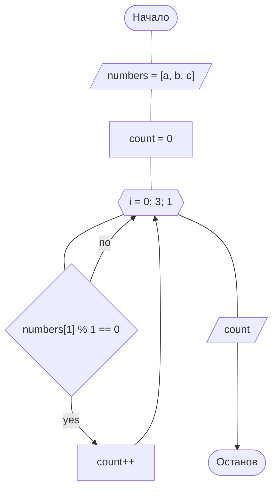

# Экзаменационные задачи

## Задание 1
Составить алгоритм  и консольную программу для решения задачи.

### 1. Подсчитать количество целых чисел среди a, b, c.



```c#
// Подсчитать количество целых чисел среди a, b, c.

namespace _01
{
    internal class Program
    {
        static void Main(string[] args)
        {
            string msg = "real numbers separated by a space";
            try
            {
                Console.Write("Enter {0}: ", msg);
                string[] input = Console.ReadLine().Split();

                double[] numbers = new double[input.Length];

                for (int i = 0; i < input.Length; i++)
                {
                    numbers[i] = double.Parse(input[i]);
                }

                int count = 0;

                for (int i = 0; i < numbers.Length; i++)
                {
                    if (numbers[i] % 1 == 0) count++;
                }

                Console.WriteLine("Number of integers is: " + count);
            }
            catch (Exception e)
            {
                Console.WriteLine($"Invalid input (must be {msg}): " + e.Message);
            }
        }
    }
}
```
