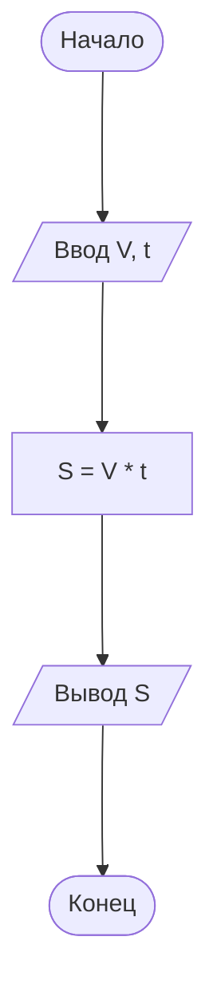
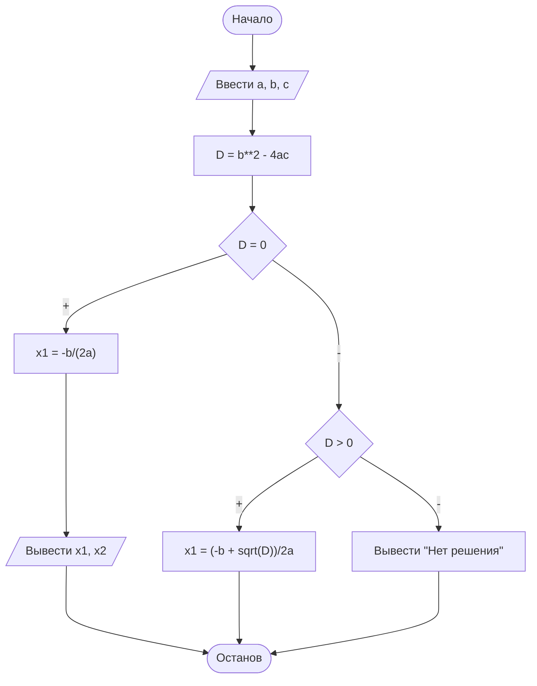
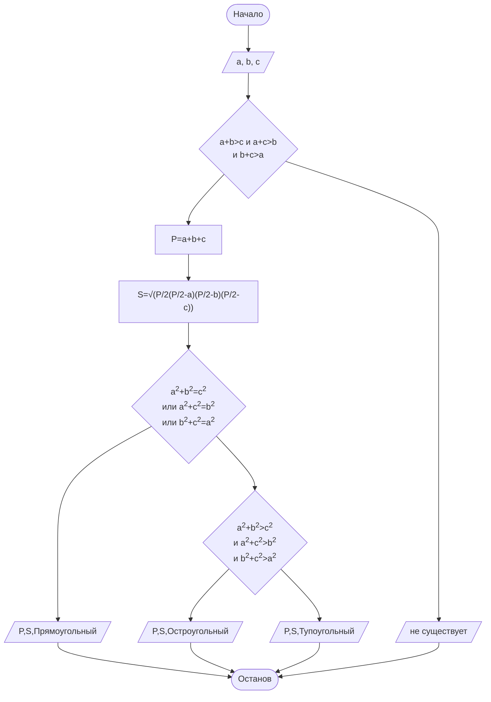
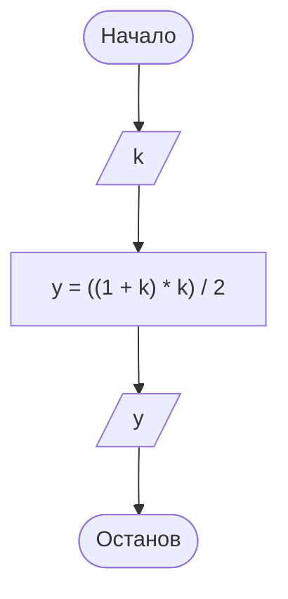
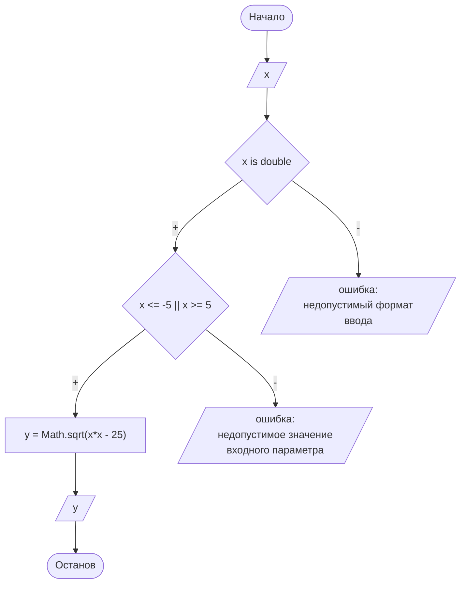

# Задачи для проработки

## Этапы решения задач на ЭВМ

### I этап: Постановка задачи и её содержательный анализ

① Формируется условие задачи:

1. Что дано? (Анализ исходных данных) → **аргументы**
2. Что необходимо определить? → **результат**
3. Какие данные допустимы и в каких единицах измерения?
4. Какие результаты и в каком виде должны быть получены?

② Всем величинам присвоить имена.

### II этап: Математическая формализация

Реально существующие объекты, предметы, явления заменяются математическими формулами.

### III этап: Алгоритмизация (построение алгоритма)

При разработке алгоритма решения сложной задачи следует использовать метод структурного подхода:

1. Алгоритм собирается из 3-х основных базовых структур.
2. Разработка алгоритма «сверху вниз».
3. Сквозной структурный контроль.

**Сквозной структурный контроль** представляет собой совокупность технологических операций контроля, позволяющих обеспечить как можно более раннее обнаружение ошибок в процессе разработки. Термин «сквозной» в названии отражает выполнение контроля на всех этапах разработки. Термин «структурный» означает наличие четких рекомендаций по выполнению контролирующих операций на каждом этапе.

Сквозной структурный контроль должен выполняться на специальных контрольных сессиях, в которых, помимо разработчиков, могут участвовать специально приглашенные эксперты. Одна из первых сессий должна быть организована на этапе определения спецификаций. На этой сессии проверяют полноту и точность спецификаций, при этом целесообразно присутствие заказчика или специалиста по предметной области, которые смогут определить, насколько правильно и полно определены спецификации программного обеспечения.

На этапе проектирования вручную по частям проверяют алгоритмы разрабатываемого программного обеспечения на конкретных наборах данных и сверяют полученные результаты с соответствующими спецификациями. Основная задача – убедиться в правильности понимания спецификаций и проанализировать достоинства и недостатки концептуальных решений, закладываемых в проект.

На этапе реализации проверяют план (последовательность) реализации модулей, набор тестов, а также тексты отдельных модулей.

Для всех этапов целесообразно иметь списки наиболее часто встречающихся ошибок, которые формируют по литературным источникам и исходя из опыта предыдущих разработок. Такие списки позволяют сконцентрировать усилия на конкретных моментах, а не проверять все подряд. При этом все найденные ошибки фиксируют в специальном документе, но не исправляют их (более подробно см. §9.2).

Помимо раннего обнаружения ошибок, сквозной структурный контроль обеспечивает своевременную подготовку качественной документации по проекту.

https://studfile.net/preview/2007545/page:17/

### IV этап: Программирование

- выбор языка программирования;
- запись алгоритма на выбранном языке программирования.

### V этап: Отладка и тестирование программы

Ошибки программы:

- синтаксические;
- логические.

**Тест** – набор исходных данных, для которых заранее известен результат.

### VI этап: Проведение расчетов и анализ результатов

Производится расчет программы (выполнение на ЭВМ).

После выполнения программы необходимо провести обработку и осмысление результатов.

### Распределение общего времени между этапами, необходимое для разработки сложных программ


## Алгоритмы
650ae4eb6a97eeab17de059a

### Введение в алгоритмы
650ae5346a97eeab17de059b

##### Примеры решения задач

###### Пример 1

Определить  расстояние  от  пункта  А до  пункта  В,  если  автобус,  двигаясь
со  скоростью  60  км/час,  проезжает это расстояние за 30 минут.

**Этапы решения задачи: I этап**

1. Что дано?
2. Что необходимо найти?

Расстояние от А до В.

Скорость автобуса – 60 км/ч, время в пути – 30 мин.

<u>**Анализ исходных данных**</u>:

3. Какие данные допустимы?

- скорость (км/час)
- время (мин) ➾ 30 мин : 60 = 0,5 час

Присвоим имена переменным:
- $V$ – скорость;
- $t$ – время;
- $S$ – расстояние.

**Этапы решения задачи: II этап**

**Построение  математической модели**:  заменим  описание задачи свернутой формулой.

$$ S = V · t $$

**Этапы решения задачи: III этап**

**Построение  алгоритма  решения задачи**.

**Алг** расстояние<br>
&nbsp;&nbsp;вещ $V, t, S$<br>
**нач**<br>
&nbsp;&nbsp;Ввести скорость автобуса,<br>
&nbsp;&nbsp;Ввести время в пути,<br>
&nbsp;&nbsp;Вычислить расстояние $S = V · t$<br>
&nbsp;&nbsp;Вывести результат $S$<br>
**кон**



**Этапы решения задачи**

- IV этап
- V этап
- VI этап – результат одно число:

$$ S = 30 $$

Ответ: 30 километров.

###### Пример 2

На  научный  семинар  собрались ученые. Каждый из них оставил коллегам визитные карточки. Всего карточек – 132. Сколько  всего  ученых  собралось  на семинар?

**Этапы решения задачи: I этап**

**Анализ исходных данных**:

1.  Что дано? Количество оставленных учеными карточек – 132.
2. Что необходимо найти? Количество ученых.
3. Какие данные допустимы?
- карточка  (штука)
- ученые (человек)

**Присвоим имена переменным**:
- $x$ – количество ученых

**Этапы решения задачи: II этап**

**Построение  математической  модели**: заменим  описание  задачи  свернутой формулой.

$$ x \cdot (x - 1) = 132 \rarr x^2 - x - 132 = 0 $$

**аргументы**: $a = 1, b = -1, c = -132$.

**результат**: $x_1 = \frac{-b + \sqrt{D}}{2a}, x_2 = \frac{-b - \sqrt{D}}{2a}$.

**промежуточная величина**: $D = b^2 - 4ac$.

**Этапы решения задачи: III этап**

Построение алгоритма решения задачи.



$$
 ax^2 + bx + c = 0 \\
 D = b^2 - 4ac
$$

- если $D < 0$, корней нет;

$$ x \in \varnothing $$

- если $D = 0$, есть один корень;

$$ x = \frac{-b}{2a} $$

- если $D > 0$, есть два различных корня;

$$
x_1 = \frac{-b + \sqrt{D}}{2a}, x_2 = \frac{-b - \sqrt{D}}{2a}.
$$

**Этапы решения задачи: IV этап**

**Этапы решения задачи: V этап**

**Этапы решения задачи: VI этап**

Результат:
- $x_1 = 12$;
- $x_2 = -11$ – отрицательное число не подходит.

**Ответ**: на семинаре было 12 ученых.

### Примеры блок-схем
650c39176a97eeab17de05b5

)
)
)
)

#### Вычислить площадь, периметр и тип треугольника по трем сторонам
650c3b6d6a97eeab17de05b7

##### Постановка задачи и её содержательный анализ

**Задание**: Вычислить площадь, периметр и тип треугольника по трем сторонам.

**Анализ исходных данных**

- $a$, $b$, $c$ — стороны треугольника.

**Требуемый результат**

- $s$ — площадь треугольника;
- $p$ — периметр треугольника;
- $t$ — тип треугольника.

##### Математическая формализация

###### Анализ условия

Область определения целевой функции зависит как от формата, так и значений входных параметров. Соответствие формата входных значений формулируется следующим образом:

$$ \tag{1} E_1 = (a \in \Bbb Q) \land (b \in \Bbb Q) \land (c \in \Bbb Q). $$

Исходя из условия (1), можно формализовать функцию валидации формата входных параметров:

$$ \tag{2}
v_1(a, b, c) =
\begin{cases}
1, & |E_1| = 1 \\
0, & |E_1| = 0
\end{cases}.
$$

Кроме того, существование треугольника определяется ещё одним условием: сумма двух любых сторон должна быть больше третьей. Это означает, что необходимо сравнить суммы всех пар сторон с оставшейся третьей стороной. Чтобы треугольник существовал, сумма всегда должна быть больше отдельной стороны или, по крайней мере, не меньше, если учитывать так называемый вырожденный треугольник. Данное условие формулируется следующим образом:

$$ \tag{3} E_2 = (a + b > c) \land (a + c > b) \land (b + c > a). $$

Исходя из условия (3), можно формализовать функцию валидации существования треугольника по значениям сторон:

$$ \tag{4}
v_2(a, b, c) =
\begin{cases}
1, & |E_2| = 1 \\
0, & |E_2| = 0
\end{cases}.
$$

Таким образом, общая валидационная функция входных параметров может быть выражена как:

$$ v(a, b, c) = v_1 + v_2 = E_1 \land E_2 \tag{5}. $$

Следовательно, полностью условие задачи можно формализовать следующим образом:

$$ \tag{6}
f(a, b, c) =
\begin{cases}
\text{invalid input}, & v_1(a, b, c) = 0 \\
\text{non-existent}, & v_2(a, b, c) = 0 \\
p, s, t, & v(a, b, c) = 1
\end{cases},
$$

где $f(a, b, c)$ — целевая функция.

Область определения целевой функции $f$ зависит как от формата, так и значений входных параметров. Известно, что существование треугольника определяется следующим условием: сумма двух любых сторон должна быть больше третьей. Это означает, что необходимо сравнить суммы всех пар сторон с оставшейся третьей стороной. Чтобы треугольник существовал, сумма всегда должна быть больше отдельной стороны или, по крайней мере, не меньше, если учитывать так называемый вырожденный треугольник. Кроме этого, необходимо обеспечить верность формата входных параметров. С учётом обоих условий, область определения целевой функции формулируется следующим образом:

$$ \tag{7} D(f) = \{(a, b, c) \in \Bbb R | (a + b > c) \land (a + c > b) \land (b + c > a) \}. $$

Таким образом, с учётом анализа условия задачи и исходных данных целевая функция первично формализуется так:

$$ \tag{8}
f(a, b, c) =
\begin{cases}
\text{invalid input}, & (a, b, c) \notin \Bbb R \\
\text{non-existent}, & (a + b < c) \lor (a + c < b) \lor (b + c < a) \\
p, s, t, & (a + b > c) \land (a + c > b) \land (b + c > a)
\end{cases},
$$

Нахождения области определения функции и области допустимых значений аргументов функций.

Должны быть реализованы следующие условия и выполнены:

###### Метод решения

Периметр треугольника определяется как сумма всех его сторон:

$$ \tag{9} p(a, b, c) = a + b + c. $$

Площадь треугольника по трём сторонам определяется исходя из формулы Герона:

$$ \tag{10} S = \sqrt{P(P-a)(P-b)(P-c)}, $$

где $P$ — полупериметр.

Следовательно, в соответствии с (9) и предварительно вычисленного по (7) значения периметра, искомая функция вычисления площади формулируется как:

$$ \tag{11} s(p, a, b, c) = \sqrt{\frac{p}{2}(\frac{p}{2}-a)(\frac{p}{2}-b)(\frac{p}{2}-c)}, $$

Тип треугольника определяется следующим образом:


$$ \tag{12}
t(a, b, c) =
\begin{cases}
\text{right}, & A^2 = B^2 + C^2 \\
\text{obtuse}, & A^2 > B^2 + C^2 \\
\text{acute}, & A^2 < B^2 + C^2
\end{cases},
$$

- $A$ — б&oacute;льшая сторона треугольника,
- $B$, $C$ — остальные стороны треугольника.

Поскольку неизвестно, какая из сторон является наибольшей, то можно попытаться определить таковую:

$$ \tag{13}
sides(a, b, c) =
\begin{cases}
A = a, B = b, C = c, & (a \ge b) \land (a \ge c) \\
A = b, B = a, C = c, & \overline{(a \ge b)} \land (b \ge c) \\
A = c, B = b, C = a, & \overline{(a \ge c)} \land \overline{(b \ge c)} \\
\end{cases},
$$

Полученные таким образом значения $A$, $B$, $C$ используются для подстановки в функцию (10), определяющую тип треугольника.

Возможен и другой вариант решения данной задачи — можно модифицировать формулу (10), последовательно перебирая все варианты соотношения сторон, т.к. их количество ограничено количеством сторон треугольника:

$$ \tag{14}
t(a, b, c) =
\begin{cases}
\text{right}, & (a^2 = b^2 + c^2) \lor (b^2 = a^2 + c^2) \lor (c^2 = a^2 + b^2) \\
\text{obtuse}, & (a^2 > b^2 + c^2) \lor (b^2 > a^2 + c^2) \lor (c^2 > a^2 + b^2) \\
\text{acute}, & (a^2 < b^2 + c^2) \lor (b^2 < a^2 + c^2) \lor (c^2 < a^2 + b^2)
\end{cases},
$$

##### Алгоритмизация

###### Графическое описание алгоритма



##### Программирование

> Действительные числа в общем виде определяются **вещественным типом данных** (`double`)!

Выбираем тип `double` или `float`.

- выбор языка программирования;
- запись алгоритма на выбранном языке программирования.

<details>
<summary><b>Листинг</b></summary>

```c#
using System;

public class Triangle
{
    public static void Main()
    {
        Console.WriteLine ("Enter triangle side lengths, separated by ordinary space: ");
        string line = Console.ReadLine();
        string[] splitString = line.Split(' ');
        float a = float.Parse(splitString[0]);
        float b = float.Parse(splitString[1]);
        float c = float.Parse(splitString[2]);
        float p = a + b + c;
        Console.WriteLine($"Triangle sides are: {a}, {b}, {c}, Perimeter is {p}");
    }
}
```

</details>

##### Отладка и тестирование программы

Выделение классов эквивалентности исходя из теории множеств.

Анализ граничных значений.

**Набор тестов для проверки правильности алгоритма**

##### Проведение расчетов и анализ результатов

##### Определить в какой четверти находится точка с координатами х и у
65102fce6a97eeab17de0631

**Задание**: Определить в какой четверти находится точка с координатами х и у

**Анализ исходных данных**

- $x$, $y$ — координаты точки.

**Требуемый результат**

- $n$ — порядковый номер четверти координатной плоскости прямоугольной системы координат;

##### Математическая формализация

###### Анализ условия

Область определения целевой функции $f$ зависит от входных параметров. Предполагается, что вводимые пользователем данные должны быть действительными числами. С учётом этого условий, область определения целевой функции формулируется следующим образом:

$$ \tag{7} D(f) = \{(x, y) | (x \in \Bbb R) \land (y \in \Bbb R) \}. $$

С учётом анализа условия задачи и исходных данных целевая функция первично формализуется так:

$$ \tag{8}
F(x, y) =
\begin{cases}
\text{invalid input}, & (a, b, c) \notin D(f) \\
n & (a, b, c) \in D(f) \\
\end{cases},
$$

###### Метод решения

Известно, что в первую четверть ($I$) координатной плоскости декартовой системы координат попадают точки, у которых обе координаты $(x, y)$ больше нуля, во вторую ($II$) — $(x < 0, y > 0)$, во третью ($III$) — $(x < 0, y < 0)$, в четвёртую ($IV$) — $(x > 0, y < 0)$. Кроме того, возможны пограничные случаи: если одна из координат равна нулю, то точка лежит на соответствующей оси, разделяющей координатные плоскости (либо $X$, либо $Y$), если обе — то в начале координат в центре координатной плоскости ($C$). Таким образом, всего имеется семь взаимно непересекающихся множеств ($C$ — одноэлементное, остальные — бесконечные), и задача сводится к определению отношения точки как элемента к одному из множеств. Соответственно, целевая функция $N$ для нахождения искомого значения $n$ формализуется так:

$$ \tag{8}
N(x, y) =
\begin{cases}
C, & x = y \\
X, & y = 0 \\
Y, & x = 0 \\
I, & x > 0, y > 0 \\
II, & x < 0, y > 0 \\
III, & x < 0, y < 0 \\
IV, & x, > 0, y < 0 \\
\end{cases},
$$

#### Найти сумму цифр числа
651130646a97eeab17de065a

**Задание**: Найти сумму цифр числа

##### Анализ исходных данных

- $x$ — число.

##### Требуемый результат

- $s$ — сумма цифр числа $x$;

##### Математическая формализация

###### Анализ условия

Область определения целевой функции $f$ зависит от входного параметра. Предполагается, что вводимые пользователем данные должны быть действительным числом. С учётом этого условий, область определения целевой функции формулируется следующим образом:

$$ \tag{7} D(f) = \{x\ |\ x \in \Bbb R \}. $$

С учётом анализа условия задачи и исходных данных целевая функция первично формализуется так:

$$ \tag{8}
f(x) =
\begin{cases}
\text{invalid input}, & x \notin D(f) \\
s & x \in D(f) \\
\end{cases},
$$

###### Метод решения

Для начала необходимо разработать решение задачи для любых целых положительных чисел, после чего можно модифицировать решение для любых целых отрицательных, а затем и любых дробных чисел. Предполагается, что исходное число дается в десятичной записи. 

Задача нахождения суммы цифр целого положительного числа $x$ решается путём последовательного нахождения остатков от деления числа на степени основания системы счисления. Таким образом, цифру любого разряда числа $x$ можно найти следующим образом:

$$ \tag{?} d_i = (x_b \% b^i)/b^{i-1}, $$

- $b$ — основание системы счисления;
- $i$ — порядковый номер разряда (по возрастанию старшинства, начиная с единиц — 1);
- $d_i$ — цифра соответствующего разряда;
- $\%$ — знак операции взятия остатка;
- $/$ — знак целочисленного деления.

Соответственно, для десятичных чисел ($b = 10$) формула будет выглядеть так:

$$ \tag{?} d_i = (x_{10} \% 10^i)/10^{i-1}, $$

Тогда целевая функция $s$ в обобщённом виде будет выглядеть так:

$$ \tag{?}
s(x) = \sum_{i=1}^n d_i
$$

##### Алгоритмизация

Посольку число разрядов заведомо неизвестно, то задача решается последовательным перебором всех разрядов числа арифметическим циклом (не итерационным) `while`.


## Практические работы на сб (16.09.2023)
650ae9cc6a97eeab17de059f

### Практическая работа 1
6514165b6a97eeab17de06ac

#### 1.  Цель работы:
1.1. Сформировать умение  составлять  простейшие разветвляющиеся алгоритмы.<br>
1.2. Сформировать умение составлять наборы тестов.

#### 2.  Литература
2.1. Колдаев, В.Д. Структуры и алгоритмы обработки данных: Учебное пособие/В.Д. Колдаев – Москва: ИЦ РИОР:НИЦ ИНФРА-М, 2014. Режим доступа: http://znanium.com/bookread2.php?book=418290#<br>
2.2. Математическая логика и теория алгоритмов:учебник/ А.В. Пруцков,Л.Л. Волкова. – Москва: КУРС:ИНФРА-М, 2017. – Режим доступа: http://znanium.com/catalog.php?bookinfo=773373<br>
2.3. Основы алгоритмизации и программирования:Учебное пособие/ В.Д. Колдаев; Под ред. Л.Г. Гагариной. – Москва: ИД Форум: ИНФРА-М, 2015 - Режим доступа: http://znanium.com/bookread2.php?book=484837

#### 3. Подготовка к работе:
3.1. Изучить понятие алгоритма, его свойства.<br>
3.2. Изучить графический способ описания алгоритмов.<br>
3.3. Изучить методику разработки линейных алгоритмов.

#### 4. Задание:
4.1. Составить алгоритмы для предложенных задач (таблица 1) по плану:

4.1.1. исходные данные;<br>
4.1.2. результат;<br>
4.1.3. анализ условия задачи;<br>
4.1.4. метод решения;<br>
4.1.5. графическое описание алгоритма;<br>
4.1.6. набор тестов для проверки правильности алгоритма.

**Вариант 1:**

1) На плоскости даны две точки А(x1,  y1) и В(х2, у2). Определить расстояние между этими точками.
2) Найти сумму цифр трехзначного числа, введенного пользователем.
3) Определить площадь заштрихованной фигуры (рисунок 1), если известна длина стороны квадрата.

    

    **Рисунок 1**

4) Обменять значения двух переменных:
    - используя третью переменную;
    - не используя третью переменную.

**Вариант 2:**

1) Вычислить значение $y (k>0)$.

    $$ y = 1+2+3+...+k. $$

2) Найти произведение цифр трехзначного числа, введенного пользователем.

3) Определить площадь заштрихованной фигуры (рисунок 1), если известно, что радиус меньшей окружности $r$ равен половине радиуса большей окружности.

    

    **Рисунок 2**

4) Обменять значения двух переменных:
    - используя третью переменную;
    - не используя третью переменную.

#### 5. Порядок выполнения работы:
5.1. Решить задания в любом порядке.

#### 6. Содержание отчета:
6.1. Титульный лист.<br>
6.2. Цель работы.<br>
6.3. Условия задач.<br>
6.4. Подробное решение заданий.<br>
6.5. Вывод по проделанной работе.

#### 7. Контрольные вопросы
7.1. Что такое алгоритм?<br>
7.2. Каковы основные свойства алгоритма?<br>
7.3. Какие способы описания алгоритмов существуют?<br>
7.4. Какие виды алгоритмов и соответствующих им конструкций существуют?<br>
7.5. Что называется отладкой алгоритма?<br>
7.6. Что такое тест?<br>
7.7. Какой тест называют полным? неизбыточным?

#### Вариант 1
661e8b3ed048d373527217fa

#### Вариант 2.
661e8b71d048d373527217fb

##### Задача 1
6633acf8d048d373527218e2

###### Анализ исходных данных

**Условие**:

$$ \tag{1} y = 1+2+3+...+k, k > 0 $$

**Исходные данные**:

- $k > 0$ — последний элемент выражения $(1)$.

**Требуемый результат**:

- $y$ — значение выражения $(1)$;

###### Математическая формализация

**Анализ условия**

Исходя из условия, выражение $(1)$ представляет собой возрастающую арифметическую прогрессию $y$, в которой известен первый элемент ($y_1 = 1$), разность ($d = 1$) и задан последний элемент $k$. Необходимо найти сумму первых $n$ элементов прогрессии.

Рассматриваемое соответствие $kQy$ можно задать как $q = (K, Y, \Gamma)$, такое что:

$$ \tag{2} \Gamma = \{(k, y) \in K \times Y\ |\ k \in K, y \in Y\}. $$

где $\Gamma$ — график соответствия $q$.

Тогда, согласно условию, область отправления рассматриваемого соответствия определяется как:

$$ \tag{3} \text{dom}\ q = \{k \in K\ |\ k \in \Bbb Z,\ k > 0 \} = \Bbb N. $$

Из $(1)$ очевидно, что область прибытия рассматриваемого соответствия ограничена множеством натуральных чисел, являясь эквивалентным ему:

$$ \tag{4} \text{cod}\ q = \{y \in Y\ |\ Y \subset \Bbb N \}. $$

Обе области являются бесконечными счётными множествами. Кроме того, из условия следует, что $пр_1 \Gamma = \text{dom}\ q$, что делает соответствие $q$ всюду определенным на всей области отправления, т.е. $\Gamma : k \mapsto y$ (отображение).

Пусть $f : k \mapsto y$, т.е. $f : K \to Y$. Тогда согласно условию $dom f$ теоретически формализуется как:

$$ \tag{2} D(f) = \{k \in \Bbb Z\ |\ k > 0 \} = \Bbb N. $$

Следовательно, $ran f$ теоретически определяется как:

$$ \tag{3} R(f) = \{y \in Y\ |\ y = f(k), k \in \Bbb N\} $$

**Метод решения**

Сумму первых $n$ элементов арифметической прогрессии можно найти по формуле:

$$ \tag{5} S_n = \frac{(y_1 + y_n) \cdot n}{2}. $$

Т.к. $y_1 = 1$ и $d = 1$, то $n = y_n = k$. С учётом этого, выражение $(5)$ можно изложить следующим образом:

$$ \tag{6} y = \frac{(1 + k) \cdot k}{2} = \frac{1}{2} k^2 + \frac{1}{2} k. $$

Можно заметить, что выражение $(6)$ соответствует квадратичной функции (имеющей общий вид $y = ax^2 + bx + c$), при $a = b = \frac{1}{2}, c = 0$. Значит, рассматриваемое отображение $q$ является функциональным, т.е. $f : k \mapsto y$, что эквивалентно $f : K \to Y$, а $y = f(k)$. В общем виде квадратичная функция является сюръективной, т.е. $\text{pr}_2 \Gamma_f = \text{cod}\ q$, но при сужении на области определения, ограниченной натуральными числами $D(f) =  \Bbb N$, она становится биективной.

При данной области определения рассматриваемая дискретная квадратичная функция $f(x)$ инъективна, т.е. каждому значению аргумента соответствует единственное значение функции, поскольку $D(f)$ не содержит отрицательных чисел.

Из выражения $(5)$ следует, что область определения соответствия $q$ $\text{pr}_1 \Gamma = \text{dom}\ q$, что делает соответствие $q$ всюду определенным (отображением), следовательно, $\Gamma : k \mapsto y$. Кроме того, из выражения $(5)$ следует, что отображение $q$ является биективным, а значит $f : k \mapsto y$, т.е. $f : K \to Y$, а $y = f(k)$. Соответственно, искомая функция $f$ определяется следующим образом:

$$ \tag{6} \Gamma_f = \{(k, f(k)) \in K \times Y\ |\ k \in K\}. $$

Исходя из выражений (3) и (5), очевидно, что область прибытия функции $f$ определяется как:

$$ \tag{7} \text{cod}\ f = \{y \in Y\ |\ y \in \Bbb N \}. $$

При этом $\text{pr}_2 \Gamma_f = \text{cod}\ q$, поскольку выше уже была установлена биективность $f$.

###### Алгоритмизация

По условию задачи не предполагается введение данных, выходящих за пределы $\text{dom}\ q$, исходя из чего составлен алгоритм, показанный на Листинге 1.

**Листинг 1 – Алгоритм к заданию 1**.
```
алг f (арг цел k, рез цел y)
  дано k > 0
  надо y
нач
| ввод k
| y := ((1 + k) * k) / 2
| вывод y
кон
```

Графическое описание алгоритма показано на Рисунке 2



Рисунок 2 – Блок-схема алгоритма к заданию 1

###### Программирование

Программа, представленная на Листинге 2, записана на языке C# и предназначена для исполнения в среде .NET 7.0. Типы данных для аргумента $k$ и возвращаемого значения $y$ выбраны исходя из выражений $(3)$ и $(4)$ соответственно.

```c#
static uint f (uint k)
{
    uint y = ((1 + k) * k) / 2;
    return y;
}
```

###### Отладка и тестирование

Выбранный для аргумента и возвращамого значения тип данных (`System.UInt32`) налагают технические ограничения как на $\text{pr}_1\Gamma_f$, так и на $\text{pr}_2\Gamma_f$,лимитированные значением $max =$ `UInt32.MaxValue` по максимуму, что делает практически реализуемую функцию сужением $f$ на подмножество $D$ её области определения ($D(f) \subset \text{pr}_1\Gamma_f$), за пределами которого $f|D$ не может быть определена технически. Т.е. приняв $D(f) \subset \text{pr}_1\Gamma_f$ и $R(f) \subset \text{pr}_2\Gamma_f$:

$$ \tag{7} D(f) = \{k \in \Bbb N\ |\ k \leq max \}. $$

$$ \tag{8} R(f) = \{y \in \Bbb N\ |\ y = f(x), y \leq max \}. $$

т.е. $k \leq max$ и $y \leq max$.

Исходя из (3) (4) и самого характера монотонно возрастающей функции $f$ ($\forall (k_i, y_j)(y_j > k_i) \implies y_{max} > k_{max}$), в данном случае лимитирующим является $R(f) \subset \text{pr}_2\Gamma_f$). Следовательно, для установления верхней границы $D(f)$ ($k_{max}$) необходимо определить верхнюю границу ($R(f)$) $y_{max}$.

Поскольку $f$ биективна, то она обратима, следовательно, $R(f) = D(f^{-1})$.

следует уточнить как:

$$ \tag{6} \text{dom}'\ f = \{k \in \Bbb N, k < 4294967295 \}. $$

$$ \tag{7} \text{cod}'\ f = \{y \in \Bbb N\ | y < 4294967295 \}. $$

Поскольку $\text{dom}\ f \supset \text{dom}'\ f$ и $\text{cod}\ f \supset \text{cod}'\ f$, реализуемая функция является сужением теоретически установленной функции $f$:

$$ f|D = D \to R. $$

Следует иметь в виду, что область определения реализуемой функции может не совпадать с уточнённой областью отправления $(6)$. Поскольку отображение $q$ биективно (т.е. взаимно-однозначно), то функция $f$ является обратимой. Т.к. по своему характеру функция $f$ является монотонно возрастающей, то для нахождения истинной области определения реализуемой функции и, существует $f^{-1}.

не совпадает с областью определения теоретически установленной функции $f$, т.е. $D(f) \neq \text{dom}\ q$, поскольку:

Таким образом, $\text{dom}\ q \supset D(f)$, а $\text{dom}\ q$ является областью отправления реализуемой функции $f$,

Исходя из практических ограничений, накладываемых выбранным типом данных для возвращаемого значения (`System.UInt32`), область прибытия реализуемой функции должн:

При этом следует иметь в виду, что в силу ограничений на тип возвращаемого значения, реализуемая функция не может быть определена на всём диапазоне значений $(6)$.

Таким образом, $\text{dom}\ q$ является областью отправления для реализуемой

получается, что $\text{pr}_1$ реализуемая функция не может быть полностью определённой на всём  $f|D$ фактически является сужением искомой $f(k)$, поскольку $\text{dom}\ q \supset D(f)$, т.к. область определения формализуется следующим образом:

Поскольку искомый алгоритм по условию не предусматривает обработки недопустимых значений аргумента, то для проверки правильности решения следует использовать позитивное тестирование методами эквивалентного разбиения и анализа граничных значений.

Исходя из выбранного типа данных (`System.UInt32`), необходимо уточнить практические $dom f$ и $ran f$:

$$ \tag{6} R(f) = \{ y \in \Bbb N\ |\ 1 \leq y \leq 4294967295 \} $$

Соответственно, теоретическая $dom f$:

Набор тестов для проверки правильности алгоритма приведен в Таблице 1.

-----

**Задание**: Определить в какой четверти находится точка с координатами х и у

##### Анализ исходных данных

- $x$, $y$ — координаты точки.

##### Требуемый результат

- $n$ — порядковый номер четверти координатной плоскости прямоугольной системы координат;

##### Математическая формализация

###### Анализ условия

Область определения целевой функции $f$ зависит от входного параметра. Предполагается, что вводимые пользователем данные должны быть действительным числом. С учётом этого условий, область определения целевой функции формулируется следующим образом:

$$ \tag{7} D(f) = \{x\ |\ x \in \Bbb R \}. $$

С учётом анализа условия задачи и исходных данных целевая функция первично формализуется так:

$$ \tag{8}
f(x) =
\begin{cases}
\text{invalid input}, & x \notin D(f) \\
s & x \in D(f) \\
\end{cases},
$$

### Практическая работа 2
65155d056a97eeab17de06c9

1. Цель работы
    1. Сформировать умение составлять разветвляющиеся алгоритмы
    2. Сформировать умение составлять наборы тестов

2. Литература
    1. Колдаев, В.Д. Структуры и алгоритмы обработки данных: Учебное пособие/В.Д. Колдаев – Москва: ИЦ РИОР:НИЦ ИНФРА-М, 2014. Режим доступа: http://znanium.com/bookread2.php?book= 418290#
    2. Математическая логика и теория алгоритмов:учебник/ А.В. Пруцков,Л.Л. Волкова. – Москва: КУРС:ИНФРА-М, 2017.  –  Режим доступа: http://znanium.com/catalog.php?bookinfo=773373
    3. Основы алгоритмизации и программирования:Учебное пособие/ В.Д. Колдаев; Под ред. Л.Г. Гагариной. – Москва: ИД Форум: ИНФРА-М, 2015-  Режим доступа: http://znanium.com/bookread2.php?book= 484837

3. Подготовка к работе:
    1. Изучить понятие алгоритма, его свойства.
    2. Изучить графический способ описания алгоритмов.
    3. Изучить методику разработки разветвляющихся алгоритмов.

4. Задание:
    1. Составить алгоритмы для предложенных задач (таблица 2) по плану:
        1. исходные данные;
        2. результат;
        3. анализ условия задачи;
        4. метод решения;
        5. графическое описание алгоритма;
        6. набор тестов для проверки правильности алгоритма.

    **Вариант 1:**

    1) Вычислить

    $$ y = \frac{18}{x^4 - 1} $$

    2) Вычислить

    $$ m = min(x+y^2, y+z^2) + 1. $$

    3) Вычислить стоимость покупки с учетом скидки. Скидка в 7% предоставляется, если сумма покупки больше 1500 руб.

    4) Проверить, является ли введенное пользователем целое число четным

    5) Даны целые числа $A$, $B$. Если числа не равны, то заменить каждое из них одним и тем же числом, равным большему из исходных, а если равны, то заменить числа нулями.

    **Вариант 2:**

    1) Вычислить

    $$ y = \sqrt{x^2 - 25} $$

    2) Вычислить

    $$ m = max(x+y \cdot z, x \cdot y + z) - 2. $$

    3) На плоскости даны две точки $A(x1, y1)$ и $B(x2, y2)$. Определить, какая из этих точек находится ближе к началу координат.

    4) Проверить, является ли введенное пользователем целое число нечетным

    5) Перераспределите значения переменных $x$ и $y$ так, чтобы в $x$ оказалось большее из этих значений, а в $y$ меньшее.

5. Порядок выполнения работы:
    1. Решить задания в любом порядке.

6. Содержание отчета:
    1. Титульный лист.
    2. Цель работы.
    3. Условия задач.
    4. Подробное решение заданий.
    5. Вывод по проделанной работе.

7. Контрольные вопросы
    1. Что такое алгоритм?
    2. Какой алгоритм называется разветвляющимся?
    3. Какая алгоритмическая структура используется для изображения разветвляющегося алгоритма?
    4. Какое выражение называется логическим? Каков его результат?
    5. В каком случае используется полная форма ветвления? В каком — неполная?
    6. Что называется отладкой алгоритма?
    7. Что такое тест?
    8. Какой тест называют полным? неизбыточным?

**Задание 1**

##### Анализ исходных данных

В качестве исходных данных фигурирует безразмерная переменная величина, обозначенная как x. Необходимо определить значение безразмерной величины, обозначенной как y, по следующей формуле:

$$ \tag{1} y = \sqrt{x^2 - 25} $$

**Исходные данные**:

- $x$ — число.

**Требуемый результат**:

- $y$ — значение выражения;

##### Математическая формализация

###### Анализ условия

Прежде всего, область определения искомой функции $F$ зависит от формата аргумента $x$ (это должно быть действительное число) и формулизуется следующим образом:

$$ \tag{2} D_1(F) = \{x\ |\ x \in \Bbb R \}. $$

Кроме того, вычисление по формуле $(1)$ налагает определенные ограничения на область допустимых значений аргумента – подкоренное выражение не должно быть отрицательным, поскольку под знаком корня четной степени может быть только неотрицательное число т.е.:

$$ \tag{3} ОДЗ: x^2 - 25 \geq 0. $$

Следовательно, данное условие формирует вторую часть области определения искомой функции:

$$ \tag{4} D_2(F) = \{x\ |\ (x \leq 5) \lor (x \geq 5) \}. $$

В данном случае очевидно, что $D_2 \subset D_1$, поэтому с учётом обоих условий, область определения целевой функции окончательно можно формализовать следующим образом:

$$ \tag{5} D(F) = D_1 \cap D_2 = \{x \in \Bbb R\ |\ (x \leq 5) \lor (x \geq 5) \}. $$

Исходя из этого, с учётом дифференцированного анализа исходных данных и условия задачи целевая функция в общем виде выглядит так:

$$ \tag{6}
F(x) =
\begin{cases}
\text{invalid input format}, & x \notin D_1 \\
\text{invalid input value}, & x \notin D_2 \\
y, & x \in D
\end{cases},
$$

###### Метод решения

Для нахождения значения функции $y$ необходимо произвести вычисления согласно $(1)$:

$$ \tag{7} Y(x) = \sqrt{x^2 - 25} $$

##### Алгоритмизация

Исходя из общего вида искомой функции, обозначенного в $(6)$, искомый алгоритм должен содержать дифференцированную логику валидации входного параметра, соответствующего аргументу $x$ функции $F(x)$. Это возможно реализовать, используя разветвляющийся алгоритм.

###### Графическое описание алгоритма



##### Программирование


## Задания для разработки алгоритма на 08.09.2022
6516c4be6a97eeab17de06ef

### Задачи
651a777c6a97eeab17de0789

1. Подсчитать количество целых чисел среди $a, b, c$.

2. Даны координаты двух точек $A$ и $B$. Вычислить расстояние между точками. Определить, какая точка находится ближе к началу координат.

3. Пользователь вводит 4х- значное число, перевернуть его.

4. Найти максимальное из трех чисел.

## Введение в С#
651bf8716a97eeab17de07b8

### Введение в язык программирования С#. Базовые понятия языка С#
651e8b566a97eeab17de0808

#### Составить программы для расчета значений  функций
6523f9396a97eeab17de0880

$$
z = \left[\frac{x-1}{x^2+1}-\left(\frac{x+3.141592}{x^2+1}\right)\left(\cfrac{x-1}{3.141592+\cfrac{x-1}{x^3+x^2+1}}\right) \right],\\~\\
y = \frac{1}{3} + \frac{1}{5} \cdot \sin\left(\frac{5}{3}\pi - 7a\right),\\~\\
z = \left(\frac{1+d+d^2}{3a+a^2}-4+\frac{1-a+a^2}{2d-d^2}\right)^{-1}\left(2\sin (a) + 7 \sqrt{d} - 5 \frac{\pi}{2} \sqrt[3]{a}\right)
$$


**Task_02**
```c#
namespace Task_02
{
    internal class Program
    {
        static bool CheckIfLeap(int y)
        {
            if (y % 400 == 0) return true;
            else if (y % 4 == 0 && y % 100 != 0) return true;
            return false;
        }
        static int GetDaysQuantity(int m, int y)
        {
            // February case
            if (m == 2) return CheckIfLeap(y) ? 29 : 28;

            // Rest months
            return 30 + (m + m / 8) % 2;
        }
        static void Main(string[] args)
        {
            int m, y;

            // User input
            Console.Write("Enter year: ");
            y = Convert.ToInt32(Console.ReadLine());
            Console.Write("Enter month number (starting from 1, no leading zeroes): ");
            bool isValidMonth = int.TryParse(Console.ReadLine(), out m);

            // Calculation
            bool l = CheckIfLeap(y);

            // Output
            Console.WriteLine($"Year {y} is {(l ? "" : "not")} leap.");

            if (isValidMonth && m > 0 && m < 13)
            {
                int n = GetDaysQuantity(m, y);

                System.Globalization.DateTimeFormatInfo mfi = new System.Globalization.DateTimeFormatInfo();
                Console.WriteLine($"There are {n} day{(n.ToString().Last() == '1' ? "" : "s")} in {mfi.GetMonthName(m)} of {y}.");
            }
            else
            {
                Console.WriteLine("Invalid month number, must be an integer in range between 1 and 12 inclusively");
            }
        }
    }
}
```

```c#
namespace Task_03
{
    internal class Program
    {
        static bool CheckIfTriangle(double[] sides)
        {
            if (sides[0] + sides[1] > sides[2] && sides[1] + sides[2] > sides[0] && sides[2] + sides[0] > sides[1]) return true;
            return false;
        }
        static double GetTriangleSquare(double[] sides)
        {
            double p = sides.Sum() / 2;
            return Math.Sqrt(p * (p - sides[0]) * (p - sides[1]) * (p - sides[2]));
        }
        static string GetTriangleType(double[] sides)
        {
            if (
                Math.Pow(sides[0], 2) > Math.Pow(sides[1], 2) + Math.Pow(sides[2], 2) ||
                Math.Pow(sides[1], 2) > Math.Pow(sides[0], 2) + Math.Pow(sides[2], 2) ||
                Math.Pow(sides[2], 2) > Math.Pow(sides[0], 2) + Math.Pow(sides[1], 2)
                )

            {
                return "obtuse";
            }
            else if (
                Math.Pow(sides[0], 2) < Math.Pow(sides[1], 2) + Math.Pow(sides[2], 2) ||
                Math.Pow(sides[1], 2) < Math.Pow(sides[0], 2) + Math.Pow(sides[2], 2) ||
                Math.Pow(sides[2], 2) < Math.Pow(sides[0], 2) + Math.Pow(sides[1], 2)
                )
            {
                return "acute";
            }
            return "right";
        }
        static void Main(string[] args)
        {
            // User input
            Console.Write("Enter triangle sides, separated by an ordinary space: ");
            string[] inputArr = Console.ReadLine().Split(' ');
            double[] sides = new double[inputArr.Length];
            for (int i = 0; i < inputArr.Length; i++) sides[i] = double.Parse(inputArr[i]);

            // Check if triangle exists
            if (!CheckIfTriangle(sides))
            {
                Console.WriteLine("Input sides does not make a triangle");
                return;
            }

            // Calculation
            double S = GetTriangleSquare(sides);
            string t = GetTriangleType(sides);

            // Output
            Console.WriteLine($"Triangle square is {S.ToString("N2")}. Triangle is {t}");
        }
    }
}
```

```c#
using System.Globalization;

namespace Task_04
{
    internal class Program
    {
        static double ConvertToValue(double amount, string valueCode)
        { 
            return amount / GetExchangeRate(valueCode);
        }
        static double GetExchangeRate(string valueCode)
        {
            switch (valueCode)
            {
                case "eur":
                    return 97.16;
                case "jpy":
                    return 0.59;
                case "usd":
                    return 88.70;
                default:
                    return 0;
            }
        }
        static string? ParseValue(string valueCode)
        {
            string v = valueCode.ToLower();
            switch(v)
            {
                case "eur":
                    return "eur";
                case "jpy":
                    return "jpy";
                case "usd":
                    return "usd";
                default:
                    return null;
            }
        }
        static void Main(string[] args)
        {
            // Handle user input
            double a;
            Console.Write("Enter the amount you would like to convert to value (in Russian roubles): ");
            bool isAmountParsed = double.TryParse(Console.ReadLine(), out a);
            if (!isAmountParsed)
            {
                // Handle invalid decimal separator
                string decimalSeparator = NumberFormatInfo.CurrentInfo.NumberDecimalSeparator;
                Console.WriteLine("Incorrect amount input: use decimal separator according to your system current culture settings ({0})", decimalSeparator);
                return;
            }

            Console.Write("Enter value code (USD | EUR | JPY): ");

            string? v = ParseValue(Console.ReadLine());

            if (v == null)
            {
                Console.WriteLine("Incorrect value input, acceptable values are: USD | EUR | JPY");
                return;
            }

            // Calculation
            double s = ConvertToValue(a, v);

            // Output
            Console.WriteLine($"You get {s.ToString("N2")} {v.ToUpper()}");
        }
    }
}
```

```c#
using System.Globalization;

namespace Task_05
{
    internal class Program
    {
        static double GetAmtWithDiscount(double amount)
        {
            if (amount > 1000)
            {
                return amount * 0.95;
            }
            else if (amount > 500)
            {
                return amount * 0.97;
            }
            return amount;
        }
        static void Main(string[] args)
        {
            // User input
            try
            {
                Console.Write("Enter purchase amount, in Russian roubles: ");
                double a = Convert.ToDouble(Console.ReadLine());
                Console.Write("Enter amount deposited by customer, in Russian roubles: ");
                double d = Convert.ToDouble(Console.ReadLine());

                // Calculation
                double amt = GetAmtWithDiscount(a);
                double c = d - amt;

                // Output
                if (c == 0)
                {
                    Console.WriteLine("Thank you!");
                }
                else if (c > 0)
                {
                    Console.WriteLine($"Take your change: {c.ToString("N")} RUR.");
                }
                else
                {
                    Console.WriteLine($"Insufficient deposit, please add {(c * -1).ToString("N")} RUR.");
                }
            }
            catch (Exception)
            {

                // Handle invalid decimal separator
                string decimalSeparator = NumberFormatInfo.CurrentInfo.NumberDecimalSeparator;
                Console.WriteLine("Incorrect input: use decimal separator according to your system current culture settings ({0})", decimalSeparator);
            }
        }
    }
}
```

Практическая работа №3.

```c#
namespace Task_01
{
    internal class Program
    {
        /// <summary>
        /// Defines whether the given point belongs to the function y = 2x-3 graph
        /// </summary>
        /// <param name="a">Point coordinates</param>
        /// <returns>True if belongs, False if doesn't belong</returns>
        static bool DoesBelongToGraph(double[] a)
        {
            double y = 2 * a[0] - 3;
            return a[1] == y;
        }
        static void Main(string[] args)
        {
            Console.Write("Enter A coordinates x0, y0, separated by a single space: ");
            string[] input = Console.ReadLine().Split();
            double[] a = new double[] { double.Parse(input[0]), double.Parse(input[1]) };

            bool b = DoesBelongToGraph(a);

            Console.WriteLine($"A does{(b ? "" : "n't")} belong to the function y = 2x-3 graph.");
        }
    }
}

```

```c#
namespace Task_02
{
    internal class Program
    {
        /// <summary>
        /// Gets time period of day depending on hour
        /// </summary>
        /// <param name="h">Hour</param>
        /// <returns>Name (string representation) of time period</returns>
        static string GetTimeOfDay(int h)
        {
            switch(h)
            {
                case var _ when h >= 0 && h < 7:
                    return "Night";
                case var _ when h >= 7 && h <= 11:
                    return "Morning";
                case var _ when h >= 12 && h < 17:
                    return "Afternoon";
                case var _ when h >= 17 && h <= 23:
                    return "Evening";
                default:
                    return "Error";
            }
        }
        static void Main(string[] args)
        {
            // Input
            Console.Write("Enter current time in hours: ");
            int h = Convert.ToInt32(Console.ReadLine());

            // Calculation
            string t = GetTimeOfDay(h);

            // Output
            Console.WriteLine(t);
        }
    }
}
```

```c#
namespace Task_03
{
    internal class Program
    {
        /// <summary>
        /// Checks if number is even
        /// </summary>
        /// <param name="x">Number</param>
        /// <returns>True if number is even, False if number is odd</returns>
        static bool CheckIfEven(int x)
        {
            return x % 2 == 0;
        }
        /// <summary>
        /// Checks if number is positive
        /// </summary>
        /// <param name="x">Number</param>
        /// <returns>True if number is positive, False if number is negative, Null if number is zero</returns>
        static bool? CheckIfPositive(int x)
        {
            if (x > 0) return true;
            else if (x < 0) return false;
            return null;
        }
        static void Main(string[] args)
        {
            // Input
            Console.Write("Enter integer number: ");
            int x = int.Parse(Console.ReadLine());

            // Calculation
            bool? isPositive = CheckIfPositive(x);
            string s = isPositive == null
                ? "Zero number."
                : $"{((bool)isPositive ? "Positive" : "Negative")} {(CheckIfEven(x) ? "even" : "odd")} number."
            ;

            // Output
            Console.WriteLine(s);
        }
    }
}
```

```c#
namespace Task_04
{
    internal class Program
    {
        static void Main(string[] args)
        {
            // Input
            Console.Write("Enter quadratic coefficient (a): ");
            double a = double.Parse(Console.ReadLine());
            Console.Write("Enter linear coefficient (b): ");
            double b = double.Parse(Console.ReadLine());
            Console.Write("Enter constant coefficient (free term) (c): ");
            double c = double.Parse(Console.ReadLine());

            // Calculation
            double d = Math.Pow(b, 2) - 4 * a * c;

            if (d > 0)
            {
                double x1 = (-b + Math.Sqrt(d))/(2 * a);
                double x2 = (-b - Math.Sqrt(d))/(2 * a);
                Console.WriteLine($"Quadratic equantion has two solutions: {x1.ToString("N2")} and {x2.ToString("N2")}.");
            }
            else if (d == 0)
            {
                double x = -b / (2 * a);
                Console.WriteLine($"Quadratic equantion has one solution: {x.ToString("N2")}.");
            }
            else
            {
                Console.WriteLine("Quadratic equantion has no solutions.");
            }
        }
    }
}
```

```c#
namespace Task_05
{
    internal class Program
    {
        /// <summary>
        /// Defines discount fraction depending on purchase amount
        /// </summary>
        /// <param name="x">Purchase amount</param>
        /// <returns>Discount fraction</returns>
        static double GetDiscount(double x)
        {
            if (x > 3000) return 0.05;
            else if (x > 2000) return 0.03;
            return 0;
        }
        static void Main(string[] args)
        {
            // Input
            Console.Write("Enter purchase amount: ");
            double x = double.Parse(Console.ReadLine());

            // Calculation
            double y = x * (1 - GetDiscount(x));

            // Output
            Console.WriteLine("Amount considering discount: " + y.ToString("C2"));
        }
    }
}
```

```c#
namespace Task_06
{
    internal class Program
    {
        static void Main(string[] args)
        {
            // Input
            Console.Write("Enter three numbers separated by a space: ");
            string[] inputArr = Console.ReadLine().Split();
            double[] numberArr = new double[inputArr.Length];
            for (int i = 0; i < inputArr.Length; i++) numberArr[i] = double.Parse(inputArr[i]);

            // Calculation
            double s = 0;
            foreach(double n in numberArr) s += n > 0 ? n : 0;

            // Output
            Console.WriteLine("Sum of positive numbers is: " + s);
        }
    }
}
```

```c#
namespace Task_07
{
    internal class Program
    {
        static void Main(string[] args)
        {
            // Input
            Console.Write("Enter rook x coordinate (must be integer): ");
            int x1 = int.Parse(Console.ReadLine());
            Console.Write("Enter rook y coordinate (must be integer): ");
            int y1 = int.Parse(Console.ReadLine());
            Console.Write("Enter another figure x coordinate (must be integer): ");
            int x2 = int.Parse(Console.ReadLine());
            Console.Write("Enter another figure y coordinate (must be integer): ");
            int y2 = int.Parse(Console.ReadLine());

            // Calculation
            bool a = x1 == x2 || y1 == y2;

            // Output
            Console.Write($"Rook does{(a ? "" : "n't")} beat another figure.");
        }
    }
}
```

```c#
namespace Task_08
{
    internal class Program
    {
        /// <summary>
        /// Gets change in roubles and copecks
        /// </summary>
        /// <param name="a">Produce price roubles part</param>
        /// <param name="b">Produce price copecks part</param>
        /// <param name="c">Payed amount roubles part</param>
        /// <param name="d">Payed amount copecks part</param>
        /// <param name="e">Change amount roubles part</param>
        /// <param name="f">Change amount copecks part</param>
        /// <returns>True if change is requried, False if insufficient funding, Null if no change is required</returns>
        static bool? GetChange(int a, int b, int c, int d, out int e, out int f)
        {
            double productPrice = a + (double)b / 100;
            double payedAmount = c + d / 100.0;

            decimal change = (decimal)payedAmount - (decimal)productPrice;

            e = (int)change;
            f = (int)(change * 100);

            switch (change)
            {
                case > 0: return true;
                case < 0: return false;
                default: return null;
            }
        }
        static void Main(string[] args)
        {
            // Input
            Console.Write("Enter a (product price, roubles part): ");
            int a = Convert.ToInt32(Console.ReadLine());
            Console.Write("Enter b (product price,  copecks part): ");
            int b = Convert.ToInt32(Console.ReadLine());

            Console.Write("Enter c (payed amount, roubles part): ");
            int c = int.Parse(Console.ReadLine());
            Console.Write("Enter d (payed amount, copecks part): ");
            int d = int.Parse(Console.ReadLine());

            // Calculation            
            bool? isChange = GetChange(a, b, c, d, out int e, out int f);

            // Output
            if (isChange == true) Console.WriteLine($"Change is {e} roubles {f} copecks");
            else if (isChange == false) Console.WriteLine($"Insufficient payed amount, add {-e} roubles {-f} copecks");
            else Console.WriteLine("No change required");
    
        }
    }
}
```

```c#
namespace Task_09
{
    internal class Program
    {
        /// <summary>
        /// Checks whether queen one step movement from first cell to second one is possible
        /// </summary>
        /// <param name="cells">Jagged array of two cells coordinates</param>
        /// <returns>True if one step movement is possible, False if not</returns>
        static bool CheckIfOneStepIsPossible(int[][] cells)
        {
            return cells[0][0] == cells[1][0] 
                || cells[0][1] == cells[1][1] 
                || Math.Abs(cells[0][0] - cells[1][0]) == Math.Abs(cells[0][1] - cells[1][1]);
        }
        /// <summary>
        /// Checks if cell coordinate values are valid
        /// </summary>
        /// <param name="cell">Cell coordinates</param>
        static void CheckIfValidCell(int[] cell)
        {
            foreach (int coordinate in cell)
            {
                if (coordinate > 0 && coordinate < 9) continue;
                throw new Exception("Invalid coordinate");
            }
        }
        static void Main(string[] args)
        {
            try
            {
                // Input
                Console.Write("Enter cell 1 coordinates separated by space (x y): ");
                string[] cell1Input = Console.ReadLine().Split(' ');
                Console.Write("Enter cell 2 coordinates separated by space (x y): ");
                string[] cell2Input = Console.ReadLine().Split(' ');

                int[] cell1 = new int[] { int.Parse(cell1Input[0]), int.Parse(cell1Input[1]) };
                int[] cell2 = new int[] { int.Parse(cell2Input[0]), int.Parse(cell2Input[1]) };

                // Validity checks
                int[][] cells = new int[][] { cell1, cell2 };
                foreach (int[] cell in cells) CheckIfValidCell(cell);

                // Calculation
                bool a = CheckIfOneStepIsPossible(cells);

                // Output
                Console.WriteLine($"Queen one step movement from cell 1 to cell 2 is {(a ? "" : "not")} possible");
            }
            catch (Exception e)
            {
                Console.Write("Invalid input: cell coordinates must be ");
                if (e.Message == "Invalid coordinate") Console.Write("between 1 and 8 inclusively.");
                else Console.Write(" integer numbers separated by a space.");
            }
        }
    }
}
```

Практическая работа №4

```c#
namespace Task_01
{
    internal class Program
    {
        /// <summary>
        /// Defines left and right border for range by two integers and puts them the right places
        /// </summary>
        /// <param name="x">first integer</param>
        /// <param name="y">second integer</param>
        /// <param name="a">min limit</param>
        /// <param name="b">max limit</param>
        static void NormalizeBorders(int x, int y, out int a, out int b)
        {
            if (y < x)
            {
                a = y; b = x;
            }
            else
            {
                a = x; b = y;
            }
        }
        /// <summary>
        /// Returns integers divisible by 3 inside the given range and prints every such number
        /// </summary>
        /// <param name="a">range min value</param>
        /// <param name="b">range max value</param>
        /// <returns>List of all integers aliquot of 3</returns>
        static List<int> GetPrintAliquotOf3(int a, int b)
        {
            List<int> aliquotesOf3 = new List<int>();
            for (int i = a; i <= b; i++)
            {
                if (i % 3 == 0)
                {
                    Console.Write(i + " ");
                    aliquotesOf3.Add(i);
                }
            }
            return aliquotesOf3;
        }
        static void Main(string[] args)
        {
            // Input
            Console.Write("Enter integer A: ");
            int A = int.Parse(Console.ReadLine());
            Console.Write("Enter integer B: ");
            int B = int.Parse(Console.ReadLine());
                        
            // Check and fix range borders
            NormalizeBorders(A, B, out int a, out int b);

            // Calculation
            List<int> X = GetPrintAliquotOf3(a, b);
            
        }
    }
}
```

```c#
using Task_01;

namespace Task_02
{
    internal class TrailingX
    {
        /// <summary>
        /// Check if input is a valid digit
        /// </summary>
        /// <param name="x">digit</param>
        /// <returns>True if digit, False if not digit</returns>
        static bool CheckIfDigit(int x)
        {
            int[] digits = new int[] { 0, 1, 2, 3, 4, 5, 6, 7, 8, 9 };
            return Array.IndexOf(digits, x) != -1;
        }
        /// <summary>
        /// Check if input is a valid digit (another way)
        /// </summary>
        /// <param name="x">digit</param>
        /// <returns>True if digit, False if not digit</returns>
        static bool CheckIfDigit(int x, bool isList)
        {
            List<int> digits = new List<int> { 0, 1, 2, 3, 4, 5, 6, 7, 8, 9 };
            return digits.Contains(x);
        }        
        /// <summary>
        /// Prints all integers with given trailing digit
        /// </summary>
        /// <param name="a">range min value</param>
        /// <param name="b">range max value</param>
        /// <param name="x">trailing digit</param>
        /// <returns>List of all integers with given trailing digit</returns>
        static int[] GetPrintWithTrailingDigit(int a, int b, int x)
        {
            int[] havingTrailingDigit = new int[0];
            for (int i = a; i <= b; i++)
            {
                if (i % 10 == x || i % 10 == -x)
                {
                    Console.Write(i + " ");
                    Array.Resize(ref havingTrailingDigit, havingTrailingDigit.Length+1);
                    havingTrailingDigit[havingTrailingDigit.Length-1] = i;
                }
            }
            return havingTrailingDigit;
        }
        static void Main(string[] args)
        {
            try
            {
                // Input
                Console.Write("Enter integer A: ");
                int A = int.Parse(Console.ReadLine());
                Console.Write("Enter integer B: ");
                int B = int.Parse(Console.ReadLine());
                Console.Write("Enter digit X: ");
                int X = int.Parse(Console.ReadLine());

                // Check X
                if (!CheckIfDigit(X)) throw new Exception("not a digit");

                // Check and fix range borders
                Task_01.AliquotOf3.NormalizeBorders(A, B, out int a, out int b);

                // Calculation
                int[] M = GetPrintWithTrailingDigit(a, b, X);
            }
            catch (Exception e)
            {
                if (e.Message == "not a digit") Console.WriteLine("X value must be a valid decimal digit in the range between 0 and 9");
                else Console.WriteLine("A and B values must be integers");
            }

        }
    }
}
```

```c#
namespace Task_03
{
    internal class Program
    {
        /// <summary>
        /// Parse a string and convert to a natural number
        /// </summary>
        /// <param name="s">string representing a natural number</param>
        /// <returns>Parsed number</returns>
        /// <exception cref="Exception">Not an integer or natural number</exception>
        static int ParseNatural(string s)
        {
            int n = int.Parse(s);
            if (n < 1) throw new Exception("not a natural number");
            return n;
        }
        /// <summary>
        /// Reverse digit order in a natural number decimal representation
        /// </summary>
        /// <param name="n">Source natural number</param>
        /// <returns>Reverted natural number</returns>
        static int ReverseNatural(int n)
        {
            int dividend = n;
            int quotient = 0;
            while (dividend != 0)
            {
                quotient *= 10;
                quotient += dividend % 10;
                dividend /= 10;
            }
            return quotient;
        }
        static void Main(string[] args)
        {            
            try
            {
                // Input
                Console.Write("Enter a natural number: ");
                int N = ParseNatural(Console.ReadLine());

                // Calculation
                int M = ReverseNatural(N);

                // Output
                Console.WriteLine("Inverted input: " + M);
            }
            catch (Exception)
            {
                Console.WriteLine("Invalid input: must be a natural number");
            }
        }
    }
}
```

```c#
using Task_03;

namespace Task_04    
{
    internal class ExpressionValue
    {
        /// <summary>
        /// Get product of expression: x(x - n)(x - 2n)(x - 3n)...(x - n^2)
        /// </summary>
        /// <param name="x">real number</param>
        /// <param name="n">natural number</param>
        /// <returns>product of expression</returns>
        static double GetProduct(double x, int n)
        {
            double product = x;
            for (int i = 1, j = n, k = (int)Math.Pow(n, 2); j <= k; i++, j = i * n)
            {
                product *= (x - i * n);
            }
            return product;
        }
        static void Main(string[] args)
        {
            try
            {
                // Input
                Console.Write("Enter x (must be a real number): ");
                double x = double.Parse(Console.ReadLine());
                Console.Write("Enter n (must be a natural number): ");
                int n = Task_03.ReverseNumber.ParseNatural(Console.ReadLine());

                // Calculation
                double y = GetProduct(x, n);

                // Output
                Console.WriteLine(y.ToString("N2"));
            }
            catch (Exception e)
            {
                if (e.Message == "not a natural number") 
                {
                    Console.WriteLine("Invalid input: n must be a natural number");
                }
                else
                {
                    Console.WriteLine("Invalid input: x must be a real number");
                }
            }
        }
    }
}
```

```c#
namespace Task_05
{
    internal class IntegerSequence
    {
        static void Main(string[] args)
        {
            int? m = null;
            int n = 0;
            int input;
            bool isInteger;
            do
            {
                Console.Write("Enter an integer: ");                
                isInteger = int.TryParse(Console.ReadLine(), out input);
                if (!isInteger)
                {
                    Console.WriteLine("Invalid input: must be an integer.");
                    continue;
                }
                if (m == input)
                {
                    n++;
                }
                // Since any comparison to null produces False output, comparison inversion is required
                // This is done to omit the following check: if (m == null) m = input;
                else if (!(m > input))
                {
                    m = input;
                    n = 1;
                }
            }
            while (input != 0);

            if (m == null) Console.WriteLine("No valid values are provided.");
            else Console.WriteLine($"Maximum is {m}, repeated {n} times");
        }
    }
}
```

```c#
namespace Task_01
{
    public class Utils
    {
        /// <summary>
        /// Convert string to array of real numbers
        /// </summary>
        /// <param name="input">Input string</param>
        /// <param name="separator">Items separator</param>
        /// <returns>Array of real numbers</returns>
        public static double[] ConvertStringToDoubleArr(string input, string separator)
        {
            string[] strArr = input.Split(separator);
            double[] resArr = new double[strArr.Length];
            for (int i = 0; i < strArr.Length; i++) resArr[i] = double.Parse(strArr[i]);
            return resArr;
        }
        /// <summary>
        /// Get array item having maximum value
        /// </summary>
        /// <param name="arr">Array to search in</param>
        /// <returns>Maximum value</returns>
        public static double GetArrayMaxValueItem(double[] arr) => arr.Max();
        /// <summary>
        /// Get array item having maximum value
        /// </summary>
        /// <param name="arr">Array to search in</param>
        /// <param name="isForeach">Flag signifying this overload usage</param>
        /// <returns>Maximum value</returns>
        public static double? GetArrayMaxValueItem(double[] arr, bool isForeach)
        {
            double? max = null;
            foreach (double item in arr) { 
                if (!(item < max)) max = item;
            }
            return max;
        }
        /// <summary>
        /// Get array item having minimum value
        /// </summary>
        /// <param name="arr">Array to search in</param>
        /// <returns>Minimum value</returns>
        public static double GetArrayMinValueItem(double[] arr) => arr.Min();
        /// <summary>
        /// Get array item having minimum value
        /// </summary>
        /// <param name="arr">Array to search in</param>
        /// <param name="isForeach">Flag signifying this overload usage</param>
        /// <returns>Minimum value</returns>
        public static double? GetArrayMinValueItem(double[] arr, bool isForeach)
        {
            double? min = null;
            foreach (double item in arr)
            {
                if (!(item > min)) min = item;
            }
            return min;
        }        
    }
    internal class MaxRange
    {
        /// <summary>
        /// Get difference between maximum and minimum values of array items
        /// </summary>
        /// <param name="arr">Source array</param>
        /// <returns>Array range</returns>
        static double GetArrayRange(double[] arr) => Utils.GetArrayMaxValueItem(arr) - Utils.GetArrayMinValueItem(arr);
        /// <summary>
        /// Get array indices having maximum range
        /// </summary>
        /// <param name="arrs">Input arrays</param>
        /// <returns>Maximum range array indices</returns>
        static List<int> GetMaxRangeArrayIndices(params double[][] arrs)
        {
            List<int> indices = new List<int>();
            double maxRange = 0;
            for (int i = 0; i < arrs.Length; i++)
            {
                double range = GetArrayRange(arrs[i]);
                Console.WriteLine(range);
                if (range > maxRange)
                {
                    indices.Clear();
                    maxRange = range;
                }
                if (range >= maxRange) indices.Add(i);
            }
            return indices;
        }
        static void Main(string[] args)
        {
            // Input
            Console.Write("Enter first array items separated by a space (must be real numbers): ");
            double[] A = Utils.ConvertStringToDoubleArr(Console.ReadLine(), " ");
            Console.Write("Enter second array items separated by a space (must be real numbers): ");
            double[] B = Utils.ConvertStringToDoubleArr(Console.ReadLine(), " ");

            // Calculation
            List<int> I = GetMaxRangeArrayIndices(A, B);

            // Output
            Console.Write($"Array{(I.Count > 1 ? "s" : "")} with index{(I.Count > 1 ? "es" : "")} ");
            foreach (int i in I) Console.Write($"{i}{(i < I.Count-1 ? "," : "")} ");
            Console.Write($"ha{(I.Count > 1 ? "ve": "s")} maximum range");
        }
    }
}
```

```c#
using Task_01;

namespace Task_02
{        
    internal class CumulativeArray
    {
        /// <summary>
        /// Get array of items produced by cumulative summing of the source array members
        /// </summary>
        /// <param name="srcArr">Source array</param>
        /// <returns>Cumulative array</returns>
        static double[] GetCumulativeArray(double[] srcArr)
        {
            double[] resArr = new double[srcArr.Length];
            resArr[0] = srcArr[0];
            for (int i = 1; i < srcArr.Length; i++)
            {
                resArr[i] = srcArr[i] + resArr[i-1];
            }
            return resArr;
        }
        static void Main(string[] args)
        {
            // Input
            Console.Write("Enter array items separated by a space (must be real numbers): ");
            double[] A = Task_01.Utils.ConvertStringToDoubleArr(Console.ReadLine(), " ");

            // Calculation
            double[] B = GetCumulativeArray(A);

            // Output
            Console.WriteLine(String.Join(" ", B));
        }
    }
}
```

```c#
using Task_01;

namespace Task_03
{
    internal class JoinSortedArrays
    {
        enum SortOrder
        {
            asc = 1,
            desc = -1
        }
        /// <summary>
        /// Merge two sorted arrays, preserving the sorting order
        /// </summary>
        /// <param name="a">First array, sorted ascending</param>
        /// <param name="b">First array, sorted ascending</param>
        /// <param name="order">Sorting order</param>
        /// <returns></returns>        
        static double[] MergeSorting(double[] a, double[] b, SortOrder order = SortOrder.asc)
        {
            double[] c = new double[a.Length + b.Length];
            for (int i = 0, j = 0, k = 0; k < c.Length; k++)
            {
                // Streamlined conditionals (one level)
                if (
                    i < a.Length && j < b.Length && (order == SortOrder.asc ? a[i] <= b[j] : a[i] > b[j])
                    || i < a.Length && j >= b.Length
                    )
                {
                    c[k] = a[i];
                    i++;
                }
                else if (
                    i < a.Length && j < b.Length && (order == SortOrder.asc ? a[i] > b[j] : a[i] <= b[j])
                    || i >= a.Length && j < b.Length
                    )
                {
                    c[k] = b[j];
                    j++;
                }
                /* Multilevel conditionals (ascending order only)
                if (i < a.Length && j < b.Length)
                {
                    if (a[i] < b[j])
                    {
                        c[k] = a[i];
                        i++;
                    }
                    else
                    {
                        c[k] = b[j];
                        j++;
                    }
                }
                else if (i < a.Length)
                {
                    c[k] = a[i];
                    i++;
                }
                else if (j < b.Length)
                {
                    c[k] = b[j];
                    j++;
                }     
                */
            }
            return c;
        }
        static void Main(string[] args)
        {

            // Sample input (line 1): -415 -5 0 66 6879 1 225,25 -1024,128
            // Sample input (line 2): -2048,26697 0 1 2 3 4 5 6 7 8 9 -1 -55
            
            // Input
            Console.Write("Enter first array items separated by a space (must be real numbers): ");
            double[] A = Utils.ConvertStringToDoubleArr(Console.ReadLine(), " ");            
            Console.Write("Enter second array items separated by a space (must be real numbers): ");
            double[] B = Utils.ConvertStringToDoubleArr(Console.ReadLine(), " ");
            Console.Write("Set sorting order (1/empty - ascending, -1 - descending): ");
            SortOrder order = Console.ReadLine() == "-1" ? SortOrder.desc : SortOrder.asc;

            // Data preparation (ensure proper sorting)
            Array.Sort(A);
            Array.Sort(B);
            if (order == SortOrder.desc)
            {
                Array.Reverse(A);
                Array.Reverse(B);
            }
            
            // Calculation
            double[] C = MergeSorting(A, B, order);

            // Expected output (sorting order 1) : -2048,26697 -1024,128 -415 -55 -5 -1 0 0 1 1 2 3 4 5 6 7 8 9 66 225,25 6879
            // Expected output (sorting order -1): 6879 225,25 66 9 8 7 6 5 4 3 2 1 1 0 0 -1 -5 -55 -415 -1024,128 -2048,26697

            // Output
            Console.WriteLine(String.Join(" ", C));
        }
    }
}
```

```c#
namespace Task_04
{
    internal class Program
    {
        /// <summary>
        /// Removes duplicated values in array
        /// </summary>
        /// <param name="input">Source array</param>
        /// <returns>Array without duplicated values</returns>
        static string[] RemoveArrayDoubles(string[] input)
        {
            List<string> result = new List<string>();
            foreach (string item in input)
            {
                if (!result.Contains(item)) result.Add(item);

            }
            return result.ToArray();
        }
        /// <summary>
        /// Get two arrays difference
        /// </summary>
        /// <param name="minuend">First array</param>
        /// <param name="subtrahend">Second array</param>
        /// <param name="isAlt">Flag signifying alternative way</param>
        /// <returns>Arrays difference</returns>
        static string[] SubtractArrays(string[] minuend, string[] subtrahend)
        { 
            List<string> diff = new List<string>();
            foreach (string item in minuend)
            {
                bool isFound = false;                
                for (int i = 0; i < subtrahend.Length; i++)
                {
                    if (item == subtrahend[i])
                    {
                        isFound = true;
                        break;
                    }
                }
                if (isFound) continue;
                diff.Add(item);
            }
            return diff.ToArray();
        }
        static string[] SubtractArrays(string[] minuend, string[] subtrahend, bool isAlt = true)
        {
            List<string> diff = new List<string>();
            foreach (string item in minuend)
            {
                if (Array.IndexOf(subtrahend, item) == -1) diff.Add(item);
            }
            return diff.ToArray();
        }
        static void Main(string[] args)
        {
            // Sample input (line 1): 12.2 rep 87 abc 2,18 val2 15 val2 7
            // Sample input (line 2): 99 3a3b p1 16 s 2.18 7 , rep
            
            // Input
            Console.Write("Enter array A values separated by a space: ");
            string[] A = Console.ReadLine().Split(" ");
            Console.Write("Enter array B values separated by a space: ");
            string[] B = Console.ReadLine().Split(" ");

            // Calculation
            string[] C = RemoveArrayDoubles(SubtractArrays(A, B, true));
            string[] D = RemoveArrayDoubles(SubtractArrays(B, A));

            // Expected output (line 1) : 12.2 87 abc 2,18 val2 15
            // Expected output (line 2) : 99 3a3b p1 16 s 2.18 ,

            // Output
            Console.WriteLine(String.Join(' ', C));
            Console.WriteLine(String.Join(' ', D));
        }
    }
}
```

```c#
namespace Task_05
{
    public class Utils
    {
        /// <summary>
        /// Convert string to array of integer numbers
        /// </summary>
        /// <param name="input">Input string</param>
        /// <param name="separator">Items separator</param>
        /// <returns>Array of integer numbers</returns>
        public static int[] ConvertStringToIntegerArr(string input, string separator = " ")
        {
            string[] strArr = input.Split(separator);
            int[] resArr = new int[strArr.Length];
            for (int i = 0; i < strArr.Length; i++) resArr[i] = int.Parse(strArr[i]);
            return resArr;
        }
    }
    internal class Program
    {
        /// <summary>
        /// Get transformed array consisting with series expanded by any given numbers of elements
        /// </summary>
        /// <param name="input">Source array</param>
        /// <param name="addedItemsNumber">Quantity of elements to expand to</param>
        /// <returns>Expanded series array</returns>
        static int[] ExpandArraySeries(int[] input, int addedItemsNumber = 1)
        {
            List<int> result = new List<int>();
            void AddItems(List<int> list, int item, int itemsNumber)
            {
                for (int i = 0; i < itemsNumber; i++) list.Add(item);
            }
            for (int i = 0; i < input.Length-1; i++)
            {
                result.Add(input[i]);
                if (input[i] != input[i+1]) AddItems(result, input[i], addedItemsNumber);
            }
            result.Add(input[input.Length-1]);
            AddItems(result, input[input.Length-1], addedItemsNumber);
            return result.ToArray();
        }
        static void Main(string[] args)
        {
            try
            {
                // Sample input 1: 2 2 0 4 -6 3 3 3 4 2 7 56 0
                // Sample input 2: 3 2 2 0 4 -6 3 3 3 4 2 72 72

                // Input
                Console.Write("Enter array of integers, separated by a space: ");
                int[] A = Utils.ConvertStringToIntegerArr(Console.ReadLine());

                // Calculation
                int[] C = ExpandArraySeries(A, 2);

                // Expected output 1: 2 2 2 0 0 4 4 -6 -6 3 3 3 3 4 4 2 2 7 7 56 56 0 0                                  
                // Expected output 2: 3 3 2 2 2 0 0 4 4 -6 -6 3 3 3 3 4 4 2 2 72 72 72                                  

                // Output
                Console.WriteLine(String.Join(" ", C));
            }
            catch (Exception)
            {
                Console.WriteLine("Invalid input: entered values must be valid integer numbers separated by an ordinary space");
            }
        }
    }
}
```

```c#
using System;

namespace Task_06
{
    internal class Program
    {
        /// <summary>
        /// Get transformed array with removed duplications with any given occurences number
        /// </summary>
        /// <param name="input">Source array</param>
        /// <param name="occurencesNumber">Number of occurences</param>
        /// <returns>Transformed array</returns>
        static int[] RemoveArrayDupes(int[] input, int occurencesNumber = 2)
        { 
            List<int> source = input.ToList();
            for (int i = 0; i < input.Length; i++) 
            { 
                
                List<int> indices = new List<int>();
                for (int j = 0; j < source.Count; j++)
                {                    
                    if (source[j] == input[i]) indices.Add(j);
                }
                if (indices.Count == occurencesNumber)
                {
                    for (int k = indices.Count-1; k > -1; k--) source.RemoveAt(indices[k]);
                }
            }
            return source.ToArray();
        }
        static void Main(string[] args)
        {
            try
            {
                // Sample input 1: 2 2 0 4 -6 3 3 3 4 2 7 56 0
                // Sample input 2: 3 2 2 0 4 -6 3 3 3 4 2 72 72

                // Input
                Console.Write("Enter array of integers, separated by a space: ");
                int[] A = Task_05.Utils.ConvertStringToIntegerArr(Console.ReadLine());

                // Calculation
                int[] B = RemoveArrayDupes(A);
                int n = B.Length;

                // Expected output 1: 
                // Transformed array: 2 2 - 6 3 3 3 2 7 56
                // Transformed array length: 9

                // Expected output 2: 
                // Transformed array: 3 2 2 0 - 6 3 3 3 2
                // Transformed array length: 9

                // Output
                Console.WriteLine("Transformed array: " + String.Join(" ", B));
                Console.WriteLine("Transformed array length: " + n);
            }
            catch (Exception)
            {
                Console.WriteLine("Invalid input: entered values must be valid integer numbers separated by an ordinary space");
            }
        }
    }
}
```

## Пример решения задачи

3 Решение задач

3.1 Задача 1

3.1.1 Анализ задачи

**Условие**:

- вводятся координаты точки A;
- определить (вычислить, рассчитать, вывести), принадлежит ли точка A графику следующей функции. 

**Исходные данные**:

- x — сдача в рублях и копейках (десятичное неотрицательное число).

**Требуемый результат**:

- s — строковое описание (строковое представление/значение);
- a — истинность того, что сдача требуется (логическое значение/величина).

3.1.2 Математическая формализация

**Анализ условия**

**Метод решения**

3.1.3. Алгоритмизация

3.1.4. Программирование

3.1.5. Отладка и тестирование

3.1.6. Проведение расчётов и анализ результатов

**Task_01**
```c#
namespace Task_01
{
    internal class Program
    {
        static double? f (double a, double x)
        {
            if (x < -5)
            {
                return a * Math.Pow(x, 2);
            }
            else if (x < 1 && x >= -5)
            {
                return a * Math.Abs(x);
            }
            else if (a != x)
            {
                return 1 / (a - x);
            }
            return null;
        }
        static void Main(string[] args)
        {
            try
            {
                // User input
                Console.Write("Enter param a (must be a valid real number): ");
                double a = double.Parse(Console.ReadLine());
                Console.Write("Enter variable x (must be a valid real number): ");
                double x = Convert.ToDouble(Console.ReadLine());

                // Calculation
                double? y = f(a, x);

                // Output
                if (y != null)
                {
                    Console.WriteLine("y = " + y?.ToString("N3"));
                }
                else
                {
                    Console.WriteLine("No solution: division by zero, quotient is undefined");
                }
            }
            catch (Exception)
            {                
                // Handle invalid decimal separator
                string decimalSeparator = System.Globalization.NumberFormatInfo.CurrentInfo.NumberDecimalSeparator;
                Console.WriteLine("Incorrect input: use decimal separator according to your system current culture settings ({0})", decimalSeparator);
            }
        }
    }
}
```

#### «Введение в язык программирования С#» «Разработка программы с разветвлениями и циклами». Задания
667161dcd048d37352721bff

1. Дана точка на плоскости с координатами (х, у). Составить программу, которая выдает одно из сообщений "Да", "Нет", "На границе" в зависимости от того, лежит ли точка внутри заштрихованной области, вне заштрихованной области или на ее границе.

    

2. Дан порядковый номер месяца, вывести на экран количество месяцев оставшихся до конца года.

3. Кубы всех целых чисел из диапазона от А до В ( А<=В ) в обратном порядке.


### Первые программы на С#
6672a29ad048d37352721c1e

1. Любая, даже самая сложная дорога, начинается с первого шага.

    Выведите на консоль фразу The first step!

2. Неправильно указанный тип данных — частая ошибка в работе начинающего программиста.

    Исправьте положение — укажите у всех объявленных переменных правильные типы вместо многоточия. Не используйте ключевое слово var при решении этой задачи.

    ```c#
    public static void Main()
    {
        ... num1 = +5.5e-2;
        ... num2 = 7.8f;
        ... num3 = 0;
        ... num4 = 2000000000000L;
        Console.WriteLine(num1);
        Console.WriteLine(num2);
        Console.WriteLine(num3);
        Console.WriteLine(num4);
    }
    ```

3. Вася написал код, прибавляющий к числу единичку, но он опять не работает :(

    Немедленно помогите Васе, иначе он решит, что программирование слишком сложно для него!

    ```c#
    public static void Main()
    {
        string doubleNumber = "894376.243643";
        int number = doubleNumber; // Вася уверен, что ошибка где-то тут
        Console.WriteLine(number + 1);
    }
    ```

4. Подумайте, как так получилось, что казалось бы корректная программа не работает. Исправьте первую строчку программы так, чтобы она компилировалась и выводила на консоль ожидаемый ответ — 5.5.

    ```c#
    static public void Main()
    {
        var a = 5; // ← исправьте эту строку
        a += 0.5;
        Console.WriteLine(a);
    }
    ```

5. Составить программу вывода на экран числа, вводимого с клавиатуры. Выводимому числу должно предшествовать сообщение «Вы ввели число».

6. Дана сторона квадрата

7. Составить программу:

    а) вычисления значения функции $y=7x^2+3x+6$ при любом значении $x$;

    б) вычисления значения функции $x=12a^2+7a+12$ при любом значении $а$.

8. Известна стоимость монитора, системного блока, клавиатуры и мыши. Сколько будут стоить 3 компьютера из этих элементов? $N$ компьютеров?

<script type="text/javascript" src="http://cdn.mathjax.org/mathjax/latest/MathJax.js?config=TeX-AMS-MML_HTMLorMML"></script>
<script type="text/x-mathjax-config"> MathJax.Hub.Config({ tex2jax: {inlineMath: [['$', '$']]}, messageStyle: "none" });</script>
