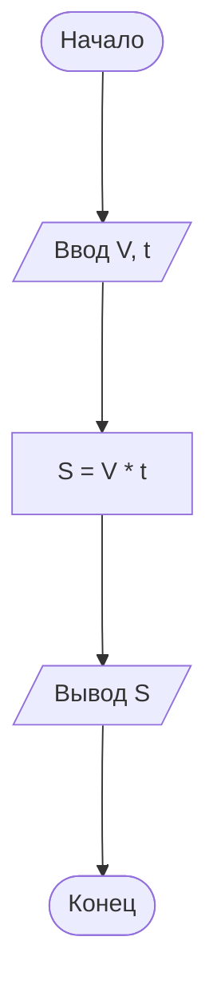
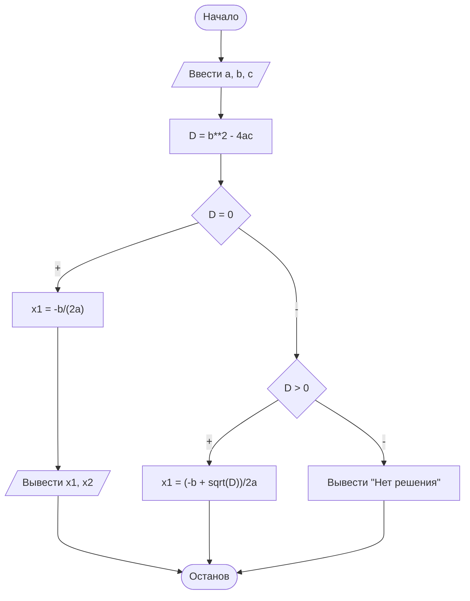
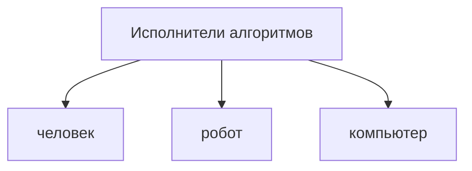

# Основы алгоритмизации и программирования
650a23836a97eeab17de058a

- [Алгоритмы](#алгоритмы)
  - [Введение в алгоритмы](#введение-в-алгоритмы)
    - [Этапы решения задач на ЭВМ](#этапы-решения-задач-на-эвм)
      - [I этап: Постановка задачи и её содержательный анализ](#i-этап-постановка-задачи-и-её-содержательный-анализ)
      - [II этап: Математическая формализация](#ii-этап-математическая-формализация)
      - [III этап: Алгоритмизация (построение алгоритма)](#iii-этап-алгоритмизация-построение-алгоритма)
      - [IV этап: Программирование](#iv-этап-программирование)
      - [V этап: Отладка и тестирование программы](#v-этап-отладка-и-тестирование-программы)
      - [VI этап: Проведение расчетов и анализ результатов](#vi-этап-проведение-расчетов-и-анализ-результатов)
      - [Распределение общего времени между этапами, необходимое для разработки сложных программ](#распределение-общего-времени-между-этапами-необходимое-для-разработки-сложных-программ)
      - [Общие рекомендации](#общие-рекомендации)
      - [Примеры решения задач](#примеры-решения-задач)
        - [Пример 1](#пример-1)
        - [Пример 2](#пример-2)
    - [Основные понятия алгоритма](#основные-понятия-алгоритма)
    - [Свойства алгоритма](#свойства-алгоритма)
    - [Способы записи алгоритма](#способы-записи-алгоритма)
    - [Блок-схема алгоритма](#блок-схема-алгоритма)
    - [Ход выполнения алгоритма](#ход-выполнения-алгоритма)
  - [Примеры блок-схем](#примеры-блок-схем)
- [Практические работы на сб (16.09.2023)](#практические-работы-на-сб-16092023)
  - [Практическая работа 1](#практическая-работа-1)
  - [Практическая работа 2](#практическая-работа-2)
- [Задания для разработки алгоритма на 08.09.2022](#задания-для-разработки-алгоритма-на-08092022)
  - [Задачи](#задачи)
  - [Введение в C#. Платформа .NET](#введение-в-c-платформа-net)
    - [Немного о C#](#немного-о-c)
    - [Что делают на языке C#](#что-делают-на-языке-c)
    - [Что такое платформа .NET](#что-такое-платформа-net)
    - [Особенности .Net](#особенности-net)
    - [Немного о компиляции](#немного-о-компиляции)
    - [CIL и CLR](#cil-и-clr)
  - [Введение в язык программирования С#. Базовые понятия языка С#](#введение-в-язык-программирования-с-базовые-понятия-языка-с)
    - [1. Назначение и возможности языка](#1-назначение-и-возможности-языка)
    - [2. Структура программы](#2-структура-программы)
      - [Структура заготовки проекта](#структура-заготовки-проекта)
      - [Простые операции](#простые-операции)
    - [3. Числовые типы данных](#3-числовые-типы-данных)
      - [Размер и диапазон целых типов](#размер-и-диапазон-целых-типов)
      - [Размер и диапазон вещественных типов](#размер-и-диапазон-вещественных-типов)
    - [4. Класс Math](#4-класс-math)
    - [5. Консольный ввод-вывод](#5-консольный-ввод-вывод)
    - [Составить программы для расчета значений  функций](#составить-программы-для-расчета-значений--функций)
  - [Практическая работа №1. Составление линейных программ на языке C#](#практическая-работа-1-составление-линейных-программ-на-языке-c)
  - [Основные операторы. Программирование типовых операций](#основные-операторы-программирование-типовых-операций)
  - [Литература](#литература)
  - [1. Программирование разветвлений](#1-программирование-разветвлений)


## Алгоритмы
650ae4eb6a97eeab17de059a

### Введение в алгоритмы
650ae5346a97eeab17de059b

#### Этапы решения задач на ЭВМ

| | | |
-- | -- | --
| 1. | Постановка задачи. | Работа без ЭВМ
| 2. | Математическая формализация. | Работа без ЭВМ
| 3. | Алгоритмизация. | Работа без ЭВМ
| 4. | Программирование | Работа на ЭВМ
| 5. | Отладка и тестирование программы | Работа на ЭВМ
| 6. | Проведение расчетов и анализ результатов |

##### I этап: Постановка задачи и её содержательный анализ

① Формируется условие задачи:

1. Что дано? (Анализ исходных данных) → **аргументы**
2. Что необходимо определить? → **результат**
3. Какие данные допустимы и в каких единицах измерения?
4. Какие результаты и в каком виде должны быть получены?

② Всем величинам присвоить имена.

##### II этап: Математическая формализация

Реально существующие объекты, предметы, явления заменяются математическими формулами.

##### III этап: Алгоритмизация (построение алгоритма)

При разработке алгоритма решения сложной задачи следует использовать метод структурного подхода:

1. Алгоритм собирается из 3-х основных базовых структур.
2. Разработка алгоритма «сверху вниз».
3. Сквозной структурный контроль.

**Сквозной структурный контроль** представляет собой совокупность технологических операций контроля, позволяющих обеспечить как можно более раннее обнаружение ошибок в процессе разработки. Термин «сквозной» в названии отражает выполнение контроля на всех этапах разработки. Термин «структурный» означает наличие четких рекомендаций по выполнению контролирующих операций на каждом этапе.

Сквозной структурный контроль должен выполняться на специальных контрольных сессиях, в которых, помимо разработчиков, могут участвовать специально приглашенные эксперты. Одна из первых сессий должна быть организована на этапе определения спецификаций. На этой сессии проверяют полноту и точность спецификаций, при этом целесообразно присутствие заказчика или специалиста по предметной области, которые смогут определить, насколько правильно и полно определены спецификации программного обеспечения.

На этапе проектирования вручную по частям проверяют алгоритмы разрабатываемого программного обеспечения на конкретных наборах данных и сверяют полученные результаты с соответствующими спецификациями. Основная задача – убедиться в правильности понимания спецификаций и проанализировать достоинства и недостатки концептуальных решений, закладываемых в проект.

На этапе реализации проверяют план (последовательность) реализации модулей, набор тестов, а также тексты отдельных модулей.

Для всех этапов целесообразно иметь списки наиболее часто встречающихся ошибок, которые формируют по литературным источникам и исходя из опыта предыдущих разработок. Такие списки позволяют сконцентрировать усилия на конкретных моментах, а не проверять все подряд. При этом все найденные ошибки фиксируют в специальном документе, но не исправляют их (более подробно см. §9.2).

Помимо раннего обнаружения ошибок, сквозной структурный контроль обеспечивает своевременную подготовку качественной документации по проекту.

https://studfile.net/preview/2007545/page:17/

##### IV этап: Программирование

- выбор языка программирования;
- запись алгоритма на выбранном языке программирования.

##### V этап: Отладка и тестирование программы

Ошибки программы:

- синтаксические;
- логические.

**Тест** – набор исходных данных, для которых заранее известен результат.

##### VI этап: Проведение расчетов и анализ результатов

Производится расчет программы (выполнение на ЭВМ). 

После выполнения программы необходимо провести обработку и осмысление результатов.

##### Распределение общего времени между этапами, необходимое для разработки сложных программ


##### Общие рекомендации

1. Необходимо создать программу универсальной.
2. Вместо констант лучше использовать переменные.
3. Программа должна иметь комментарии.

##### Примеры решения задач

###### Пример 1

Определить  расстояние  от  пункта  А до  пункта  В,  если  автобус,  двигаясь
со  скоростью  60  км/час,  проезжает это расстояние за 30 минут.

**Этапы решения задачи: I этап**

1. Что дано?
2. Что необходимо найти?

Расстояние от А до В.

Скорость автобуса – 60 км/ч, время в пути – 30 мин. 

<u>**Анализ исходных данных**</u>:

3. Какие данные допустимы? 
   
- скорость  (км/час) 
- время  (мин) ➾ 30 мин : 60 = 0,5 час

Присвоим имена переменным:   
- $V$ – скорость
- $t$ – время
- $S$ – расстояние

**Этапы решения задачи: II этап**

**Построение  математической модели**:  заменим  описание задачи свернутой формулой.

$$ S = V · t $$

**Этапы решения задачи: III этап**

**Построение  алгоритма  решения задачи**. 

**Алг** расстояние<br>
&nbsp;&nbsp;вещ $V, t, S$<br>
**нач**<br>
&nbsp;&nbsp;Ввести скорость автобуса,<br>
&nbsp;&nbsp;Ввести время в пути,<br>
&nbsp;&nbsp;Вычислить расстояние $S = V · t$<br>
&nbsp;&nbsp;Вывести результат $S$<br>
**кон**



**Этапы решения задачи**

- IV этап 
- V этап 
- VI этап – результат одно число :

$$ S = 30 $$

Ответ: 30 километров. 

###### Пример 2

На  научный  семинар  собрались ученые. Каждый из них оставил коллегам визитные карточки. Всего карточек – 132. Сколько  всего  ученых  собралось  на семинар? 

**Этапы решения задачи: I этап**

**Анализ исходных данных**:

1.  Что дано? Количество оставленных учеными карточек – 132.
2. Что необходимо найти? Количество ученых.
3. Какие данные допустимы?
- карточка  (штука)
- ученые (человек)

**Присвоим имена переменным**:
- $x$ – количество ученых 

**Этапы решения задачи: II этап**

**Построение  математической  модели**: заменим  описание  задачи  свернутой формулой.

$$ x \cdot (x - 1) = 132 \rarr x^2 - x - 132 = 0 $$

**аргументы**: $a = 1, b = -1, c = -132$.

**результат**: $x_1 = \frac{-b + \sqrt{D}}{2a}, x_2 = \frac{-b - \sqrt{D}}{2a}$.

**промежуточная величина**: $D = b^2 - 4ac$.

**Этапы решения задачи: III этап**

Построение алгоритма решения задачи.



$$ 
 ax^2 + bx + c = 0 \\
 D = b^2 - 4ac 
$$

- если $D < 0$, корней нет;

$$ x \in \varnothing $$

- если $D = 0$, есть один корень;

$$ x = \frac{-b}{2a} $$ 

- если $D > 0$, есть два различных корня;

$$
x_1 = \frac{-b + \sqrt{D}}{2a}, x_2 = \frac{-b - \sqrt{D}}{2a}.
$$

**Этапы решения задачи: IV этап**

**Этапы решения задачи: V этап**

**Этапы решения задачи: VI этап**

Результат:
- $x_1 = 12$;
- $x_2 = -11$ – отрицательное число не подходит.

**Ответ**: на семинаре было 12 ученых.

#### Основные понятия алгоритма

**Алгоритм** – понятное и точное предписание (указание) исполнителю совершить
последовательность действий, направленных на достижение указанной цели или на решение поставленной задачи. 



Исполнитель выполняет алгоритм **формально**.

**Система команд исполнителя** (**СКИ**) — совокупность команд, которые данный исполнитель умеет выполнять. Совокупность всех действий, которые исполнитель может выполнить в ответ на эти команды, называется **системой допустимых действий** Исполнителя.

#### Свойства алгоритма

1. Дискретность
2. Понятность
3. Определённость (детерминированность)
4. Конечность (результативность)
5. Выполнимость (эффективность)
6. Массовость (универсальность)
7. Однозначность

#### Способы записи алгоритма

1. Словесный (вербальный)
2. Графический
3. Математический (формулами)
4. Алгоритмические языки(программа)

#### Блок-схема алгоритма

**Блок-схема** — графическое изображение структуры алгоритма, в котором каждый этап процесса переработки данных представляется в виде геометрических фигур (блоков), имеющих определенную конфигурацию в зависимости от характера выполняемых при этом операций.


#### Ход выполнения алгоритма

- последовательный;
- разветвлённый;
- циклический.

Различают три основных типа структур алгоритма:

- линейный (следование);
- альтернативный (разветвление);
- циклический (повторение, итерация).

### Примеры блок-схем
650c39176a97eeab17de05b5

)

)

)

)

## Практические работы на сб (16.09.2023)
650ae9cc6a97eeab17de059f

### Практическая работа 1
6514165b6a97eeab17de06ac

1. Цель работы:
   1. Сформировать умение  составлять  простейшие разветвляющиеся алгоритмы.
   2. Сформировать умение составлять наборы тестов.

2. Литература
   1. Колдаев, В.Д. Структуры и алгоритмы обработки данных: Учебное пособие/В.Д. Колдаев – Москва: ИЦ РИОР:НИЦ ИНФРА-М, 2014.  Режим доступа: http://znanium.com/bookread2.php?book=418290#
   2. Математическая логика и теория алгоритмов:учебник/ А.В. Пруцков,Л.Л. Волкова. – Москва: КУРС:ИНФРА-М, 2017. – Режим доступа: http://znanium.com/catalog.php?bookinfo=773373
   3. Основы алгоритмизации и программирования:Учебное пособие/ В.Д. Колдаев; Под ред. Л.Г. Гагариной. – Москва: ИД Форум: ИНФРА-М, 2015-  Режим доступа: http://znanium.com/bookread2.php?book=484837

3. Подготовка к работе:
   1. Изучить понятие алгоритма, его свойства.
   2. Изучить графический способ описания алгоритмов.
   3. Изучить методику разработки линейных алгоритмов.

4. Задание:
   1. Составить алгоритмы для предложенных задач (таблица 1) по плану:
       1. исходные данные;
       2. результат;
       3. анализ условия задачи;
       4. метод решения;
       5. графическое описание алгоритма;
       6. набор тестов для проверки правильности алгоритма.

**Вариант 1:**

1) На плоскости даны две точки А(x1,  y1) и В(х2, у2). Определить расстояние между этими точками.
2) Найти сумму цифр трехзначного числа, введенного пользователем.
3) Определить площадь заштрихованной фигуры (рисунок 1), если известна длина стороны квадрата.

    

    **Рисунок 1**

4) Обменять значения двух переменных:
    - используя третью переменную;
    - не используя третью переменную.

**Вариант 2:**

1) Вычислить значение $y (k>0)$.

    $$ y = 1+2+3+...+k. $$

2) Найти произведение цифр трехзначного числа, введенного пользователем.

3) Определить площадь заштрихованной фигуры (рисунок 1), если известно, что радиус меньшей окружности $r$ равен половине радиуса большей окружности.

    

    **Рисунок 2**

4) Обменять значения двух переменных:
    - используя третью переменную;
    - не используя третью переменную.

5. Порядок выполнения работы:
   1. Решить задания в любом порядке.

6. Содержание отчета:
   1. Титульный лист.
   2. Цель работы.
   3. Условия задач.
   4. Подробное решение заданий.
   5. Вывод по проделанной работе.

7. Контрольные вопросы
   1. Что такое алгоритм?
   2. Каковы основные свойства алгоритма?
   3. Какие способы описания алгоритмов существуют?
   4. Какие виды алгоритмов и соответствующих им конструкций существуют?
   5. Что называется отладкой алгоритма?
   6. Что такое тест?
   7. Какой тест называют полным? неизбыточным?

### Практическая работа 2
65155d056a97eeab17de06c9

1. Цель работы
    1. Сформировать умение составлять разветвляющиеся алгоритмы
    2. Сформировать умение составлять наборы тестов

2. Литература
    1. Колдаев, В.Д. Структуры и алгоритмы обработки данных: Учебное пособие/В.Д. Колдаев – Москва: ИЦ РИОР:НИЦ ИНФРА-М, 2014. Режим доступа: http://znanium.com/bookread2.php?book=418290#
    2. Математическая логика и теория алгоритмов:учебник/ А.В. Пруцков,Л.Л. Волкова. – Москва: КУРС:ИНФРА-М, 2017. – Режим доступа: http://znanium.com/catalog.php?bookinfo=773373
    3. Основы алгоритмизации и программирования:Учебное пособие/ В.Д. Колдаев; Под ред. Л.Г. Гагариной. – Москва: ИД Форум: ИНФРА-М, 2015 - Режим доступа: http://znanium.com/bookread2.php?book=484837

3. Подготовка к работе:
    1. Изучить понятие алгоритма, его свойства.
    2. Изучить графический способ описания алгоритмов.
    3. Изучить методику разработки разветвляющихся алгоритмов.

4. Задание:
    1. Составить алгоритмы для предложенных задач (таблица 2) по плану:
        1. исходные данные;
        2. результат;
        3. анализ условия задачи;
        4. метод решения;
        5. графическое описание алгоритма;
        6. набор тестов для проверки правильности алгоритма.

    **Вариант 1:**

    1) Вычислить

    $$ y = \frac{18}{x^4 - 1} $$

    2) Вычислить

    $$ m = min(x+y^2, y+z^2) + 1. $$

    3) Вычислить стоимость покупки с учетом скидки. Скидка в 7% предоставляется, если сумма покупки больше 1500 руб.

    4) Проверить, является ли введенное пользователем целое число четным

    5) Даны целые числа $A$, $B$. Если числа не равны, то заменить каждое из них одним и тем же числом, равным большему из исходных, а если равны, то заменить числа нулями.

    **Вариант 2:**

    1) Вычислить

    $$ y = \sqrt{x^2 - 25} $$

    2) Вычислить

    $$ m = max(x+y \cdot z, x \cdot y + z) - 2. $$

    3) На плоскости даны две точки $A(x1, y1)$ и $B(x2, y2)$. Определить, какая из этих точек находится ближе к началу координат.

    4) Проверить, является ли введенное пользователем целое число нечетным

    5) Перераспределите значения переменных $x$ и $y$ так, чтобы в $x$ оказалось большее из этих значений, а в $y$ меньшее.

5. Порядок выполнения работы:
    1. Решить задания в любом порядке.

6. Содержание отчета:
    1. Титульный лист.
    2. Цель работы.
    3. Условия задач.
    4. Подробное решение заданий.
    5. Вывод по проделанной работе.

7. Контрольные вопросы
    1. Что такое алгоритм?
    2. Какой алгоритм называется разветвляющимся?
    3. Какая алгоритмическая структура используется для изображения разветвляющегося алгоритма?
    4. Какое выражение называется логическим? Каков его результат?
    5. В каком случае используется полная форма ветвления? В каком — неполная?
    6. Что называется отладкой алгоритма?
    7. Что такое тест?
    8. Какой тест называют полным? неизбыточным?

## Задания для разработки алгоритма на 08.09.2022
6516c4be6a97eeab17de06ef

### Задачи
651a777c6a97eeab17de0789

1. Подсчитать количество целых чисел среди $a, b, c$.

2. Даны координаты двух точек $A$ и $B$. Вычислить расстояние между точками. Определить, какая точка находится ближе к началу координат.  

3. Пользователь вводит 4х- значное число, перевернуть его.

4. Найти максимальное из трех чисел.

### Введение в C#. Платформа .NET
651d23766a97eeab17de07d8

#### Немного о C#

На сегодняшний момент язык программирования C# один из самых мощных, быстро развивающихся и востребованных языков в ИТ-отрасли.

Первая версия языка вышла вместе с релизом Microsoft Visual Studio .NET в феврале 2002 года.

C# является объектно-ориентированным языком.

#### Что делают на языке C#

- Видеоигры
- Десктопные приложения
- Мобильные приложения
- Утилиты и др.

#### Что такое платформа .NET

.NET– это кросплатформенная среда выполнения приложений. Проще говоря – это то, что позволяет запускаться нашим приложениям в системе. 

.Net Framework – это набор уже скомпилированных библиотек, откуда берутся методы и функции для запуска и разработки приложений. В разработке, нам придётся просто вызвать уже готовую функцию для того чтобы она заработала.

Язык C# используется всего лишь для описания команд и инструкций, но используя возможности .et Framework позволяет создавать приложения разного типа.

#### Особенности .Net

- **Поддержка нескольких языков** – C#, C++, F# и др.
- **Кроссплатформенность** - можно разрабатывать приложения на языке C# для самых разных платформ - Windows, MacOS, Linux, Android, iOS
- **Мощная библиотека классов** – позволяет создавать приложения разного типа

#### Немного о компиляции

**Процесс компиляции** (сборки) – это перевод вашего кода, понятного человеку, в бинарный код, понятный компьютеру.

**Компилируемый язык** (C#, C++) — это такой язык, что программа, будучи скомпилированной, содержит инструкции целевой машины (машинный код).

**Интерпретируемый язык** — это такой, в котором инструкции не исполняются целевой машиной, а считываются и исполняются другой программой (Python).

#### CIL и CLR

В программировании на .Net компиляция и запуск приложений происходит следующим образом:

- Код из любого языка преобразовывается в код, написанный на общем языке (Common intermediate language или CIL). Этот язык является языком низшего уровня, похожего по синтаксису на язык ассемблер.
- После, этот код передаётся так называемой исполняющей среде (Common language runtime или CLR), которая берёт функции и методы из .Net Framework и управляет нашим приложением.
- После этого конечный результат передаётся на процессор и выполняется программа.


### Введение в язык программирования С#. Базовые понятия языка С#
651e8b566a97eeab17de0808

#### 1. Назначение и возможности языка
652070ff6a97eeab17de083d

Язык С# — потомок языков С и С++. Предназначен для создания программ, не «зависящих» от операционной среды, в рамках технологии и платформы .NET FrameWork.

Позволяет создавать программы:
- для автономного и сетевого применения, работы с базами данных. Является основным текущим средством компании Microsoft по программированию;
- работающие под Windows, Unix, Linux на компьютерах Intel и  Apple.

Интегрированная среда разработки (ИСР) — Visual Studio от Microsoft;

Основные шаги создания новой программы:
- создать на устройстве «С\Temp\» папку для программ, например «PKS205\MDK0102\Zan1»;
- запустить в работу Visual Studio (VS);
- выполнить команду *Создать* > *Проект*. В результате ИСР откроет окно для выбора варианта разрабатываемого приложения;
- выбрать Тип проекта «Visual C#», Шаблон «Консольное приложение»;
- задать содержательное имя проект, например «Zan1»;
- выбрать свою папку, в которой будет храниться проект и нажать кнопку ОК.

В результате будет создан пустой проект.

#### 2. Структура программы
652071606a97eeab17de083e

##### Структура заготовки проекта
```c#
using System;
using System.Collections.Generic;
using System.Linq; //можно удалить
using System.Text;
namespace ConsoleApplication1
{
  class Program
  {
    static void Main(string[] args)
    {
    //здесь размещается основной текст программы
    }
  }
}
```

Запуск на выполнение: *Отладка* > *Запуск без отладки* или нажатие клавиши <kbd>F5</kbd>.

##### Простые операции

| Оператор |  Назначение |
-- | --
`-` (унарный) | Изменение знака величины
`*` | Умножение
`/` | Деление
`+` (бинарный) | Сложение
`–` (бинарный) | Вычитание
`%` | Получение остатка от деления (например, `17%3` равно `2`)
`++` | Оператор инкремента (префиксная форма `++n`, постфиксная `n++`)
`--` | Оператор декремента (префиксная форма `--n`, постфиксная `n--`)

Можно использовать сокращенные формы записи операций как принято в языке С:
- вместо полной формы записи `n=n+1;`
- сокращенная форма `n+=1;`

#### 3. Числовые типы данных
652073166a97eeab17de0841

В языке программирования С# каждая переменная имеет определенный тип.

Арифметическими типами являются: *целый*, *вещественный*, *десятичный*.

*Целые числа* имеют несколько разновидностей:
- **знаковые** величины;
- **беззнаковые** величины (принимают только неотрицательные значения).

##### Размер и диапазон целых типов

Тип | Размер, байт | Диапазон значений (знаковые величины)
-- | -- | --
`sbyte` | 1 | от -128 до 127
`short` | 2 | от -32 768 до 32 767
`int` | 4 | от -2 147 483 648 до 2 147 483 647 (±2*10<sup>9</sup>)
`long` | 8 | от - 9 223 372 036 854 775 808 до 9 223 372 036 854 775 807 (±9*10<sup>18</sup>)

##### Размер и диапазон вещественных типов

Тип | Размер, байт | Точность, цифр | Примерный диапазон значений
-- | -- | -- | --
`float` | 4 | 6–7 | от  ±1,5×10<sup>−45</sup> до  ±3,4×10<sup>38</sup>
`double` | 8 | 15–16 | от  ±5,0×10<sup>−324</sup> до  ±1,7×10<sup>308</sup>
`decimal` | 128 | 28–29 | от  ±1.0×10<sup>−28</sup> до  ±7.9×10<sup>28</sup>

По умолчанию вещественным константам (константам, содержащим точку) присваивается тип `double`. Для указания константы типа `float` сразу за ней записывается `f` или `F`, например `3.14f`.

Вещественные константы можно записывать в полулогарифмическом виде, например `1.7е-5`.

Идентификаторы переменных состоят из букв латинского алфавита и цифр (возможно использование букв *национальных* языков).

Строчные и заглавные символы различаются.

Желательно делать имена переменных осмысленными.

Рекомендуется применять два типа обозначения переменных, в которых регистр символов указывает предназначение величины:
- `camelCase` – первое слово начинается со строчной буквы, последующие слова с заглавной, например `age`, `ozenkaZaDisp`. Применяют для *простых* переменных (целых, вещественных, булевых и т.д.);
- `PascalCase` – каждое слово в имени переменной начинается с большой буквы, например `Age`, `OzenkaZaDisp`. Применяют для обозначения *классов* и *сложных
переменных*, тип которых определяет программист.

Переменные до их использования следует *проинициализировать*, т.е. в них следует занести какие-либо допустимые значения, иначе в ходе выполнения программы могут возникнуть трудно обнаруживаемые ошибки.

Пример фрагмента программы с объявлением переменных:
```c#
static void Main(string[] args)
{
  int i=-1, ozenka=0;
  double sredniyBall=0.0;
  …
}
```

Можно разделять объявление переменных и их инициализацию:
```c#
double c, d1;
c = 17e-5; d1 = 1.0;
```

#### 4. Класс Math
652076ef6a97eeab17de0843

| Выражение | Описание |
-- | --
`Math.Abs(<выражение>)` | Модуль
`Math.Ceiling(<выражение>)` | Округление для большего целого
`Math.Cos(<выражение>)` | Косинус
`Math.Е` | Число е
`Math.Exp(<выражение>)` | Экспонента
`Math.Floor(<выражение>)` | Округление до меньшего целого
`Math.Log(<выражение>)` | Натуральный логарифм
`Math.Log10(<выражение>)` | Десятичный логарифм
`Math.Max(<выражение1>, <выражение2>)` | Максимум из двух значений
`Math.Min(<выражение1>, <выражение2>)` | Минимум из двух значений
`Math.PI` |  Число Pi
`Math.Pow(<выражение1>, <выражение2>)` | Возведение в степень
`Math.Round(<выражение>)` | Простое округление
`Math.Sin(<выражение>)` | Синус
`Math.Sqrt(<выражение>)` | Квадратный корень
`Math.Тan(<выражение>)` | Тангенс

#### 5. Консольный ввод-вывод
6523f20f6a97eeab17de087e

Вывод на экран в текстовом режиме называют *консольным*. Любые символы (буквы, цифры) являются *текстом*. Текст заключается в двойные кавычки, он может содержать латинские символы и символы кириллицы. Возможна вставка управляющих символов:
- `\n` – перевод к началу следующей строки;
- `\t` – вставка пробелов, соответствующих размеру табуляции;
- `\а` подача звукового сигнала и т.п.

**Пример вывода текста**:
```c#
Console.WriteLine("Пример \nвывода текста");
```
**Результат отображения на экране**
```
Пример
вывода текста
```
**Вывод на экран текста без перевода строки**
```c#
Console.Write("Введите аргумент ad1= ");
```
**Вывод значений переменной**:
```c#
Console.WriteLine(<имя переменной>);
```
**Например вывод значения переменной `dVes1`**:
```c#
Console.WriteLine(dVes1);
```
**Вывод пустой строки**
```c#
Console.WriteLine();
```
**Вывод с поясняющим текстом (`dVes1 равна 11.4`)**
```c#
Console.WriteLine("\ndVes1=" + dVes1);
```
**Результат отображения, например**
```
dVes1=11,4
```
Целая часть вещественных чисел от дробной отделяется установленным системным разделителем (в тексте программы это точка; при вводе и выводе запятая, если она установлена в Windows).
```c#
Console.WriteLine("вес={0} длина={1}", ves, dl+1.0);
```
Здесь строка – это «шаблон», в который встраиваются значения переменных. Каждый пара фигурных скобок является «заполнителем», на место которых во время выполнения будет заносится значение соответствующей переменной или выражения из списка вывода. Заполнитель содержит номер элемента списка вывода, нумерация начинается с нуля. При выводе числовые значения преобразуются в текст автоматически. Количество заполнителей должно соответствовать количеству элементов списка вывода. При несоответствии количества заполнителей и числа аргументов в ходе выполнения программы будет сформировано исключение `FormatException`.

Для *форматирования* чисел при выводе используют специальные символы:
- с фиксированным разделителем `f (F)`, 
- в экспоненциальном формате `e(E)`,
- целых чисел `d(D)` и другие. 

Символы форматирования добавляются в виде суффикса к соответствующему заполнителю, например в виде `{0:f3}`, `{0:E}`, {`0:d8}`.

В результате выполнения оператора
```c#
Console.WriteLine("пример f2 ={0:f2}", 1234.678); 
```
отобразится текст
```
пример f2 = 1234,68.
```
При вводе информация от клавиатуры читается как *строка символов*, которую необходимо преобразовать в соответствующий тип данных. Непосредственный ввод осуществляется после нажатия клавиши <kbd>Enter</kbd>.

**Последовательность операторов для ввода целой величины**:
```c#
string sRab="";
int nOzenka=-1;
…
Console.WriteLine("Введите значение переменной nOzenka");
sRab=Console.ReadLine();
nOzenka = Convert.ToInt32(sRab);
```
**Последовательность операторов для ввода вещественной величины**:
```c#
string sRab="";
double dVes1 =0.0;
…
Console.WriteLine("Введите значение переменной dVes1");
sRab=Console.ReadLine();
dVes1= Convert.ToDouble(sRab);
```
Если запустить программу, например из папки *…\bin\Debug\Zan1.exe*,
то по завершению программы консольное окно закрывается автоматически. Аналогично ведет себя программа, если запустить ее в среде программирования командой `Отладка – Начать отладку`. Для приостановки завершения автономного выполнения программы и просмотра результатов ее работы можно вставить в конец программы операторы
```c#
Console.WriteLine("Нажмите <Enter> для завершения программы");
Console.Read();
```

Рассмотрим пример вычисления функций $y$ и $z$:

$$ y=sin(\frac{\pi}{2} \cdot x), z=y \cdot g $$

```c#
using System;
using System.Collections.Generic;
using System.Linq;
using System.Text;
namespace zan1
{
  class Program
  {
    static void Main(string[] args)
    {
      double x = 0.0, y = 0;
      int g = 0;
      string str; 
      Console.WriteLine("Демонстрационная программа");
      Console.Write("Введите значение параметра х= ");
      str = Console.ReadLine();
      x = Convert.ToDouble(str);
      Console.Write("Введите значение параметра g= ");
      str = Console.ReadLine();
      g = Convert.ToInt32(str);
      y = Math.Sin(Math.PI / 2 * x);
      Console.Write("\n\t\tРезультаты вычислени:\n y={0} y={0:f4} z={1:E5}\n",y,y/g);
    }
  }
}
```
**Пример работы программы**
```
Демонстрационная программа
Введите значение параметра x= 2
Введите значение параметра g= 10

                Результаты вычисления:
 y=1,2246467991473532E-16 y=0,0000 z=1,22465E-017

C:\topics\650a23836a97eeab17de058a\Demo01\Demo01\bin\Debug\net7.0\Demo01.exe (process 4668) exited with code 0.
To automatically close the console when debugging stops, enable Tools->Options->Debugging->Automatically close the console when debugging stops.
Press any key to close this window . . .
```

#### Составить программы для расчета значений  функций
6523f9396a97eeab17de0880

$$
z = \left[\frac{x-1}{x^2+1}-\left(\frac{x+3.141592}{x^2+1}\right)\left(\cfrac{x-1}{3.141592+\cfrac{x-1}{x^3+x^2+1}}\right) \right],\\~\\
y = \frac{1}{3} + \frac{1}{5} \cdot \sin\left(\frac{5}{3}\pi - 7a\right),\\~\\
z = \left(\frac{1+d+d^2}{3a+a^2}-4+\frac{1-a+a^2}{2d-d^2}\right)^{-1}\left(2\sin (a) + 7 \sqrt{d} - 5 \frac{\pi}{2} \sqrt[3]{a}\right)
$$

### Практическая работа №1. Составление линейных программ на языке C#
660e9b6ed048d37352721676

1. Цель работы: Освоить составление линейных программ на языке С#.
2. Подготовить бланк отчёта с программами, согласно заданиям.

**Задания для практической работы №1**

1. Ввести ФИО и вывести на экран: «Практическая  работу №1 выполнил: ФИО».
2. По данным сторонам прямоугольника вычислить его периметр, площадь и длину диагонали.
3. Даны два числа. Найти среднее арифметическое их квадратов и среднее арифметическое их модулей.
4. Дана длина ребра куба. Найти  площадь грани, площадь полной поверхности и объем этого куба.
5. Найти длину окружности и площадь круга заданного радиуса R.
6. Даны координаты трех вершин треугольника (x1, y1), (x2, y2), (x3, y3). Найти его периметр и площадь.
7. Дано целое четырехзначное число. Найти сумму его цифр.
8. Даны три числа расположить их по убыванию.

---

**Task_01**
```c#
namespace Task_01
{
    internal class Program
    {
        static double? f (double a, double x)
        {
            if (x < -5)
            {
                return a * Math.Pow(x, 2);
            }
            else if (x < 1 && x >= -5)
            {
                return a * Math.Abs(x);
            }
            else if (a != x)
            {
                return 1 / (a - x);
            }
            return null;
        }
        static void Main(string[] args)
        {
            try
            {
                // User input
                Console.Write("Enter param a (must be a valid real number): ");
                double a = double.Parse(Console.ReadLine());
                Console.Write("Enter variable x (must be a valid real number): ");
                double x = Convert.ToDouble(Console.ReadLine());

                // Calculation
                double? y = f(a, x);

                // Output
                if (y != null)
                {
                    Console.WriteLine("y = " + y?.ToString("N3"));
                }
                else
                {
                    Console.WriteLine("No solution: division by zero, quotient is undefined");
                }
            }
            catch (Exception)
            {                
                // Handle invalid decimal separator
                string decimalSeparator = System.Globalization.NumberFormatInfo.CurrentInfo.NumberDecimalSeparator;
                Console.WriteLine("Incorrect input: use decimal separator according to your system current culture settings ({0})", decimalSeparator);
            }
        }
    }
}
```

### Основные операторы. Программирование типовых операций
660ea086d048d37352721679

### Литература

**Основная**:
- Павловская Т.А., Щупако Ю.А. C/C++. Структурное программирование, Питер, 2005. – 402 с.

**Дополнительная**:
- Гросс К. С# 2008: Пер. с. анг. – СПб. БХВ-Петербург, 2009. – 576 с.
- Троелсен Э. Язык программирования С# 2005 и платформа /NET 2.0:пер. с анг. – М:. ООО «И.Д. Вильямс, 2007. – 1168 с.

### 1. Программирование разветвлений
6661a999d048d37352721b97

В языке C# есть тип данных `bool`, который используется для объявления переменных логических типа. Значения логических переменных: `true` (истина); `false` (ложь). Операции сравнения числовых величин `а<операция>b` в качестве результата дают логическое значение.

Обозначение | Значение
-- | --
`>` | больше
`<` | меньше
`>=` | больше или равно
`<=` | меньше или равно
`==` | равно
`!=` | не равно

*Логические операции над булевыми операндами*

Обозначение | Пояснение
-- | --
`&` | Логическое **И** (**AND**) `x&y`
`|` | Логическое **ИЛИ** (**OR**) `x|y`
`^` | Отрицание равнозначности
`~` | Логическое отрицание
`&&` | Условное логическое **И** (`x&&y`, если `x` имеет значение `false`, то `y` не вычисляется — операция **И** имеет значение `false` вне зависимости от значения `y`).
`||` | Условное логическое **ИЛИ** (`x||y`, если `x` имеет значение `true`, `y` не рассчитывается — результат операции **OR** является `true` независимо от значения `y`).

Значение результата логических операций `true` или `false`.

Логические операции `&`, `|`, `^` выполняются над *логическими* и над *целыми* величинами. В случае целых величин операции выполняются над *отдельными двоичными разрядами*:
- `1` соответствует `true`,  `0` – `false`.

К поразрядным относят операции:
- логического сложения `|`,
- логического умножения `&`,
- сложения по модулю два `^` (отрицание равнозначности),
- логического отрицания `~`.

Например:

$$
7_{10} \& 4_{10} = 111_{2} \& 100_{2} = 100_{2} = 4_{10} \\~\\
5_{10} \& 7_{10} = 101_{2} \& 111_{2} = 101_{2} = 5_{10} \\~\\
5_{10} \text{}^\wedge 7_{10} = 101_{2} \text{}^\wedge 111_{2} = 010_{2} = 2_{10}
$$

Приоритет логических операций ниже арифметических. Старшинство логических операций убывает в следующей последовательности: операции сравнения, равенства и неравенства, `&`, `^`, `|`. Операция `~` относится к унарным префиксным операциям.

Условные логические операции применимы к целым и вещественным величинам.

*Примеры записи операций сравнения*:
```c#
(nOzenka >= 3)&&(nOzenka<6)
(nOzenka = =5)||(nOzenka= =4)
(y1>=2 && y1<=7)
(r>3.14) && (r<9.15)
(dValue < dOldvalue) || (dValue != 0)
```

*Примеры операторов с логическими данными*:
```c#
bool dUsp;
dUsp=true;
dUsp=(nOzenka = =5)||(nOzenka= =4);
```

Оператор безусловного перехода:
```c#
goto <метка>;
```
Метки специально объявлять не надо, они ставятся перед оператором:
```c#
goto met1;
…
met1: y=1;
```

Условный оператор имеет две формы записи – полную и сокращенную.

*Полная форма*:
```c#
if (<условие>) {<операторы1>;} else {<операторы2>;}
```
Условие записывается в круглых скобках, оно представляет собой логическое выражение. Если условие соответствует истинности выполняется *операторы1*. В случае ложности выполняется *операторы2*. *Операторы* заканчивается символом "`;`".

*Пример записи условного оператора*:
```c#
if ((a>0)&&(a<=1)){ b=1./a;} else {b*=a;}
if (d>=0) {x1= –a+d; x2= –a–d;} else {x1=0; x2=0.0;}
```

После операторных скобок перед `else` символ "`;`" не ставится.

*Сокращенный вариант записи*:
```c#
if (<условие>) {<операторы3>;}
```
*Операторы3* выполняются только в случае истинности условия. Если условие ложно, то условный оператор эквивалентен «пустому» оператору.

Перед закрывающей операторной скобкой символ "`;`" записывается обязательно. Условные операторы можно вкладывать друг в друга.

При необходимости произвести разветвление на несколько ветвей применяют оператор `switch`:
```c#
switch (<переменная порядкового типа>)
{
  case i1: /*действия для случая, когда переменная принимает значение, равное i1 */
    break;
  case i2: /* действия для случая, когда переменная принимает значение, равное i2 */
    break;
  … //конечно многоточие в программе отсутствует
  default: // действия для случая, когда переменная принимает значение, отличающееся от перечисленных значений
    break;
}
```

Выполнение оператора:
- управление передается оператору `case`, метка которого совпадает со значением переменной в `switch`. Оператор `switch` может включать любое количество экземпляров `case`, но два оператора `case` не могут иметь одинаковое значение;
- переменная должна иметь целый, символьный тип или быть строкой символов. Нельзя использовать вещественные числа;
- значения `case` должны иметь тот же тип, что и переменная;
- после двоеточия за `case` может стоять один или несколько операторов;
- значения `case` должны быть константами;
- если ни одно выражение `case` не совпадает со значением переменной `switch`, управление передается операторам, следующим за необязательной меткой `default`. Если метки `default` нет, то управление передается за пределы оператора `switch`;
- оператор `break` передает управление за пределы конструкции `switch`.

```c#
int ozenka =0;
. . .
//Пример записи оператора
switch (ozenka)
{
  case 5:
  case 4: Console.WriteLine("Отл. и хор. успеваемость");
    break;
  case 3: Console.WriteLine("Уд. успеваемость");
    break;
  case 2:Console.WriteLine("Неуд. успеваемость");
    break;
  default: Console.WriteLine("Недопустимая оценка");
    break;
}
```

Условная трехместная операция:
```c#
условие? операнд1: операнд2
```
Пример записи условной операции: `a>b?a:b`.

Применение:
```c#
y=a>b?a:b
```

<script type="text/javascript" src="http://cdn.mathjax.org/mathjax/latest/MathJax.js?config=TeX-AMS-MML_HTMLorMML"></script>
<script type="text/x-mathjax-config"> MathJax.Hub.Config({ tex2jax: {inlineMath: [['$', '$']]}, messageStyle: "none" });</script>
